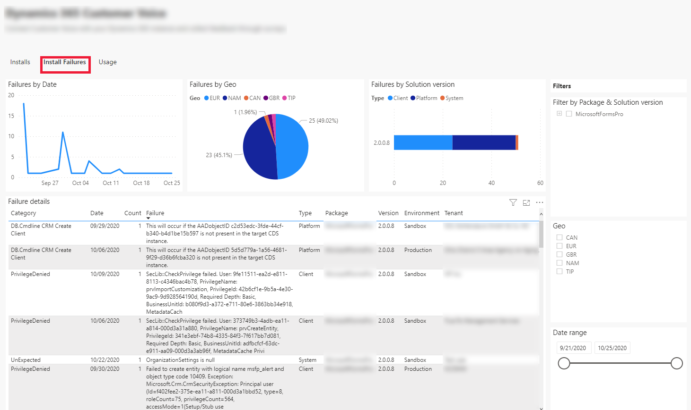
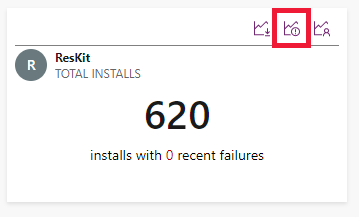
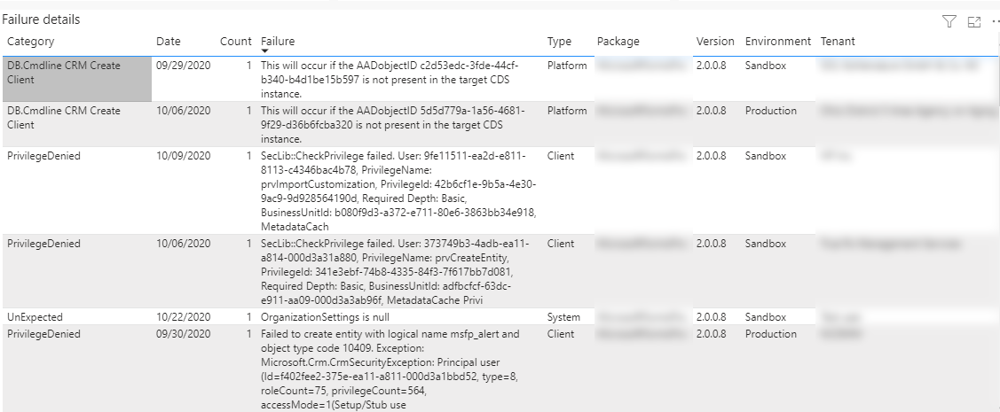

# Install failures

[!INCLUDE[cc-data-platform-banner](../../includes/cc-data-platform-banner.md)]

[!INCLUDE [cc-beta-prerelease-disclaimer](../../includes/cc-beta-prerelease-disclaimer.md)]

As an ISV, you need data like install failure details or failure count of the application to quickly resolve the issues for the customers. You can use the install failures feature to get the app installation failure data. The install failure features makes it easy for you to quickly resolve the install failures that customer encounter by providing the detailed error logs thus reducing the time for the customers to get the issues resolved.

With the install failures feature, you can see the install failures data by date, GEO, package, and by solution version. You can also see the failure details on the install failures dashboard. 

> [!div class="mx-imgBorder"]
> 
 
## View the install failure dashboard

To view the install failure data:

1. Sign in to [ISV studio](https://aka.ms/ISVStudio/).
1. On the **Home** page, you can see a list of published applications. Select the desired application for which you want to see the install failure details. 
1. Scroll-down to the page to view all the apps. Select the app and select the **Install Failures** tab.
1. You can also see the install failure details by directly selecting the install failure icon from the list of apps as shown in the screenshot:

   > [!div class="mx-imgBorder"]
   > 

The install failures tab contains the following graphs and metrics.

### Failure by date

The line chart shown below illustrates the number of app installation failures occurred by date. When hovering over the graph, the following information is shown:

 1. Failure Count 
 1. Date 

> [!div class="mx-imgBorder"]
> 

### Failure by Geo

The pie chart shown below illustrates the number app installation failures by GEO. When hovering over the graph, the following information is shown:

1. Geo 
1. Failure Count

> [!div class="mx-imgBorder"]
> 

### Failure by solution version

The bar chart shown below illustrates the number of app installation failures occurred by package version. When hovering over the graph, the following information is shown:

1. Package Version
1. Failure Type
1. Failure Count

> [!div class="mx-imgBorder"]
> 

### Failure details

Tracks the information about the app install failure error in detail. The following details are shown in the failure details tab:

1. Category
1. Date 
1. Count
1. Failure
1. Type
1. Package
1. Version
1. Environment
1. Tenant

> [!div class="mx-imgBorder"]
> 

You can drill through the **Failure** column to see the full failure details. To see the full failure details, right-click on one of the error messages on the **Failure details** tab and then select **Drill through** > **Failure details**.

> [!div class="mx-imgBorder"]
> 

### Filtering the install failure dashboard

ISVs can filter the install failures dashboard using the filters available. For example, an ISV can filter to see the metrics at **Package & Solution version**, **Geo**, and **Date range** level.   

### See also

[App usage analytics](isv-app-usage-analytics.md) 
[Home page](isv-app-management-homepage.md)  
[App page](isv-app-management-apppage.md)  
[Tenant page](isv-app-management-tenantpage.md) 
[AppSource checker](isv-app-management-appsource-checker.md) 
[Connector Certification](isv-app-management-certification.md)
