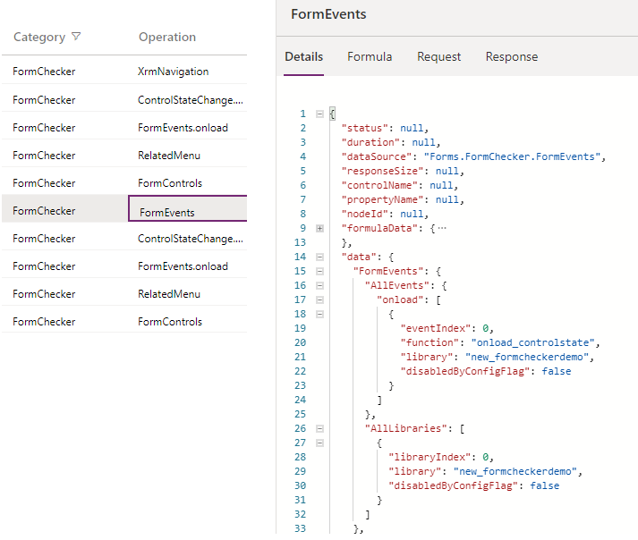
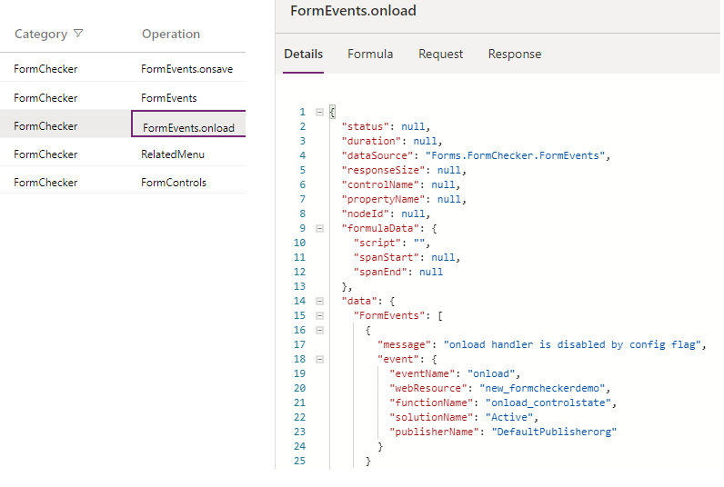
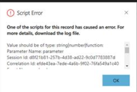
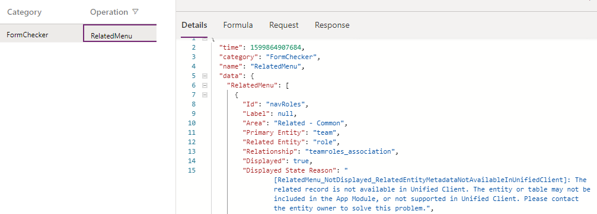
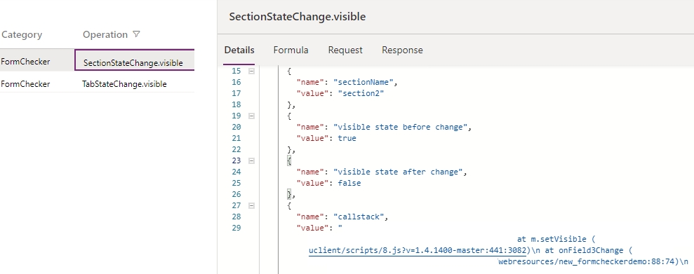
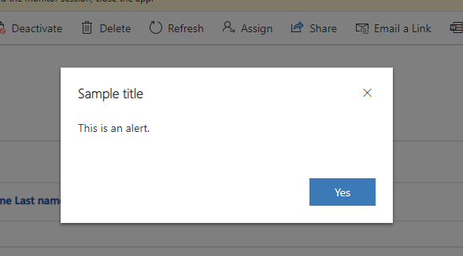
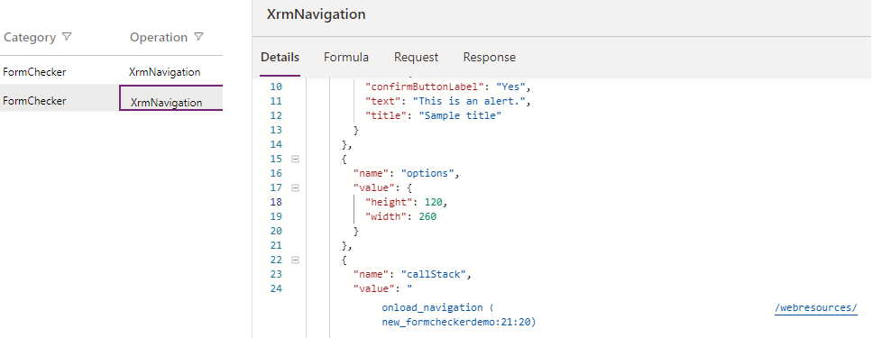

# Troubleshoot model-driven apps form issues

Troubleshooting issues in Unified Interface is important when you're working with forms and trying to fix the issues that happen when loading a form, running a script, working with events, or saving data. 

This article helps fix some common issues that you might encounter while working with model-driven app forms.

> [!IMPORTANT]
> - The workarounds mentioned in this article are only designed for troubleshooting purposes and are not intended to be used in the production scenarios. 
> - The workarounds affect the current user session unless otherwise called out (such as the browser tab that's accessing the model-driven app). They do not change system customizations or affect any other users or sessions. Once the current session is closed, the effect is no longer applied.
> - Most of the workarounds are available in production environments. Some of the workarounds mentioned in the guide may not have been deployed to your organization yet as new workarounds are added periodically.
> - The tools listed in this article can be used independently to troubleshoot a certain category of issues.

## Utilizing URL parameters to disable various form components

You require URL parameters to disable various form components that helps narrow down many issues to a specific component. It is recommended that you use the flags one at a time to narrow down the cause of the issue. The following are a list of URL parameters that can be used:

- DisableFormCommandbar

- DisableFormHandlers

- DisableFormLibraries

- DisableWebResourceControls

- DisableFormControl

- DisableBusinessProcessFlow

- navbar (this is not a "flag" parameter, instead use "&navbar=off" in the URL)

Below are some examples on how to use the flags listed above.

```Http
https://myorg.crm.dynamics.crm/main.aspx?appid=00000000-0000-0000-0000-000000000000&pagetype=entityrecord&id=00000000-0000-0000-0000-000000000000**&flags=DisableFormHandlers=true
```

You can also add multiple URL parameters separated with comma ",":  

```Http
https://myorg.crm.dynamics.crm/main.aspx?appid=00000000-0000-0000-0000-000000000000&pagetype=entityrecord&id=00000000-0000-0000-0000-000000000000**&flags=DisableFormHandlers=true,DisableWebResourceControls=true,DisableFormCommandbar=true,DisableBusinessProcessFlow=true&navbar=off
```

```Http
https://myorg.crm.dynamics.crm/main.aspx?appid=00000000-0000-0000-0000-000000000000&pagetype=entityrecord&id=00000000-0000-0000-0000-000000000000**&flags=DisableFormCommandbar=true
```

## View registered form event handlers and libraries

To view registered form event handles and libraries you can view the `FormEvents` operation in the [Monitor tool](https://docs.microsoft.com/powerapps/maker/model-driven-apps/monitor-form-checker).

> [!div class="mx-imgBorder"]
> 

You'll need the `eventIndex` and `libraryIndex` parameter values when using the **DisableFormHandlers** or **DisableFormLibraries** URL flags. Once an event or library is disabled the **disabledByConfigFlag** will be true, and you'll also see such events in the actual event handling.

> [!div class="mx-imgBorder"]
> 

## Disable form handlers

To disable form handlers use the following flags: 

- **&flags=DisableFormHandlers=\<event name\>**: Disables the form handlers by specifying the event name, for example, `DisableFormHandlers=OnLoad`. If you use the `DisableFormHandlers=true` flag, it disables the following event handlers: [OnLoad](https://docs.microsoft.com/powerapps/developer/model-driven-apps/clientapi/reference/events/form-onload), [OnSave](https://docs.microsoft.com/powerapps/developer/model-driven-apps/clientapi/reference/events/form-onsave), business rule, [OnChange](https://docs.microsoft.com/powerapps/developer/model-driven-apps/clientapi/reference/events/attribute-onchange), and [TabStateChange](https://docs.microsoft.com/powerapps/developer/model-driven-apps/clientapi/reference/events/tabstatechange).

- **&flags=DisableFormHandlers=\<event name\>_\<event index\>**: Disables the form handlers by specifying the event name and the event index value. For example, `DisableFormHandlers=true_0` disables the form handler at index 0. `DisableFormHandlers=onload_2` flag disables the form handler at index 2 of the [OnLoad](https://docs.microsoft.com/powerapps/developer/model-driven-apps/clientapi/reference/events/form-onload) event.

- **&flags=DisableFormHandlers=\<event name\>\<starting index\>\<end index\>**: Disables all the form handlers by specifying the event name and the given index range. For example, `DisableFormHandlers=true_0_2` disables the form handlers at index from 0 to 2 (0 and 2 are included). `DisableFormHandlers=onload_2_5` flag disables the [OnLoad](https://docs.microsoft.com/powerapps/developer/model-driven-apps/clientapi/reference/events/form-onload) handlers at index from 2 to 5.

## Disabling form libraries

To disable form libraries, use the following flags:

- **&flags=DisableFormLibraries=true**:  Disables all the form libraries.

- **&flags=DisableFormLibraries=\<library index\>**: Disables the form libraries by specifying the library index value. For example, `DisableFormLibraries=0` flag disables form library at index 0.

- **&flags=DisableFormLibraries=\<starting index\>_\<ending index\>**: Disables the form libraries by specifying the library index range. For example, `DisableFormLibraries=0_2` flag disables the form libraries at index from 0 to 2 (0 and 2 are included).

### Differences between DisableFormHandlers and DisableFormLibraries

The main differences between disabling form libraries and form handlers are:

- `DisableFormHandlers` flag disables the form handlers regardless of the containing form libraries, while `DisableFormLibraries` flag disables the form libraries (web resources) regardless of the functions (event handlers) included in the libraries.

- `DisableFormHandlers` flag does not prevent the containing form library from being loaded, thus does not prevent the JavaScript code that is present in the library but not registered as an event handler from being executed.  For example, if a form library `new_myscript.js` is written in the following way:

  - Assuming the `myOnloadHandler` is registered as an `OnLoad` event handler.
  - `DisableFormHandlers=true` flag only prevents the second alert dialog, while `DisableFormLibraries=true` flag prevents both the alert dialogs.

### Disable web resource controls

To disable web resource controls on a form, use the following flag: 

**&flags=DisableWebResourceControls=true**: Disables all the web resource controls.

> [!div class="mx-imgBorder"]
> 

### Disable controls on a form

To disable controls on a form, use the following flag: 

**&flags=DisableFormControl=true**: Disables all the controls on a form.

> [!NOTE]
> The **&flags=DisableFormControl=new_mycontrol** flag disables specific control on the form. If the issue gets resolved when the `&flags=DisableWebResourceControls=true` flag is used, there may be more than one web resource control on the form and you can use this flag to further identify the control that is causing the issue.

## Disable business process flow

To disable a business process flow on the form, use the following flag:

**&flags=DisableBusinessProcessFlow=true**: Disables a business process flow on the form.

## Unexpected behaviors when loading a form

While working on model-driven apps forms, you notice some unexpected behaviors while opening a form. Some of the common issues include:

- Fields or controls do not have an expected value.

- Controls are not disabled/enabled.

- Controls are not shown/hidden.

Any of the above behaviors appears after the form is opened, for example, you see a value or control for a second, and then the value changes or the control disappears.

There are many possible causes for the unexpected behaviors when a form opens. One of the most common is the [OnLoad](https://docs.microsoft.com/powerapps/developer/model-driven-apps/clientapi/reference/events/form-onload) scripts that runs synchronously or asynchronously to change the field/control behavior. To determine if your script is causing the issue, you can disable the form handlers using the URL parameters by appending `**&flags=DisableFormHandlers=true**` flag at the end of your app URL.

If the form loads normally after you disable the form handler, it indicates that there is an issue with the script that is blocking or causing an error when a form is loading.

## Intermittent form errors

There are many possible causes for intermittent or random form errors. Using the unsupported [Client API](https://docs.microsoft.com/powerapps/developer/model-driven-apps/clientapi/reference) methods are one of the main reasons why you see the intermittent errors and usually have some of the following characteristics:

- Occurs on some records, users, regions, browsers, or only during a certain period when the network or service load is high.

- Occurs rarely on support instances.

- The repro may only occur once on a computer, and it may occur again after clearing browser cache.

- [formContext.getControl](https://docs.microsoft.com/powerapps/developer/model-driven-apps/clientapi/reference/controls/getcontrol)  or [formContext.getControl(arg).getAttribute()](https://docs.microsoft.com/powerapps/developer/model-driven-apps/clientapi/reference/controls/getattribute) randomly returns null for a valid control or attribute.

There are many ways to write unsupported client API methods and all share a common pattern that they are not written in a supported way and they cause a race condition in the form load pipeline. Because they introduce a race condition, the issue only occurs when the custom script is executed before the form is fully ready to be accessed via client API depending on many factors:

- In the JavaScript web resource, code is put into a global scope that is executed immediately when the web resource file is loaded without waiting for the form to be accessible. Make sure the code is executed inside a valid form handler, such as an [OnLoad](https://docs.microsoft.com/powerapps/developer/model-driven-apps/clientapi/reference/events/form-onload) handler.

- In the Power Apps component framework component script file, client API methods are accessed inside the [init](https://docs.microsoft.com/powerapps/developer/component-framework/reference/control/init) or [updateView](https://docs.microsoft.com/powerapps/developer/component-framework/reference/control/updateview) function. The `init()` and `updateView()` is executed immediately when the component is loaded without waiting for the form to be readily accessible. You cannot use the  unsupported `Client API` methods in the Power Apps component framework components.

- In the web resource file, client API is accessed inside a `window.setTimeout()` function. The page state is unpredictable when the `setTimeout()` method executes the wrapped function due to the nature of the timer function, so when the execution happens the page may be in a transitional state (during page load, or save) that's not readily accessible by client API.

Using the [Monitor Tool](https://docs.microsoft.com/powerapps/maker/model-driven-apps/monitor-form-checker), you can access information that helps you determine when the unsupported client access occurs and when the access happens at the wrong time due to race condition.

> [!div class="mx-imgBorder"]
> 

> [!NOTE]
> The `callStack` has been modified for demo purpose. The `callStack` provides you with all the details like what web resource, function, and line that is causing the error.

## **Save in Progress** error dialog

Sometimes when you save the form, you see the **Save in Progress** error dialog. This error occurs when the form [OnSave](https://docs.microsoft.com/powerapps/developer/model-driven-apps/clientapi/reference/events/form-onsave) event is triggered before the previous [OnSave](https://docs.microsoft.com/powerapps/developer/model-driven-apps/clientapi/reference/events/form-onsave) event is completed. This is not supported and the error dialog is by design because calling the `OnSave` event before the previous `OnSave` event is complete would cause recursive save loops with unintended behaviors.

A typical cause for this error is the script that calls `save()` method in [OnSave](https://docs.microsoft.com/powerapps/developer/model-driven-apps/clientapi/reference/events/form-onsave) event handler. Another possible cause is the concurrent `save()` calls in the `setTimeout()` method, and which could cause the error dialog to intermittently show up, depending on whether the prior `save()` call is completed when another save() call is made.

**Resolution**:

In the monitor tool, the `FormEvent.onsave` operation provides all the details that are causing the error. FormChecker won't be able to detect the error when the issue cannot be reproduced.

> [!div class="mx-imgBorder"]
> 

## The form/record is not saved when you try to save

A common cause is an [OnSave](https://docs.microsoft.com/powerapps/developer/model-driven-apps/clientapi/reference/events/form-onsave) event handler that calls the `executionContext.getEventArgs().preventDefault()` method to cancel the save operation.

**Resolution**:

In the monitor tool, the `FormEvent.onsave` operation provides all the details why the save event is canceled that's not explicit enough from the form UI itself:

> [!div class="mx-imgBorder"]
> 

## Form script errors

If you see a form script error during the form [OnLoad](https://docs.microsoft.com/powerapps/developer/model-driven-apps/clientapi/reference/events/form-onload), [OnSave](https://docs.microsoft.com/powerapps/developer/model-driven-apps/clientapi/reference/events/form-onsave), [OnChange](https://docs.microsoft.com/powerapps/developer/model-driven-apps/clientapi/reference/events/attribute-onchange), business rule execution, or other events, the error dialog itself may not contain sufficient information to troubleshoot.

For example, the customer has an `onLoad` event handler as shown below, say `onload(controlName)`, and checked the **Pass execution context as first parameter** option in the form designer. 

```javascript
function onload(controlName)
{
  formContext.getControl(controlName);
}
```

This causes the form script error because the first parameter for the `OnLoad` function is `executionContext` however, the script incorrectly uses it as the control name for the `getControl()` method and throws the error:

> [!div class="mx-imgBorder"]
> 

**Resolution**:

In the monitor tool the `FormEvent.onload` operation provides all the details including the web resource, function, and the line that is causing the issue.

> [!div class="mx-imgBorder"]
> 

## Form freezes or loads slow or throws unexplained errors

There are many possible reasons for a form to freeze, loads slowly, throws **Web resource method does not exist** script error, or throws an error that is not a regular script error dialog. Some of the possible reasons are:

1. Bad `OnLoad` scripts

1. Web resource controls

1. Ribbon button scripts and rules

1. Synchronous network requests

1. Custom plugins

1. Business process flow errors

**Resolution**:

- Use the **DisableFormCommandbar** flag and refresh the page. If the issue gets resolved, it indicates that the issue is caused by some command customization.

- If the issue still persists, use the **DisableFormHandlers=true** flag. If the issue doesn't gets resolved, you can further identify the exact event handler function that's causing the problem.

- Assuming the form has 10 libraries, and 20 `OnLoad` event handlers, you can use the binary search approach to narrow down the handler index range.

    - Open the [Monitor Tool](https://docs.microsoft.com/powerapps/maker/model-driven-apps/monitor-form-checker) to view the registered form event handlers and libraries to get the list of `OnLoad` event handlers of indices ranging from 0 to 19 and form libraries of indices ranging from 0 to 9.

    - Use the **DisableFormHandlers=onload_0_9** flag. If the issue gets resolved, it indicates that the issue is caused by some handlers between the index range 0 and 9 (both included); otherwise, the issue is caused by handlers between index 10 and 19.

    - Assuming the issue is caused by handlers of index 0 to 9, use the **DisableFormHandlers=onload_0_4 (or true_0_4)** flag to disable handlers for the index range between 0 and 4. Continue doing the same until the range is small enough to loop through each one individually.
  
    - Assuming the index range is narrowed down to 3 to 4, use the **DisableFormHandlers=onload_3** and then **DisableFormHandlers=onload_4** until you identify the exact handler that's causing the issue.

    - Assuming the issue is caused by the handler of index 3, read the event handler details obtained using the monitor tool.

- If the issue still persists, use the **DisableFormLibraries=true** flag to disable all form libraries, and follow the similar binary search approach if the number of libraries is large, or just disable them one after the other in similar way as you did above.

- If the issue still persists, use the **DisableWebResourceControls=true** flag to disable all the web resource controls. If the issue gets resolved, use the **DisableFormControl** flag to further identify the exact web resource control.

- Continue turning off form components one by one with the appropriate URL parameters. The component that is disabled and makes the issue go away will be the component causing the problem. 

Also, check for and fix synchronous network requests as described here:

- <https://powerapps.microsoft.com/blog/turbocharge-your-model-driven-apps-by-transitioning-away-from-synchronous-requests/> 

- <https://docs.microsoft.com//powerapps/developer/model-driven-apps/best-practices/business-logic/interact-http-https-resources-asynchronously> 

## Business rule or custom script is not working

This issue happens if a business rule/custom script used to work in the web client and stopped working in Unified Interface. One of the main reasons for this error to occur is when a business rule or script in Unified Interface is referencing a control that is not available in the Unified Interface.

**Resolution**:

An example of a common issue where this can happen is when a composite control is included in a script that exists in web client, but in the Unified Interface the composite control is broken down into parts and is stored in a different way. For example, if the field `fullname` is part of the business rule or custom script in web client, the fields `firstname`, `middlename`, or `lastname` should be used in Unified Interface.

You can use the [Monitor Tool](https://docs.microsoft.com/powerapps/maker/model-driven-apps/monitor-form-checker) to see more details including the composite control that is causing the problem, the fields that can be used in the business rule or custom script instead.

> [!div class="mx-imgBorder"]
> 

## Related Menu/Related tab

There are many reasons why a related menu item doesn't show in the tab or have incorrect labels.

**Resolution**:
 
In the below example, it shows the reasons why a related entity `role` (Security role) does not show in the `team` form, because the `role` entity is not available in
Unified Interface.

> [!div class="mx-imgBorder"]
> 

In the [Monitor Tool](https://docs.microsoft.com/powerapps/maker/model-driven-apps/monitor-form-checker), the `RelatedMenu` operation provides all the details that is causing the issue.

There are also a few sources where a record can be included as an option for the related menu tab. The following example includes details that indicate the label `Activities` in account form related menu comes from the related entity's plural display name.

> [!div class="mx-imgBorder"]
> 

## Why a control is disabled/enabled/visible/hidden

There are many possible reasons why a control is disabled or hidden when the form loads. 

**Resolution**:

1. You can use the [Monitor Tool](https://docs.microsoft.com/powerapps/maker/model-driven-apps/monitor-form-checker) to view the `FormControls` event that includes all the details on the initial control state.

   > [!div class="mx-imgBorder"]
   > 

2. Another way is to check the `ControlStateChange` operation that explains why a control is in disabled/visible state. This can occur during a form load or triggered after the form is loaded using an `OnChange` event handler.

   > [!div class="mx-imgBorder"]
   > 

A control can be disabled using the below list of rules. If a rule is met, the following rules are ignored. If you want to change whether a control is disabled or not, you must change the input to the rule used for the final result, or a rule earlier in the list.

- If the flags `DisableWebResourceControls=true` or `DisableFormControl=<control name>` are passed and the control is impacted by these flags, control will be disabled.
- If the owning entity is marked as read-only in Unified Interface in entity metadata, the control is disabled.
- If the entity is not available in offline mode, the control is disabled.
- If the current user doesn't have write permissions on the record, the control is disabled.
- If the attribute metadata has `IsValidforCreate` set to false, the control is disabled.
- If the attribute metadata has `IsValidforUpdate` set to false, the control is disabled.
- If the current user doesn't have  `Assign to` privilege, the owner attribute is disabled.
- If the user doesn't have write permissions on the attribute defined by field-level security, the control is disabled.
- If the control is disabled or enabled by `Client API` script, the control disabled state will honor that setting.
- If the control is disabled in form designer, the control is disabled.

Finally, if the control passes all of the above checks, the record state determines whether control is disabled. The control is enabled by default on active records and disabled on  inactive records.

> [!NOTE]
> The difference between `FormControls` and `ControlStateChange` is that the `FormControls` operation reflects the initial control state when the form loads, while the `ControlStateChange`operation reflects the state change at any time on the form. For example, if control is disabled for security reasons, it's very unlikely to be enabled after the form is loaded, so the initial state can be found in `FormControls` and not likely found in `ControlStateChange`. Even if a `Client API` function tries to enable the control, it will not be effective, and you'll see `ControlStateChange` event of the disabled state change intention by the script without success, and you'll be able to find out why the intention is unsuccessful in `FormControls`.

## Why a tab or section is visible or hidden

There are many possible reasons why a tab or section is hidden or visible. 

**Resolution**:

The `TabStateChange` or `SectionStateChange` operations in the monitor tool explains the visible state change as shown below.

> [!div class="mx-imgBorder"]
> 

## Unexpected dialogs or navigation

There are many possible reasons why an expected dialog or navigation happens. One of the common causes is when you use the [Xrm.Navigation](https://docs.microsoft.com/powerapps/developer/model-driven-apps/clientapi/reference/xrm-navigation) API methods to open a record or a form. For example, when you open a form, a dialog pops up as below is shown:

> [!div class="mx-imgBorder"]
> 

**Resolution**:

The `XrmNavigation` operation in the [Monitor Tool](https://docs.microsoft.com/powerapps/maker/model-driven-apps/monitor-form-checker) helps you identify the script that is causing the unexpected behavior.

> [!div class="mx-imgBorder"]
> 
