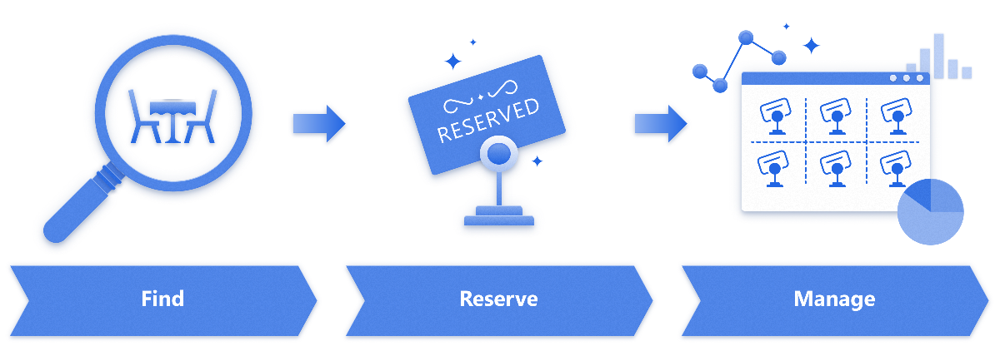
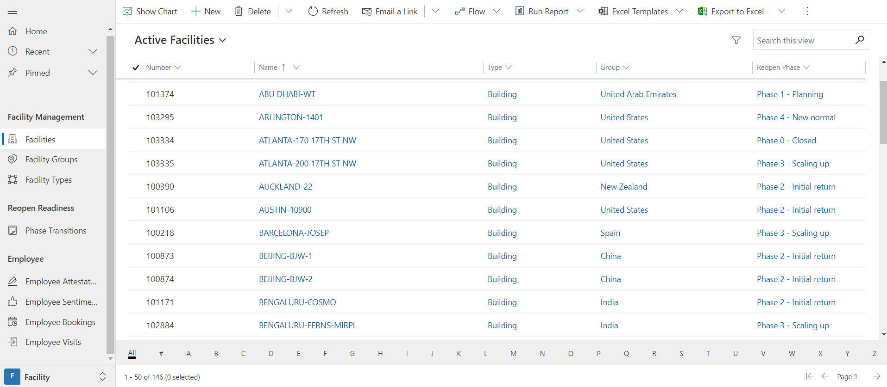
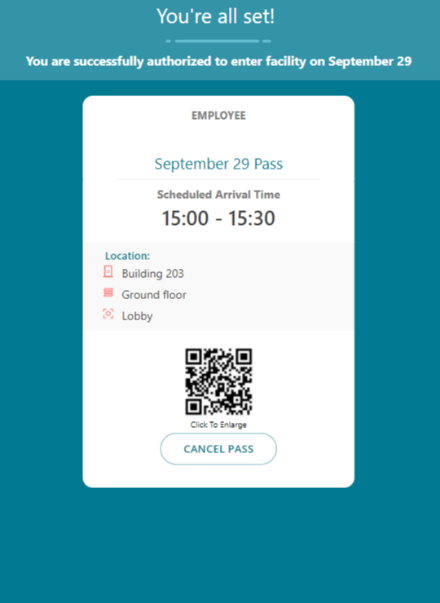
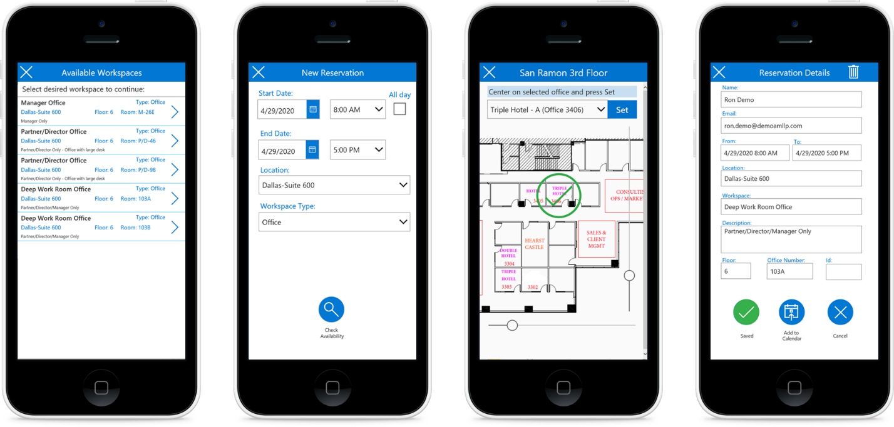
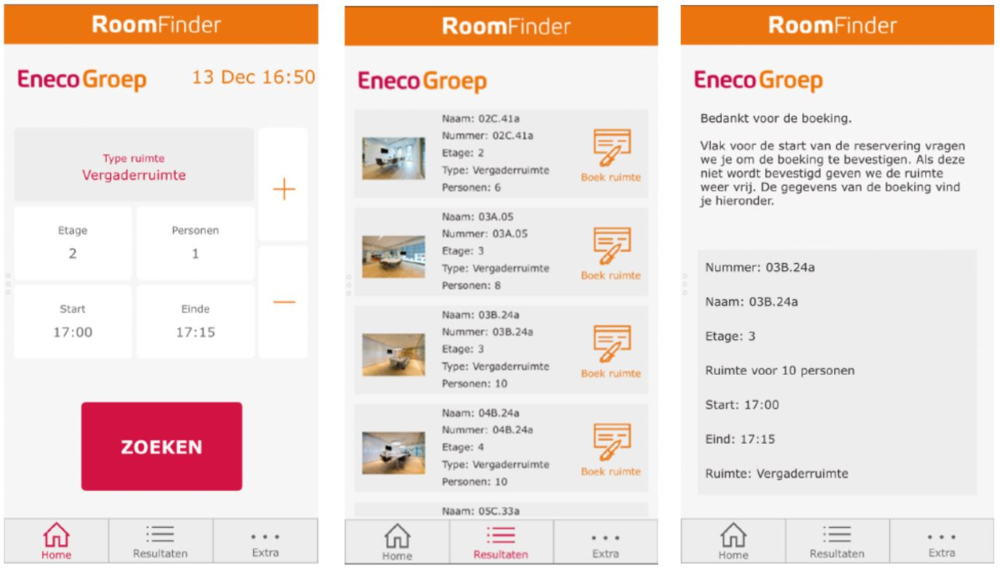
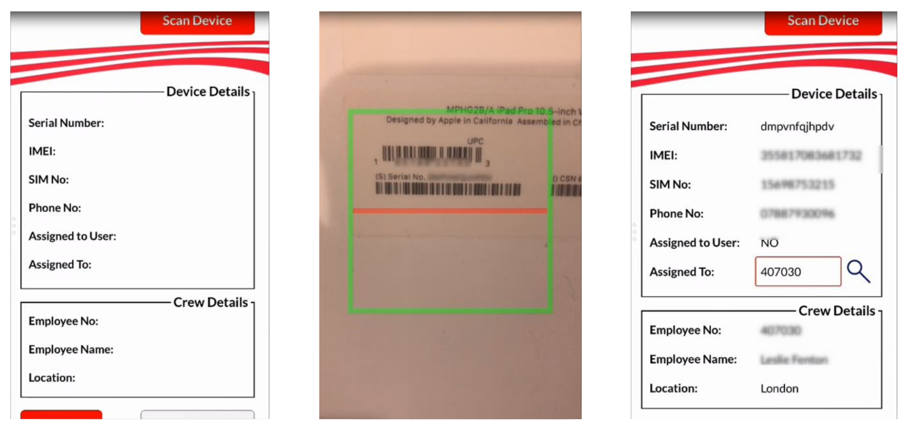

# Pattern: Asset management

<!---->

Power Apps provides a great platform for managing your company's physical
assets.

Whether you just want to know who currently has what gear, or you want to
create a reservation system for limited resources such as workspace or vehicles,
Power Apps can help you create tools that are easy for your employees to use and timely business intelligence to help you track, manage, and analyze patterns in
resource use.

Below are several examples of real-world use cases that showcase organizations
who replaced paper and email-based systems with Power Apps solutions.
Additionally, Microsoft has created some templates you can use to jump-start your
own asset reservation or checkout projects.

## How to recognize the asset check-out pattern

In a typical asset management scenario:

1. An employee finds an available asset (such as a room, vehicle, or gear).

2. They check out the asset right then, or reserve it for a specific time.

3. Management centrally manages and monitors available assets.

## Template: Return to the Workplace solution

[Return to the Workplace Solution documentation](https://docs.microsoft.com/powerapps/sample-apps/return-to-workplace/overview)

Reopen responsibly, monitor intelligently, and protect continuously with
solutions for a safer work environment. Equip facility managers and task force
leaders to make informed decisions to safely reopen locations. Empower employees
to return confidently with self-service tools for working safely and
productively. Help health and safety leaders ensure the care and well-being of
your workforce.

### Main modules of the Return to the Workplace solution

- **Location Readiness dashboard** helps determine the readiness of the
    facilities and efficiently manage their safe reopening.

- **Facility Safety Management** gives facility managers the tools they need
    to manage the reopening and readiness of the facilities.

- **Workplace Care Management** gives health and safety leaders the tools they
    need to actively manage COVID-19 cases, identify hot spots for safety
    improvement, and import data from external systems to support case
    management and manual contact tracing.

- **Employee Return to the Workplace** offers your workforce the self-service
    tool that they need to feel confident about returning and remain productive
    while onsite. They can use Employee Return to the Workplace app to check in
    remotely and self-screen before entering a building.

### Apps for for workspace scheduling

- Facilities managers use the [Facility Safety Management app](https://docs.microsoft.com/powerapps/sample-apps/return-to-workplace/app-for-facility-manager) to set up facilities available for booking and see a dashboard of bookings.

  

- Employees use the [Employee Return to the Workplace app](https://docs.microsoft.com/powerapps/sample-apps/return-to-workplace/app-for-employee) to book a space.

  

### Additional apps and templates

- Available at create.powerapps.com:

  - [Asset Checkout (canvas app or model-driven app)](https://powerusers.microsoft.com/t5/Community-App-Samples/Asset-Checkout-Microsoft-sample/td-p/43221#)

  - [Book a Room (canvas app)](https://make.preview.powerapps.com/environments/839eace6-59ab-4243-97ec-a5b8fcc104e4/search?q=book%20a%20room)

- Community templates: [Booking app templates](https://powerusers.microsoft.com/t5/forums/searchpage/tab/message?filter=location&q=booking&noSynonym=false&location=forum-board:AppFeedbackGallery&collapse_discussion=true)

## How customers are using this pattern

### Armanino Workspace Scheduler app

[Read the whole story.](https://customers.microsoft.com/story/786165-armanino-partner-professional-services-power-apps)

Sometimes it's not how much you have, but how you use it. Armanino—one of the 20
largest independent accounting and business consulting firms in the United
States—is caught between a traditional office model and the need for an
agile workforce. It uses office space for teamwork and client meetings in 16
office locations in 15 major urban centers where it has bases, yet it also
deploys specialized professionals wherever they're needed. The firm wanted to
make sure office space is always available for its highly mobile workforce, but
avoid overspending on underutilized space.

So Armanino created the Workspace Scheduler mobile app by using Power Apps. To do
so, the firm worked with its own dedicated team of Microsoft Dynamics 365 experts—a
longstanding member of the Microsoft AI Inner Circle program and a Gold
Certified Partner.

The mobile app gives every staff member fast, accurate information about what space is available and a reservation capability enhanced with Microsoft Outlook, Office 365 Users, and
SQL Server connectors.

Now every Armanino worker who's willing to share office space can indicate when their
space is free on Workspace Scheduler, and any worker on the road can find and
reserve that space ahead of time.

### Eneco RoomFinder app

[Read the whole story.](https://customers.microsoft.com/story/eneco-power-and-utilities-powerapps)

More than a corporate headquarters building, Eneco World reflects a philosophy
about bringing people together to collaborate and innovate. To improve
productivity and efficiency, Dutch energy supplier Eneco turned to Macaw—a
trusted Microsoft Gold Partner—for help in developing an app that would provide
an easy way for nearly 3,000 employees to find the space they needed to meet and
work together.

Eneco met that challenge with Microsoft Office 365 cloud-based services, using
Power Apps, Power Automate, and Power BI to develop the RoomFinder app that now connects
people and ideas.

#### The challenge

Although Eneco employees benefited from having everyone in the same office, it
soon became difficult to find available conference rooms and quiet workspaces.
Eneco employees were using default room booking functionality in Microsoft
Exchange to book the official meeting rooms at the headquarters building, but
there were also approximately 200 smaller rooms for which employees needed access
on a daily basis. These included quiet rooms for one or two employees to
use for concentration or collaboration, rooms for small meetings, and scrum rooms for project teams.

Until recently, employees would search the 14 floors to find open meeting rooms
and put their names on sheets of paper to reserve them. "It's a big building,"
says Ferry Bouwman, Technical Lead for Office 365 at Eneco. "If I'm on the
second floor, I don't know if there's a room available on the thirteenth floor,
for example." Another challenge was that only rooms on the three floors, which
the company calls Eneco Village, could be reserved for meetings with colleagues
outside of Eneco. Rooms on other floors were set aside for internal meetings,
but they couldn't be reserved.

"In 2017, one department held a Challenge Day to encourage competition to build
an app that might provide a solution, but that became an expensive proposition,"
says van der Burg. "So, they turned to us and said, 'You've got Power Apps.
Maybe you can make something work.'"

#### A custom room finder app

The solution was the result of a collaboration of Microsoft Partner Macaw,
Eneco's Office 365 Competence Center, and end users. Macaw used Microsoft Power
Apps in Office 365 to design a custom app for Eneco and Microsoft Power BI to
support reporting and predictive data analytics.

"We started by charting Eneco's requirements on a whiteboard," says Erik Bouman,
Solution Consultant for Office 365 at Macaw. "By accessing data about available
rooms, we built functions that would provide meeting organizers with a list of
rooms and time slots. It was important that the app be as user-friendly as
possible. Power Apps made the development process quick and easy."

### Virgin Atlantic

[Read the whole story
here](https://powerapps.microsoft.com/blog/virgin-atlantic-drives-agile-wins-for-mobile-workforce-with-the-power-platform/)

Virgin Atlantic needed to hand out iPads to 3000 cabin crew members. A Power
Apps app was created by the IT Asset Management team to scan the barcode of the
iPad and assign it to each crew member. All information was stored in SharePoint
Online and later imported into their Asset Management system. Within six weeks,
90% of the iPads were handed out with the help of this app, significantly
cutting down the time that would have otherwise been spent manually writing down
serial numbers and crew payroll numbers. On some days volunteers were handing
out as many as 250 iPads per day.

