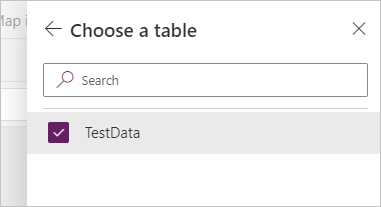
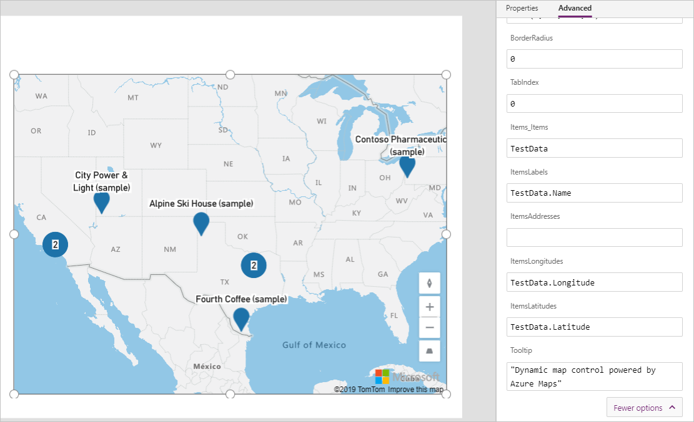
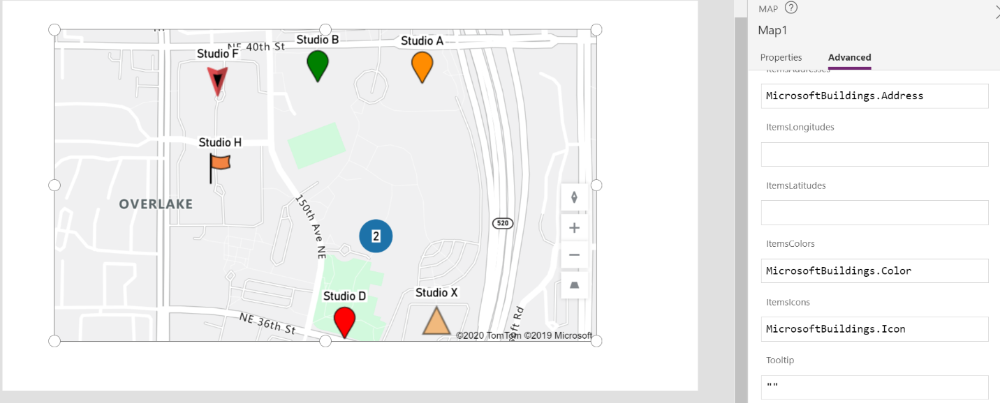
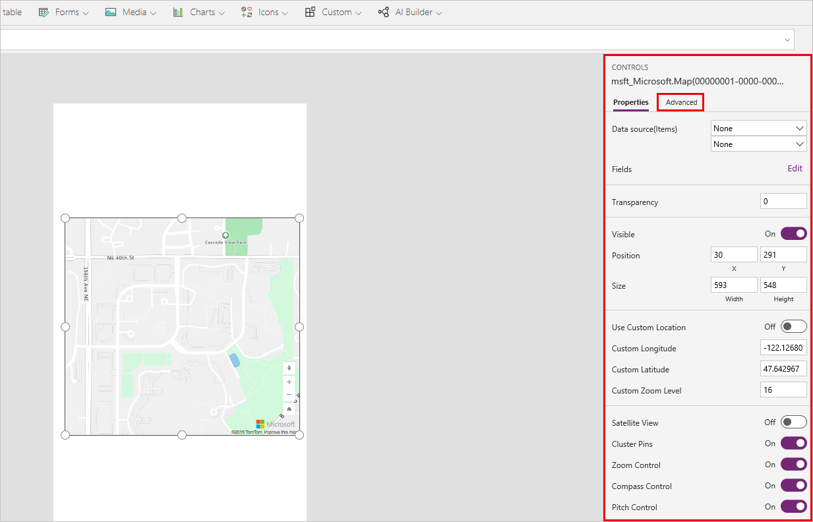

# Interactive map component (Preview)

[!INCLUDE [cc-beta-prerelease-disclaimer.md](../../includes/cc-beta-prerelease-disclaimer.md)]

Easily bring dynamic mapping capabilities into your canvas apps by viewing the physical position of entities from a data source, or by inputting new physical locations.

Pan, tilt, zoom, and drag to center your map view. As you zoom out, the markers will optionally cluster to represent dense groups of data. 

The current location of the user can also be represented on the map on mobile devices or web experiences. 

The map component also supports road and satellite views.

To use the component, you need to [enable geospatial features for the environment](geospatial-overview.md#enable-the-geospatial-features-for-the-environment) in addition to [enabling geospatial features for each app](geospatial-overview.md#enable-the-geospatial-features-for-each-app) that you want to use it in.

Make sure you also [review the prerequisites for using geospatial components](geospatial-overview.md#prerequisites).

## Use the component

Insert the component into your app as you normally would for any other control or component.

With an app open for editing in the [Power Apps studio](https://create.powerapps.com):

1. Open the **Insert** tab.
2. Expand **Media**.
3. Select the component **Map** to place it in the center of the app screen, or drag it to position it anywhere on the screen.
4. (Optional) Select **Allow** in the window that asks to know your location. This enables the component to display the user's current location.

    

You can modify the component by using a number of [properties](#properties).

### Use the map component with data from Excel

You can load a table that contains existing data from an Excel workbook into the map component. The component will then plot each row in your table as a map pin.

Your workbook needs to contain a named table with the following columns that should then be mapped to the associated property in the component's **Advanced** pane.

Column description | Maps to property | Required
-- | -- | --
Label for the pin | ItemsLabels | Required
Longitude of the pin | ItemsLongitudes | Required
Latitude of the pin | ItemsLattitudes | Required
Color of the pin | ItemsColors | Optional
Icon for the pin | ItemsIcons | Optional

You can also use a string to denote the address in ItemsAddresses, in which case ItemsLongitudes and ItemsLatitudes won't work.

The color field accepts any CSS string, as defined in [Color enumeration and ColorFade, ColorValue, and RGBA functions in Power Apps](./functions/function-colors).

You can use the icons described in the [List of image templates](/azure/azure-maps/how-to-use-image-templates-web-sdk#list-of-image-templates) topic as your icon.

The following is an example of an Excel table with the required columns:

:::image type="content" source="media/geospatial/sample-excel.png" alt-text="Sample excel file with a table named TestData and containing Name, Longitude, and Latitude columns":::

You can copy the following sample data to test this functionality:

Name | Longitude | Latitude | Color | Icon
-- | -- | -- | -- | --
Fourth Coffee (sample) | -98.29277 | 26.2774 | Blue | marker-flat
Litware, Inc. (sample) | -96.85572 | 32.55253 | #ffefcd| hexagon-thick
Adventure Works (sample) | -96.99952 | 32.72058 | | car
Fabrikam, Inc. (sample) | -118.30746 | 34.86543 | |
Blue Yonder Airlines (sample) | -118.66184 | 34.17553 | |
City Power & Light (sample) | -113.46184 | 37.15363 | |
Contoso Pharmaceuticals (sample) | -80.26711 | 40.19918 | |
Alpine Ski House (sample) | -102.63908 | 35.20919 | |
A Datum Corporation (sample) | -89.39433 | 40.71025 | |
Coho Winery (sample) | -116.97751 | 32.87466 | |

1. Copy and paste the table into a new Excel workbook.

1. Select one of the cells, and then on the Home tab in the ribbon, select **Format as Table** and choose any style, and then **OK**.

    

1. Select the table, and then go to the **Table Design** tab on the ribbon. Enter a name for the table under **Table Name:**, for example *TestData*.

    

1. Save the workbook.

1. Open or create a new app in Power Apps, and insert the map component.

1. On the **Properties** pane, select the **Locations(Items)** field and then search for *excel* and select **Import from Excel**.

    :::image type="content" source="/media/geospatial/select-excel.png" alt-text=" ":::

1. Locate the Excel workbook and then select **Open**. Select the table that contains the information, **TestData**, and then **Connect**.

    

1. On the **Properties** pane, go to the **Advanced** tab, and select **More options**.

1. Set the following properties:

    - **ItemsLabels** as *TestData.Name*
    - **ItemLatitudes** as *TestData.Latitude*
    - **ItemsLongitudes** as *TestData.Longitude*
    - (Optional) **ItemsColors** as *TestData.Colors*
    - (Optional) **ItemsIcons as *TestData.Icons*

1. The map component will now show each row in the table as a pin, labeled with its *Name* as defined in the Excel table, and using the provided icons and colors. If an icon or color isn't provided, then the component will use the default icon and color.

    

    

>[!TIP]
>You can assign the same custom icon to all pins. For the **ItemsIcons** field in the Advanced Properties pane, enter the icon you want to use. For example, set **ItemsIcons** to *MarkerSquare*.

### Properties

The following properties can be defined and configured in the component's **Properties** pane.

Some properties are only available on the **Advanced** tab in the **Properties** pane, in the **More options** section.

| Property | Description | Type | Location |
| - | - | - | - |
| Data source(Items) | Data source (table) that lists a predefined set of longitudes and latitudes to display as map pin on the map when it's loaded. Map each of the columns in your data by using the *ItemAddresses*, *ItemLongitudes*, *ItemLatitudes*, and *ItemLabels*. | Not applicable | Properties |
| Use default location | Whether the map initializes at a default location set by the user. | Boolean | Properties |
| Default longitude | Longitude the map would go to when it's loaded if **Use default location** is enabled. | Floating point number | Properties |
| Default latitude | Latitude the map would go to when it's loaded if **Use default location** is enabled. | Floating point number | Properties |
| Default zoom level | Zoom level the map would be set to when it's loaded if **Use default location** is enabled. | Integer | Properties |
| Show current location | Whether the map should display the current location of the user (if it has permission). | Boolean | Properties |
| Satellite view | Whether the style of the map is a satellite view or a road view. | Boolean | Properties |
| Cluster pins | Whether the map pins are clustered. | Boolean | Properties |
| Zoom control | Whether the zoom component appears on the map. | Boolean | Properties |
| Compass control | Whether the compass component appears on the map. | Boolean | Properties |
| Pitch control | Whether the pitch component appears on the map. | Boolean | Properties |
| Pin color | The color of the pins. | Color picker | Properties |
| Maximum map pins | Maximum number of pins displayed on the map. | Integer | Properties |
| ItemsLabels | A column in Items with the strings you want to use as labels for the pins. | TableName.ColumnName | Advanced |
| ItemsAddresses | A column in Items with the strings that represent the location of the pins. Doesn't work with **ItemsLongitudes** or **ItemsLatitudes**. | TableName.ColumnName | Advanced |
| ItemsLongitudes | Name of the column in the table in your data source with floating-point numbers that represent the longitude position of the pins. Doesn't work with **ItemsAddresses**. | TableName.ColumnName | Advanced |
| ItemsLatitudes | Name of the column in the table in your data source with floating-point numbers that represent the latitude position of the pins. Doesn't work with **ItemsAddresses**. | TableName.ColumnName | Advanced |
| Items_Items | Name of the table in your data source that contains all the records that you want to plot in the map by using pins. Each row must have an entry for the label, longitude, and latitude for each row. | TableName | Advanced |

### Additional properties

**[BorderColor](./controls/properties-color-border.md)** - The color of a control's border.

**BorderRadius** - The radius of a control's border.

**[BorderStyle](./controls/properties-color-border.md)** - Whether a control's border is **Solid**, **Dashed**, **Dotted**, or **None**.

**[BorderThickness](./controls/properties-color-border.md)** - The thickness of a control's border.

**[Color](./controls/properties-color-border.md)** - The color of text in a control.

**[DisplayMode](./controls/properties-core.md)** - Whether the control allows user input (**Edit**), only displays data (**View**), or is disabled (**Disabled**).

**[Height](./controls/properties-size-location.md)** - The distance between a control's top and bottom edges.

**[TabIndex](./controls/properties-accessibility.md)** - Keyboard navigation order.

**[Tooltip](./controls/properties-core.md)** - Explanatory text that appears when the user hovers over a control.

**Transparency** - How transparent the component is, as a percentage.

**[Visible](./controls/properties-core.md)** - Whether a control appears or is hidden.

**[Width](./controls/properties-size-location.md)** - The distance between a control's leftmost and rightmost edges.

**[X](./controls/properties-size-location.md)** - The distance between the leftmost edge of a control and the leftmost edge of its parent container (or screen, if it has no parent container).

**[Y](./controls/properties-size-location.md)** - The distance between the top edge of a control and the top edge of its parent container (or screen, if it has no parent container).

## Other geospatial components

To see dynamic address suggestions as you type, use the **[Address input](geospatial-component-input-address.md)** component.
