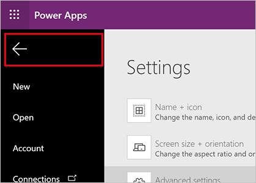

# Add mixed reality components to your canvas app (Preview)

[!INCLUDE [cc-beta-prerelease-disclaimer.md](../../includes/cc-beta-prerelease-disclaimer.md)]

You can add a number of mixed reality (MR) components to your canvas app to support multiple 3D and MR scenarios.

Components are groups of controls that can answer the need for a specific scenario. For example, you can use these MR components to:

- View and manipulate 3D content.
- Overlay 3D content and 2D images onto the feed from the camera.
- Measure distance, area, and volume using your device with MR.
- Identify spaces in the real world through an MR overlay.

mixed-reality-overview.png

:::image type="content" source="/media/augmented-overview/mixed-reality-overview.png" alt-text="A photo showing the Power Apps editor portal with the view in 3D component next to the app on a mobile device.":::

You can read more about components and how to build your own in [Power Apps component framework docs](/powerapps/developer/component-framework/custom-controls-overview).

The following prebuilt components can be used for MR scenarios:

- [View in 3D](mixed-reality-component-view-3d.md)
- [View in mixed reality](mixed-reality-component-view-mr.md)
- [Measure in mixed reality](mixed-reality-component-measure-distance.md)
- [View shape in mixed reality](mixed-reality-component-view-shape.md)

## Prerequisites

1. [You'll need an MR-capable device](#mixed-reality-capable-devices).
2. [Enable the MR features for each app](#enable-the-mixed-reality-features-for-each-app).

### Mixed-reality capable devices

To use the components in an app created with Power Apps, the device that runs the app (such as a phone or tablet) needs to have specific hardware and software. The device you use to create the app in the Power Apps studio (such as your PC) does not need to be MR-capable.

#### For Android devices

For Android devices, this means you'll need to have the ARCore services installed. ARCore is usually installed automatically as part of the default set of apps and services on your device if it supports MR. The services are referred to as Google Play Services for AR. If necessary, you can download [Google Play Services for AR from the Google Play Store](https://play.google.com/store/apps/details?id=com.google.ar.core).

For more details on ARCore and supported devices, see the [list of supported devices on the Google ARCore support site](https://developers.google.com/ar/discover/supported-devices#android_play).

For devices in China, the experience is a little different as you'll need to [download ARCore from specific, supported app stores in China](https://developers.google.com/ar/discover/supported-devices#android_china).  

#### For iOS (Apple) devices

For iOS devices, MR is supported on specific hardware with ARKit. See the [list of iOS devices supported for MR at the bottom of the Apple augmented reality website](https://www.apple.com/augmented-reality/).

### Enable the mixed reality features for each app

For each app you create, you need to enable the MR features. This should be enabled by default, but if it isn't or you've turned it off, you can enable the features as follows:

1. Open the app for editing in Power Apps Studio at [https://create.powerapps.com](https://preview.create.powerapps.com).

2. Select **File** from the top menu.

    

3. Go to the **Settings** tab, select **Advanced settings**, and scroll down to find the **Mixed reality features** option. Set the option to **On**.

    

4. Return to editing your app by selecting the back arrow icon.

    

5. Open the **Insert** pane to see the MR components under **Media** and **Mixed Reality**.

    

## Next steps

Start installing the components in your apps:

- View 3D content with the **[View in 3D](mixed-reality-component-view-3d.md)** component.
- View images and 3D content in the real world with the **[View in mixed reality](mixed-reality-component-view-mr.md)** component.
- Measure distance, area, and volume with the **[Measure in mixed reality](mixed-reality-component-measure-distance.md)** component.
- Create and view predefined 3D shapes with the **[View shape in mixed reality](mixed-reality-component-view-shape.md)** component.
