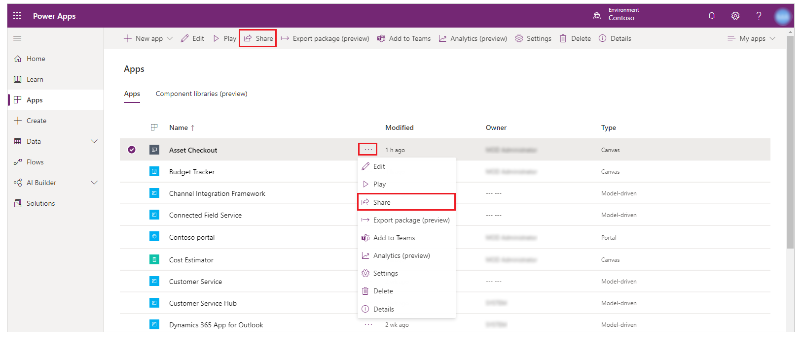
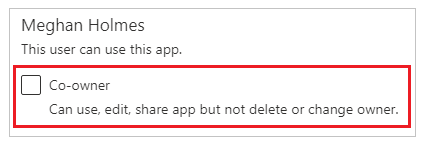
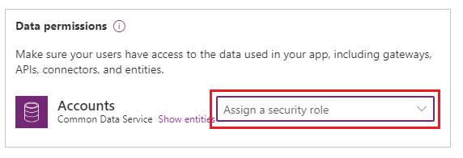
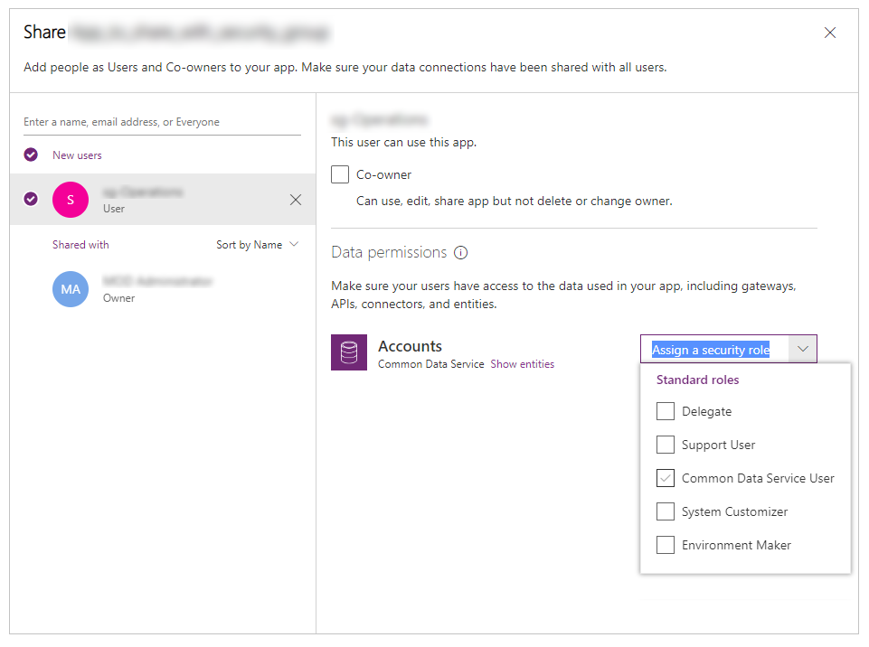

# Share a canvas app in Power Apps

After you build a canvas app that addresses a business need, specify which users in your organization can run the app and which can modify and even reshare it. Specify each user by name, or specify a security group in Microsoft Azure Active Directory. If everyone would benefit from your app, specify that your entire organization can run it.

> [!IMPORTANT]
> For a shared app to function as you expect, you must also manage permissions for the data source or sources on which the app is based, such as [Microsoft Dataverse](#dataverse) or [Excel](share-app-data.md). You might also need to share [other resources](share-app-resources.md) on which the app depends, such as flows, gateways, or connections.

## Prerequisites

Before you share an app, you must [save it to the cloud](save-publish-app.md#save-changes-to-an-app) (not locally) and then [publish](save-publish-app.md#publish-an-app) the app.

- Give your app a meaningful name and a clear description, so that people know what your app does and they can easily find it in a list. On the **File** menu in Power Apps Studio, select **App settings**, specify a name, and then type or paste a description.

- Whenever you make changes, you must save and publish the app again if you want others to see those changes.

## Share an app

1. Sign in to [Power Apps](https://make.powerapps.com).

1. Select **Apps** from the left pane.

    

1. Select the app that you want to share by selecting its icon.

    

1. Select **Share** from the top menu. You can also select **More Commands** (**...**) and then select **Share** from the drop-down menu:

    

1. Specify by name or alias the users or security groups in Azure Active Directory with which you want to share the app.

    - To allow your entire organization to run the app (but not modify or share it), type **Everyone** in the sharing panel.

        

    - You can share an app with a list of aliases, friendly names, or a combination of those (for example, **Meghan Holmes &lt;meghan.holmes@contoso.com>**) if the items are separated by semi-colons. If more than one person has the same name but different aliases, the first person found will be added to the list. A tooltip appears if a name or alias already has permission or can't be resolved.

        

    > [!NOTE]
    > You can't share an app with a distribution group in your organization or with a group outside your organization.

1. If you want to allow the users to edit and share the app, select the **Co-owner** check box.

    

    You can't grant **Co-owner** permission to a security group if you [created the app from within a solution](add-app-solution.md).

    > [!NOTE]
    > Regardless of permissions, no two people can edit an app at the same time. If one person opens the app for editing, other people can run it but not edit it.

1. If your app connects to data for which users need access permissions, specify them.

    For example, your app might connect to an entity in a Dataverse database. When you share such an app, the sharing panel prompts you to manage security for that entity.

    

    For more information about managing security for an entity, go to [Manage entity permissions](share-app.md#manage-entity-permissions).

    If your app uses connection to other data sources such as an Excel file hosted on OneDrive for Business, ensure you share such data source with users that you share app with.

    

    For more information about sharing canvas app resources and connections, go to [share canvas app resources](share-app-resources.md).

1. If you want to help people find your app, select the **Send an email invitation to new users** check box.

    

1. At the bottom of the share panel, select **Share**.

    Users can now run the app using Power Apps Mobile on a mobile device. Or, from AppSource on [Dynamics 365](https://home.dynamics.com) in a browser. Co-owners can edit and share the app in [Power Apps](https://make.powerapps.com?utm_source=padocs&utm_medium=linkinadoc&utm_campaign=referralsfromdoc).

    If you sent an email invitation, users can also run the app by selecting the link in the invitation email.

    - If a user selects the link on a mobile device, the app opens in Power Apps Mobile.
    - If a user selects the link on a desktop computer, the app opens in a browser.

    Co-owners who receive an invitation get another link that opens the app for editing in Power Apps Studio.

To change permissions for a user or a security group:

- To allow co-owners to run the app but no longer edit or share it, clear the **Co-owner** check box.
- To stop sharing the app with that user or group, select the Remove (x) icon.

## Security-group considerations

- All existing members of the security group inherit the app permissions. New users joining the security group will inherit the security group permissions on the app. Users leaving the group will no longer have access through that group. Users may continue to have permissions either directly, or through membership of another security group.

- Every member of a security group has the same permission for an app as the overall group does. However, you can specify greater permissions for one or more members of that group to allow them greater access. For example, you can give Security Group A permission to run an app. And then, you can also give User B, who belongs to that group, **Co-owner** permission. Every member of the security group can run the app, but only User B can edit it. If you give Security Group A **Co-owner** permission and User B permission to run the app, that user can still edit the app.

### Share an app with Microsoft 365 Groups

You can share an app with [Microsoft 365 groups](https://docs.microsoft.com/microsoft-365/admin/create-groups/compare-groups). However, the group must be security enabled. Enabling security ensures the Microsoft 365 group can receive security tokens for authentication to access apps or resources.

Follow these steps to check if an Microsoft 365 group has security enabled:

1. Ensure you have access to the [Azure AD cmdlets](https://docs.microsoft.com/azure/active-directory/users-groups-roles/groups-settings-v2-cmdlets).

1. Go to [Azure portal](https://portal.azure.com/) \> Azure Active
    Directory \> Groups \> Select the appropriate group \> Copy the Object Id.

1. [Connect to Azure AD](https://docs.microsoft.com/powershell/module/azuread/connect-azuread) using PowerShell:

    

1. Get the [group details](https://docs.microsoft.com/powershell/module/AzureAD/Get-AzureADGroup) using ```Get-AzureADGroup -ObjectId <ObjectID\> |
    select *```. <br> In the output, ensure the property **SecurityEnabled** is set to **True**:

    

If the group isn't security enabled, you can enable it using PowerShell cmdlet [Set-AzureADGroup](https://docs.microsoft.com/powershell/module/AzureAD/Set-AzureADGroup) by setting the **SecurityEnabled** property to **True**: 

```Set-AzureADGroup -ObjectId <ObjectID> -SecurityEnabled $True```


> [!NOTE]
> You must be the owner of the Microsoft 365 group to enable security.
> Setting SecurityEnabled property to *true* does not affect how Power Apps and Microsoft 365 features work. This command is required as SecurityEnabled property is set to *false* by default when creating Microsoft 365 Groups outside of Azure AD.

After a while, you can discover this group in the Power Apps sharing panel and share apps with this group.

## Manage entity permissions

### Dataverse

If you create an app based on Dataverse, you must also ensure that the users that you share the app with have the appropriate permissions for the entity or entities used by the app. Particularly, those users must belong to a security role that can do tasks such as creating, reading, writing, and deleting relevant records. In many cases, you'll want to create one or more custom security roles with the exact permissions that users need to run the app. You can then assign a role to each user as appropriate.

> [!NOTE]
> - You can assign security roles to individual users and security groups in Azure AD but not to Office groups.
> - The user must also be in the Dataverse root business unit. If the user is not in the root business unit, you can share the app without providing a security role, and then set the security role directly.

#### Prerequisite

To assign a role, you must have **System administrator** permissions for a Dataverse database.

#### Assign a security group in Azure AD to a role

1. In the sharing panel, select **Assign a security role** under **Data permissions**.

1. Select the Dataverse role(s) that you want to apply to the selected Azure AD user(s) or group(s):

     

### Dataverse (previous version)

When you share an app that's based on an older version of Dataverse, you must share the runtime permission to the service separately. If you don’t have permission to do this, see your environment administrator.

## Next steps

[Share a canvas app with guest users](share-app-guests.md)

### See also

- [Edit an app](edit-app.md)
- [Restore an app to a previous version](restore-an-app.md)
- [Export and import an app](export-import-app.md)
- [Delete an app](delete-app.md)
