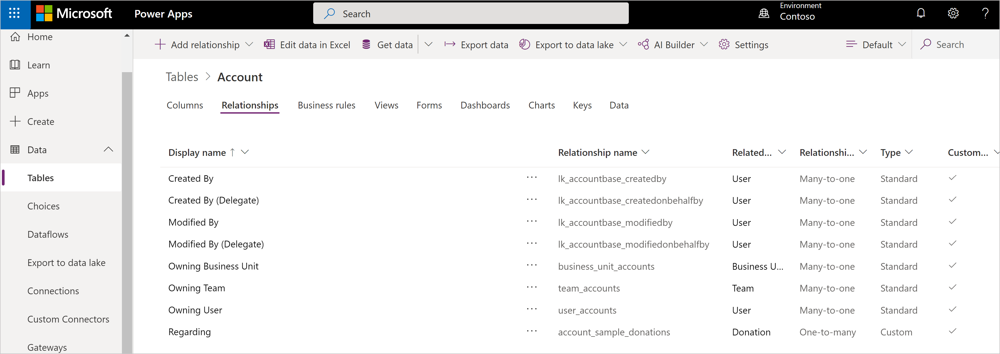
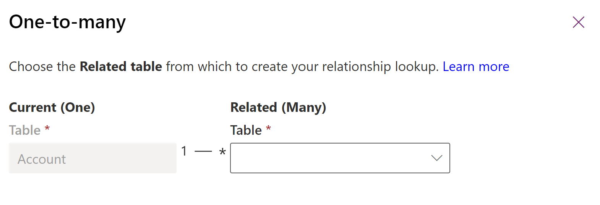
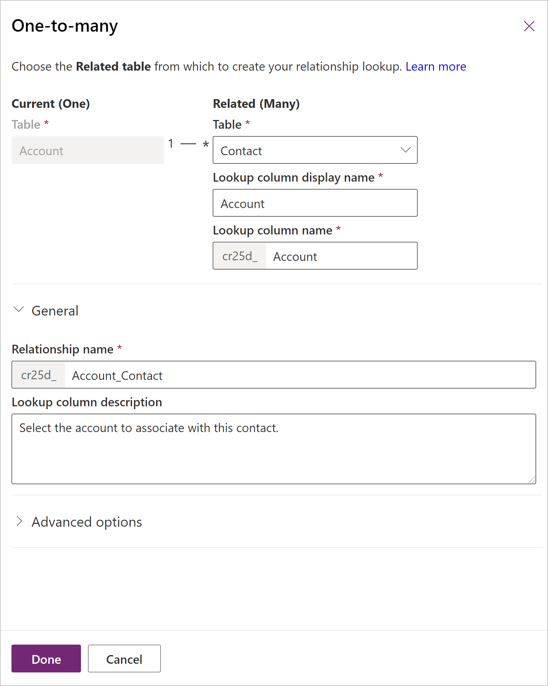

# Create and edit One-to-many or Many-to-one table relationships using Power Apps portal

[!INCLUDE[cc-data-platform-banner](../../includes/cc-data-platform-banner.md)]

The [Power Apps portal](https://make.powerapps.com/?utm_source=padocs&utm_medium=linkinadoc&utm_campaign=referralsfromdoc) provides an easy way to create and edit 1:N (one-to-many) or N:1 (many-to-one) relationships for  Common Data Service.

The portal enables configuring the most common options, but certain options can only be set using solution explorer. More information: 
- [Create and edit 1:N (one-to-many) or N:1 (many-to-one) relationships](create-edit-1n-relationships.md)
- [Create and edit 1:N (one-to-many) or N:1 (many-to-one) table relationships using solution explorer](create-edit-1n-relationships-solution-explorer.md).

## View table relationships

1. From the [Power Apps portal](https://make.powerapps.com/?utm_source=padocs&utm_medium=linkinadoc&utm_campaign=referralsfromdoc), select either **Model-driven** or **Canvas** design mode.
2. Select **Data** > **tables** and select the table that has the relationships you want to view.
3. With the **Relationships** tab selected, you can select the following views: 

 |View|Description|
 |--|--|
 |**All**| Shows all the relationships for the table|
 |**Custom**|Shows only custom relationships for the table|
 |**Default**|Shows only the standard relationships for the table|

## Create relationships

While [viewing table relationships](#view-table-relationships), in the command bar, select **Add relationship** and choose either **Many-to-one** or **One-to-many**.

> [!NOTE]
> For information about **Many-to-many** relationships see [Create N:N (many-to-many) relationships](create-edit-nn-relationships.md)

> [!Important]
> The portal uses different terminology than solution explorer. The solution explorer **Primary table** is the **Current table** in the portal.

Depending on your choice you will see either:

|Type|Panel|
|--|--|
|**Many-to-one**||
|**One-to-many**||

Choose the **Related table** for the relationship you want to create between the two tables. 

> [!NOTE]
> With either choice, a lookup column will be created on the *current* table.

Once you select the table you can edit the details of the relationship. In this example, multiple contact table records can be associated with a single account.

> [!div class="mx-imgBorder"] 
> 

You can edit the default values provided before you save. Select **More options** to view the **Relationship name** and **Lookup column description** values

|Field|Description|
|--|--|
|**Lookup column display name**|The localizable text for the lookup column that will be created on the related table. This can be edited later.|
|**Lookup column name**|The name for the Lookup column that will be created on the related table.|
|**Relationship name**|The name for the relationship that will be created.|
|**Lookup column description**|The description for the lookup column. In model-driven apps this will appear as a tooltip when people hover their mouse over the column.  This can be edited later.|

You can continue editing the table. Select **Save table** to create the relationship you have configured.

## Edit relationships

While [viewing table relationships](#view-table-relationships), select the relationship you want to edit.

> [!NOTE]
> Each relationship can be found within the primary table or the related table as a **Many-to-one** or **One-to-many** relationship. Although it can be edited in either place, it is the same relationship.
>
> The publisher of a managed solution can prevent some customizations of relationships that are part of their solution.

The only columns you can edit are **Lookup column display name** and **Lookup column description**. These can also be edited in the properties of the lookup column in the related table. More information: [Edit a column](create-edit-column-portal.md#edit-a-column)

## Delete relationships

While [viewing table relationships](#view-table-relationships), select the relationship you want to delete.

You can use the **Delete relationship** command from the command bar or from the row context menu when you click the ellipses (**...**).

Deleting the relationship will delete the lookup column on the related table.

> [!NOTE]
> You will not be able to delete a relationship that has dependencies. For example, if you have added the lookup column to a form for the related table, you must remove the column from the form before you delete the relationship.

### See also

[Create and edit relationships between tables](create-edit-table-relationships.md) 
[Create and edit 1:N (one-to-many) or N:1 (many-to-one) relationships](create-edit-1n-relationships.md) 
[Create and edit 1:N (one-to-many) or N:1 (many-to-one) table relationships using solution explorer](create-edit-1n-relationships-solution-explorer.md) 
[Edit a column](create-edit-column-portal.md#edit-a-column)
