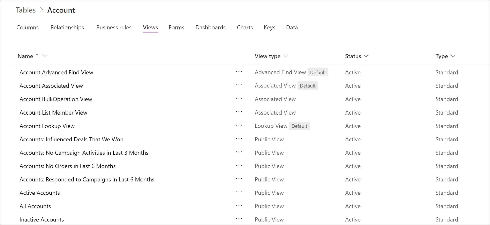
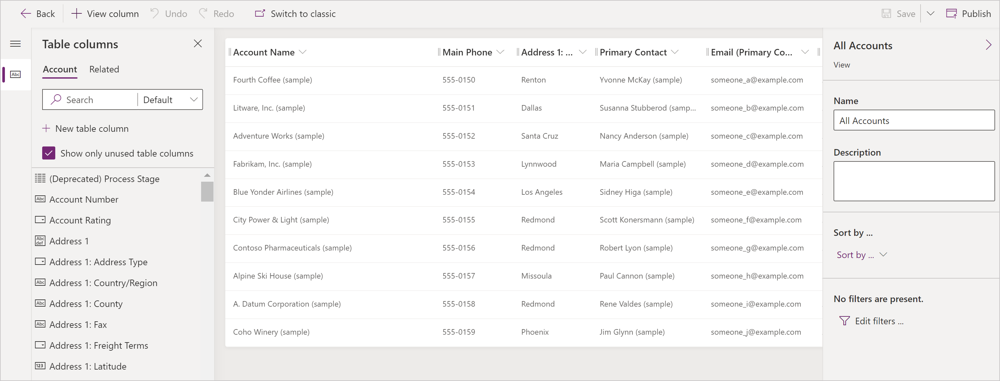

# Access a model-driven app view definition in Power Apps

 In this topic you open a view definition to display properties and options to configure the view. There are several ways you can access view definitions in Power Apps. 
  
  
## Open a view for editing in the latest view designer

> [!IMPORTANT]
> The latest version of the view designer is currently in preview. Some features like advanced filtering, custom controls, and column properties are not yet supported. To accomplish these tasks, [Open a view for editing in solution explorer](#open-a-view-for-editing-in-solution-explorer).

1.  Sign in to [Power Apps](https://make.powerapps.com/?utm_source=padocs&utm_medium=linkinadoc&utm_campaign=referralsfromdoc).  

2.  Expand **Data**, select **Tables**, and then select the table that you want, such as the **Account** table.   

3. Select the **Views** tab.

    > [!div class="mx-imgBorder"] 
    > 

4. Select the view you want to open, such as the account table **All Accounts** view.

    > [!div class="mx-imgBorder"] 
    > 

5. From the view editor you can perform several tasks: 
 
- [Sort rows in a view](configure-sorting.md)
- [Choose and configure columns in views](choose-and-configure-columns.md)

## Open a view for editing from a legacy web app
On any list view for a table in a legacy web app, on the command bar you will find the following commands after you select the ellipsis (...) button:  

- **View**: Opens the definition of the current view in the default solution.  
  
- **New System View**: Opens a new window to create a new view for the current table in the default solution.  
  
- **Customize Table**: Takes you to the definition of the current table in the default solution where you can then select **Views**.  
  
- **System Views**: Opens the same window as **Customize Table**, except with **Views** selected.  

   

## Open a view for editing in solution explorer 
1.  Open [solution explorer](advanced-navigation.md#solution-explorer).  
  
2.  Under **Components**, expand **Tables**, and then expand the table you want.  
  
3.  Select **Views**.  
  
4.  Double-click the view you want to open. This will open the classic view designer.
    
    > [!div class="mx-imgBorder"] 
    > 

 This list of views has four filters you can use to find the views you want more easily:  
  
- **All Active Views**  

- **Active Public Views**  

- **Inactive Public Views**  

- **Active System-Defined Views**  
  
 If the table that the view is associated with is part of an unmanaged solution, you can still create or edit views for that table in the default solution. System views are associated with a table and are not available as separate solution components. Unlike columns, views do not use a customization prefix in a unique name that should be consistent in a solution, so you do not need to create views in the context of a solution. 
 
## Next steps
[Understand views](create-edit-views.md)

