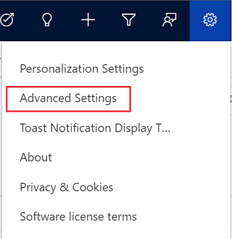
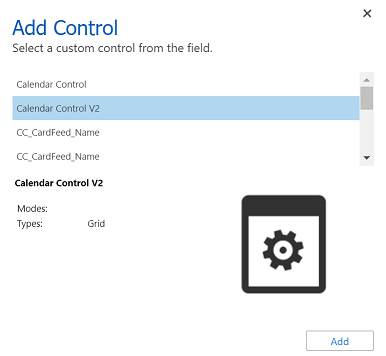
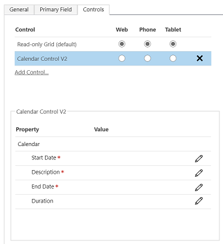
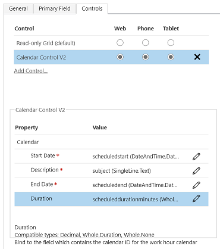

# Add the calendar control to entities

The **Calendar Control V2** control displays scheduled activities and their associated details in a calendar. You can view, create, and delete your activities in a day, week, or month view. You must be a system customizer or a system administrator to add the **Calendar Control V2** control.

**To add the control**

1.  In your app, select the **Settings** icon, and then select **Advanced Settings**.

    > [!div class="mx-imgBorder"]
    >  

    The **Business Management** page opens in a new browser tab.

2.  On the navigation bar, select **Settings**, and then under **Customization**, select **Customizations**.

3.  Select **Customize the System**.

4.  Under **Components** in the solution explorer, expand **Tables**, and then select an table. For example, **Activity**.

5.  On the **Controls** tab, select **Add Control**.

    > [!div class="mx-imgBorder"]
    >  

6.  In the **Add Control** dialog box, select **Calendar Control V2**, and then select **Add**.

    > [!div class="mx-imgBorder"]
    > 

7.  The calendar control is added to the list of controls.

    > [!div class="mx-imgBorder"]
    > 

8.  **Read-only grid** is the default option, so when users select a table from the site map, they'll see a read-only grid of opportunities. To make the calendar view the default view instead, select the corresponding **Calendar Control V2** option buttons.

9.  Select the edit icon for each of the mandatory columns, and then select the binding values.

    > [!div class="mx-imgBorder"]
    > 

10. Select **Save** to save your changes.

11. To publish the changes you've made, select **Publish**.

### See also

[Work with rows in the new calendar view](../../user/calendar-view.md)
