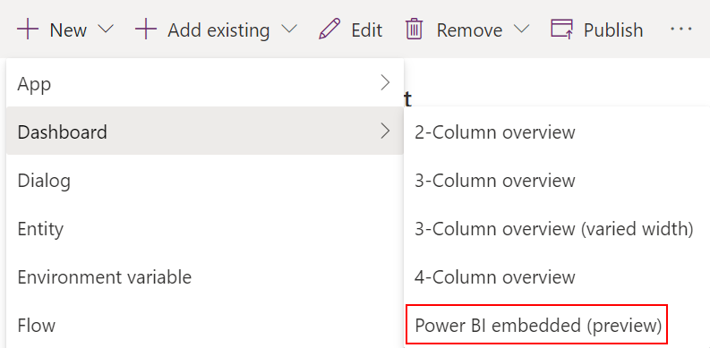

# Create or edit model-driven app Power BI embedded page (preview)

[!INCLUDE [cc-beta-prerelease-disclaimer](../../includes/cc-beta-prerelease-disclaimer.md)]

This topic will outline the setup of a system dashboard referencing a Power BI report or dashboard.  A new option has been added to the solution New > Dashboard menu called **Power BI embedded (preview)**.

To learn more about Power BI reports and dashboards, open <a href="https://docs.microsoft.com/power-bi/create-reports/">Create Power BI Reports</a>. 

> [!IMPORTANT]
> - This is a preview feature, and isn't available in all regions.
> - [!INCLUDE[cc_preview_features_definition](../../includes/cc-preview-features-definition.md)]

## Create system dashboard with Power BI embedded

This examples sets up a Power BI embedded page for a single environment with one workspace.  The next example would need to be used with Environment Variables for managed solution ALM which has a different workspace for prod.

1. Create or edit a solution in <a href="https://make.powerapps.com">make.powerapps.com</a>

1. Click **New** > **Dashboards** > **Power BI embedded**

    > [!div class="mx-imgBorder"] 
    > 

1. New Power BI embedded dialog appears

    > [!div class="mx-imgBorder"] 
    > 

1. Enter name for the dashboard which will be shown to the user in the selector on the **Dashboards** page

1. Select the Power BI type of Report or Dashboard

1. Select a Power BI workspace then select a Power BI report/dashboard

1. Click Create to save and publish the system dashboard

<!-- Reference this section for "Use environment variable" Learn more link -->
## Create Power BI embedded page with an Environment Variable

When a solution with a Power BI embedded component will be moved to other environments turning on "Use environment variable" allows configuring the dashboard.  Each environment can specify the workspace and either dashboard or report to reference.  This allows configuration without unmanaged customizations.

1. Create or edit an existing Power BI embedded dashboard

1. Select "Use environment variable"

    > [!div class="mx-imgBorder"] 
    > 

1. Open "Power BI environment variable" selector and click **New environment variable**

    > [!div class="mx-imgBorder"] 
    > 

1. Nested panel will open to allow creating the environment variable and will default the Display Name and Name based on the dashboard

1. 

## Related

* [Create or edit model-driven app dashboards](create-edit-dashboards.md)

* [View entity data in Power BI Desktop](../common-data-service/view-entity-data-power-bi.md)
