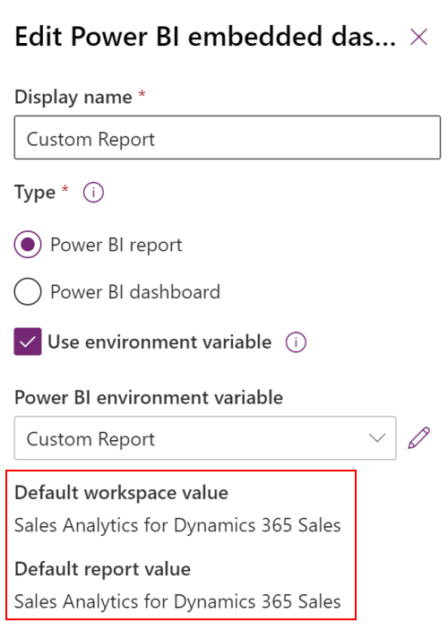

# Create or edit a Power BI embedded system dashboard (Preview)

[!INCLUDE [cc-beta-prerelease-disclaimer](../../includes/cc-beta-prerelease-disclaimer.md)]

This article explains how to set up and use a system dashboard that references a Power BI report or dashboard in a model-driven app. System administrators and system customizers can create system reports and dashboards, which can be made available to model-driven app users.  Users need to have the relevant Power BI license and authorization to consume content.  Read more about relevant Power BI licenses at [Power BI pricing](https://powerbi.microsoft.com/en-us/pricing/).

To learn more about Power BI reports and dashboards, see [Create reports and dashboards in Power BI](https://docs.microsoft.com/power-bi/create-reports/).

> [!IMPORTANT]
> [!INCLUDE[cc_preview_features_definition](../../includes/cc-preview-features-definition.md)]

> [!NOTE]
> Power BI embedded in a system dashboard or form ignores the Power Platform admin center **Power BI visualization embedding** environment setting. That setting controls whether end users can add embedded Power BI reports to personal views, charts, and dashboards.

## Create a system dashboard with Power BI embedded

This procedure shows you how to set up a Power BI embedded page for a single environment connected to a Power BI workspace. 

1. Go to the **Solutions** area in <a href="https://make.powerapps.com">make.powerapps.com</a>, and then create or open an existing solution. 

2. Select **New** > **Dashboards** > **Power BI embedded**.

3. Enter the following information in the **New Power BI embedded** dialog that appears:
   - Enter a **Display name** for the dashboard, which will be shown to the user in the selector on the **Dashboards** page.
   - Select the type, either **Power BI report** or **Power BI dashboard**.
   - Select a **Power BI workspace**.
   - Select a Power BI report or dashboard.

    > [!div class="mx-imgBorder"] 
    > 

4. Select **Save** to save and publish the system dashboard.

## Add a Power BI embedded page to a model-driven app

1. Create or edit an existing model-driven app using the app designer.

2. Select the **Dashboards** subarea on the app designer canvas. 

3. On the dashboards property pane, there is a **Power BI embedded page** category. Clear **All** to select specific dashboards. Optionally, the Power BI embedded page can be set as the default dashboard in the site map.

    > [!div class="mx-imgBorder"] 
    > 

4. Open **Site map** from the app designer, then select the existing **Dashboards** subarea or insert one.

5. Open the **Default Dashboard** property and then select the Power BI embedded dashboard name.

    > [!div class="mx-imgBorder"] 
    > 

6. Select **Save**. To make your changes available to users, select **Publish**.

## Select the Power BI embedded page in the model-driven app

1. Play the model-driven app, and then select a dashboard from the left navigation pane.

2. Open the dashboard selector and select the Power BI embedded page.

## Create Power BI embedded page with an environment variable

When a solution with a Power BI embedded component will be moved to other environments, you can turn on **Use environment variable** to configure the dashboard. For each environment, you specify the workspace and either a dashboard or report to reference. Environment variables allow configuration without unmanaged customizations.

1. Create or edit an existing Power BI embedded system dashboard.

2. Select **Use environment variable**.

    > [!div class="mx-imgBorder"] 
    > 

3. Open the **Power BI environment variable** selector and then select **New environment variable**.

    > [!div class="mx-imgBorder"] 
    > 

    A nested panel opens where you create the environment variable. The environment variable properties are automatically filled using the dashboard **Display Name** and **Name**.

    You can configure the workspace and report or dashboard. The values are stored as JSON. More information: [Environment variables overview](../common-data-service/environmentvariables.md)

    > [!div class="mx-imgBorder"] 
    > 

4. Save the environment variable. The default and current values for workspace and report or dashboard are displayed.

    > [!div class="mx-imgBorder"] 
    > 

### See also

[Create or edit model-driven app dashboards](create-edit-dashboards.md)  
[View table data in Power BI Desktop](../common-data-service/view-entity-data-power-bi.md)  
[Use Power BI](use-power-bi.md)  
[Use Power BI with Microsoft Dataverse](../common-data-service/use-powerbi-with-cds.md)  
[Create a Power BI report using the Common Data Service connector](../common-data-service/data-platform-powerbi-connector.md)
