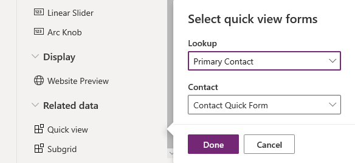

# Create a model-driven app quick view form to view information about a related table

In this topic you learn how to create a quick view form and how to add a quick view control to a main form. 

A quick view form can be added to another form as a quick view control. It provides a template to view information about a related table record within a form for another table record. This means your app users do not need to navigate to a different record to see the information needed to do their work.  
  
 Quick view controls are associated with a lookup column that is included in a form. If the lookup column value is not set, the quick view control will not be visible. Data in quick view controls cannot be edited and quick view forms do not support form scripts.  
  
 Because quick view forms are viewed using a quick view control in a form, they do not include header, footer, or navigation areas. Security roles cannot be assigned to quick view forms and they cannot be activated or deactivated.  
  
   
## Create a quick view form  
 You create quick view forms using the form editor in a manner similar to the way you create other forms. Quick view forms are read-only. Use them to create forms that are for reading purposes only.  
  
1. Sign in to [Power Apps](https://make.powerapps.com/?utm_source=padocs&utm_medium=linkinadoc&utm_campaign=referralsfromdoc).  

2. Expand **Data**, select **Tables**, select the table that you want, and then select the **Forms** tab. 
  
3. On the toolbar, select **Add form** > **Quick View Form**.  
  
5. In the **Form** panel, enter a **Display Name** and **Description** to differentiate this quick view form from any others.  
  
6. In the form designer drag any columns from the **Fields Explorer** into the section on the form.

    > [!IMPORTANT]
    > Required columns cannot be removed from a form. If you add a Required column to the form and want to remove it, you have to delete the form and then recreate it. When you set the Required property for a column, a record can't be saved without data in this column.

7. To save the form select **Save**.  

8. Select **Publish** to see the new form in the application. <!-- Which app? What does Publish do?-->
  
   
## Edit a quick view form  
 Quick view forms have a simplified layout because they are designed to be viewed within a form section. Only one single column tab is available. You can add only additional single column sections, columns, subgrids, and spacers.   
  
  > [!IMPORTANT]
  > Required columns cannot be deleted. If you add a Required column to the form, you cannot delete it. If you do not want the column in the form you have to delete the form and then recreate it.
  
 When you edit a quick view form, you must publish your changes before they will be visible in the application.  
  
   
## Add a quick view control to a main form  
 Quick view forms can only be added to a main form where a lookup column exists that targets the table of the quick view form.  
  
1.  Sign in to [Power Apps](https://make.powerapps.com/?utm_source=padocs&utm_medium=linkinadoc&utm_campaign=referralsfromdoc).  

2.  Expand **Data**, select **Tables**, select the table that you want, and then select the **Forms** tab.  

3. Select a form, which **Type** is **Main**.

4. In the form designer, from the Components pane, select **Quick view**.  
  
5.  In the **Select quick view forms** dialog box, select the **Lookup** column, and then select the Lookup column value. More information: [Quick view control properties](quick-view-control-properties-legacy.md).  

    > [!div class="mx-imgBorder"] 
    > 

6.  Select **Done** to close the **Select quick View forms** dialog box. The quick view form appears on the form.

7.  To save the form select **Save**.  

    > [!IMPORTANT]
    > Be aware of the behavior that occurs when you create a parent relationship with the same table. For example, if Account has a relationship to Account and you create a lookup that is used by a quick create form that creates a parent record, the first record will not be saved with the lookup that has the parent record value. This is because of the circular reference introduced by using the same table. If you experience this issue you can resolve it by removing the parent record id on the quick create form before saving the record.

## Next steps   
 [Create and design forms](create-design-forms.md)   
 [Create or edit quick create forms](create-edit-quick-create-forms.md)
