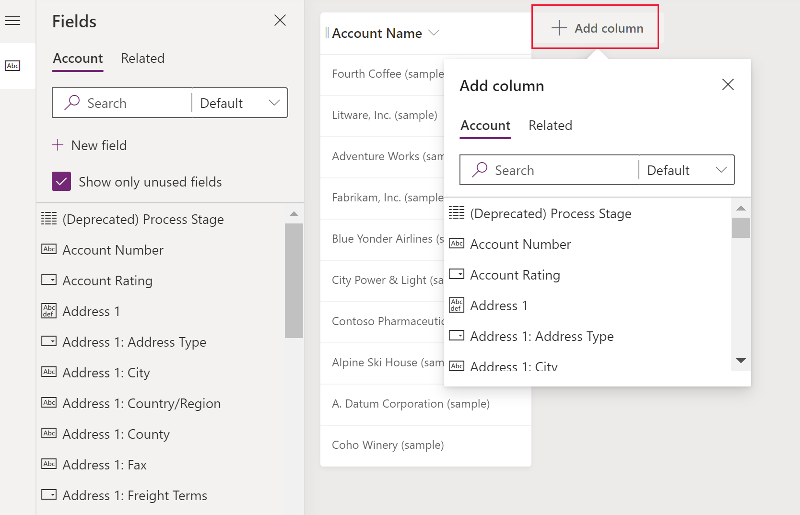
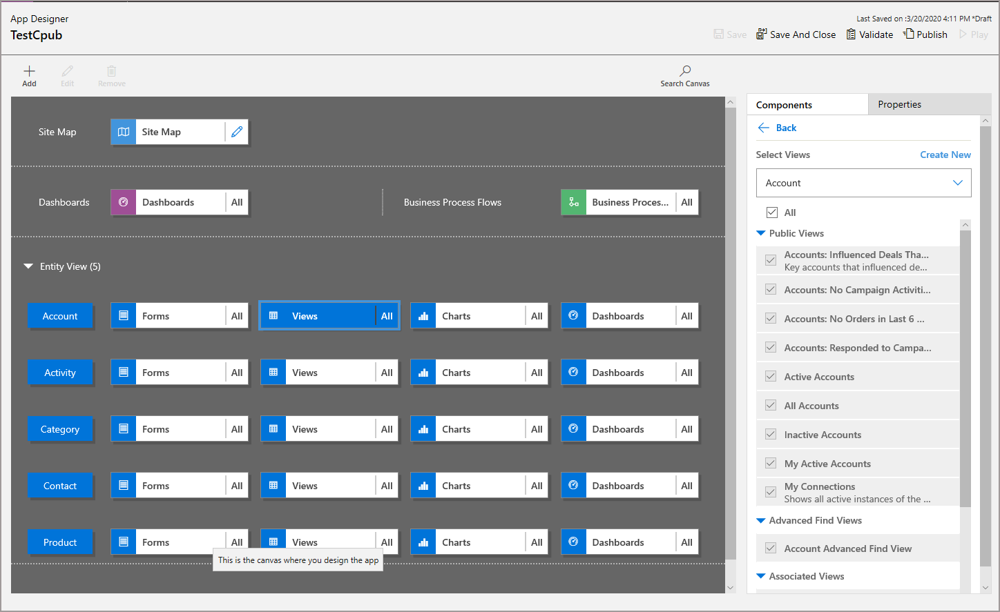

# Create and edit public or system model-driven app views

In this article you perform several tasks required to work with views, such as create a public view, add an existing view to an app, and change columns, filters, and sort order for a view.

In Power Apps, views define how records for a specific table are  displayed. A view defines the following:
-  The columns (attributes) to display
-  The width of the columns
-  How the records are sorted by default
-  Which filters are applied to determine which records appear in the list by default

Typically, views are classified into three types:
- **Personal:** Individual users can create personal views according to their personal requirements. These views are visible only to the user who created them and anyone they choose to share them with. 
- **Public:** As an app maker, you can create and edit public views to fit your organizational requirements. These views are available in the view selector, and you can use them in subgrids in a form or as a list in a dashboard.
- **System:** As an app maker, you can also modify system views to meet the requirements of your organization. These are special views that the application depends on: they exist for system tables or are automatically created when you create custom tables. These views are available to some or all users, depending on their permissions.

More information: [Understand views](create-edit-views.md)

## Create a public view in Power Apps
As an app maker, you can create and edit public views by using Power Apps.

> [!NOTE]
> Public views created in Power Apps that include **Contains data** or **Does not contain data** filters will not appear in the list of saved views in Advanced Find.

1. Sign in to [Power Apps](https://make.powerapps.com/?utm_source=padocs&utm_medium=linkinadoc&utm_campaign=referralsfromdoc).  

2. Expand **Data**, select **Tables**, select the table that you want, and then select the **Views** tab. 

3. On the toolbar, select **Add view**. 

4. On the **Create a view** dialog box, enter a name and, optionally, a description, and then select **Create**. 
    
5. In the view designer, select **Add column** to add additional columns you want to display in the view. 

   

   > [!TIP]
   > The **Default** view in the **Add column** pane displays the commonly used columns. If the column you want isn’t listed, select **All** to display additional columns.
   >
   > 

6. In the view designer, you can perform the follow tasks: 
   - To change the column filtering select the header of the column you want to filter, and then in the dropdown select **Filter by**.
   - To change the column sorting select the header of the column you want to filter and then select **Sort A-Z** or **Sort Z-A**.
   - Configure column width by clicking and dragging the column to the desired position.
   - Reorder columns by dragging a column to the position you want to move it to. 

    > [!NOTE]
    > You can also change column order by clicking on the column header and selecting **Move Right** or **Move Left**.

7. Select **Publish** to save the view and make it available for other users in your organization. 
   

## Work with views in app designer
The following sections describe how to create and edit views in app designer.

### Open and add a view in the app designer

The following steps explain how to open and add a view in the app designer.
1. In Power Apps select **Apps** from the left navigation pane, select **...** next to the app you want, and then select **Edit**. 

2. In the app designer **Table View** section, select **Views**.

    In this example, we have selected **Views** from the **Account** table.

    

3. To add a view, select it by using view types such as Public, Advanced Find, Associated, and Lookup. The view is automatically added to the **Views** list.

    > [!NOTE]
    > Views are displayed based on the table that you have selected. For example, when you select **Account**, views that are related to the Account table are displayed.

More information about the app designer: [Design custom business apps by using the app designer](design-custom-business-apps-using-app-designer.md)

### Add a column to your view in app designer
Views display records in a table that contains rows and columns. Each row is a record, and the columns you display from the record are determined by the columns you add to the view.

1. In app designer, select the table view that you want and then on the right pane next to the view that you want select edit (pencil button).  
2. On the **Components** tab, select the **Column Attributes** list for either the **Primary Table** or **Related Table**.

     

3. From the list, select the attribute you want and drag it to the column heading. You can also add the attribute by double-clicking it.
4. Repeat step 3 until you've added all the attributes you want to display in your view.

As you add attributes, you can drag them to any position among existing column headings. You can also move columns around after you add them to your view.

### Define filter criteria in app designer
You can set filter criteria so that only a subset of the records is displayed in a view. When a user opens the view, only the records that meet the defined filter criteria are displayed. You can select columns from both the primary and related tables to filter on.
1. In the app designer, expand the **Filter Criteria** section.
   
     

2. Select **Add Filter**.
3. Select an attribute from the drop-down list in the first column. 
4. Select an operator from the drop-down list in the second column.

    

5. Enter a value to filter by in the third column.

You can filter data based on the attributes of related tables in addition to the primary table. 

1. On the **Components** tab, select the **Column Attributes** list for **Related Table**, select the **Choose a Table** down arrow in the topmost column, and then choose the table you want.

    This will add a separate section.

2. Repeat steps 2 through 5 from the previous procedure.

More information: [Create and edit relationships between tables](../common-data-service/create-edit-entity-relationships.md)

#### Group multiple filters in app designer
You can add multiple filters to your view if you want to filter records by using more than one column. 

1. Select the filters that you want to group.
    
2. Select Group And or Group Or to group the filters.
    
When you select **Group And**, only records that meet both criteria are displayed in the view. When you select **Group Or**, records that meet any of the filter criteria are displayed. For example, to show only records that have priority of High or Normal, and status of Active, select **Group And**.

To remove the filter from a group, select the group, and then select **Ungroup**. 

### Set primary and secondary sort order for columns in app designer
When a view is opened, the records it displays are sorted in the order you set when you created the view.   By default, records will be sorted according to the first column in a view when no sort order is selected. You can choose to sort on a single column, or you can choose two columns—one primary and one secondary—to sort by. When the view is opened, the records will first be sorted by the column you want to use for primary sort order, and then by the column you want to use for secondary sort order. 

> [!NOTE]
> You can only set primary and secondary sort order for column attributes you added  from the primary table.

1. Select the column you want to use for sorting.
2. Select the down arrow, and then choose **Primary Sort** or **Secondary Sort**.
 
     

If you remove the column you chose for the primary sort order, the column you chose for the secondary sort order becomes the primary.

### Define a web resource in app designer
Specify a web resource of script type, to associate with a column in your view. These scripts help to display icons for columns.

1. Select the column you want to add a web resource to.
2. On the **Properties** tab, select **Advanced**.
3. In the **Web Resource** drop-down list, select the web resource you want to use.
4. In the **Function Name** box, enter a function name.

### Edit a public or system view in app designer
You can change the way a public or system view is displayed by adding, configuring, or removing columns.
1. In the **Views** list for a table, select the **Show list of references** down arrow .
    
2. Next to the view you want to edit, select **Open the View Designer** . 

    The view opens in the view designer. 

When you edit a public or system  view, you must save and publish your changes before they will be visible in the application.

## Community tools
**View Layout Replicator** and **View Designer** are tools that XrmToolbox community developed for Power Apps.

More information: [Developer tools](/powerapps/developer/common-data-service/developer-tools).

> [!NOTE]
> These tools are provided by XrmToolBox and are not supported by Microsoft. If you have questions pertaining to the tool, please contact the publisher. More information: [XrmToolBox](https://www.xrmtoolbox.com/). 

### Next steps
[Create 1:N (one-to-many) or N:1 (many-to-one) relationships](../common-data-service/create-edit-1n-relationships.md)
