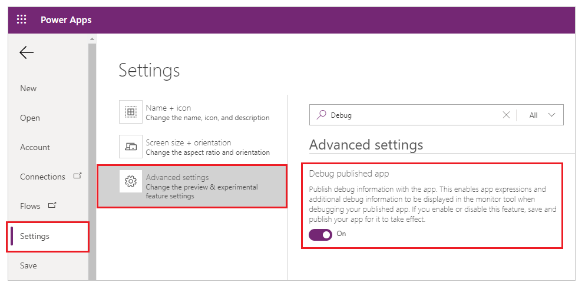
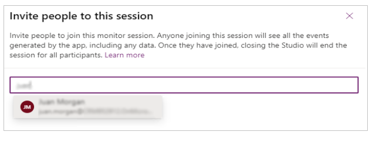

# Monitor overview

**Monitor** is a tool that offers makers the ability to view a stream of events from a user’s session to diagnose and troubleshoot problems. Makers can either use Monitor to view events while building a new app in Power Apps Studio, or to monitor published apps during runtime.

## Benefits

Monitor can help you diagnose and troubleshoot problems faster and build more
reliable apps. It provides a deep view into how an app runs by providing a log
of all activities in your app as the app runs. Monitor tool also provides a
better understanding of how the events and formulas contained in your app work
so you can improve performance and identify any errors or problems.

## Debugging an app

The key to debugging an problem is to have a better understanding of what your app does, and how. Sometimes, it is difficult to isolate an problem when just looking at the app formulas, or even reviewing runtime errors. Watching the events as they occur in your app can help you understand the order and performance of events and errors to diagnose problems faster.

A few example problems and queries that you can uncover when using Monitor are:

- **High number of network calls**
    - Is the app fetching data too frequently?
    - Can you optimize the app to only fetch data when required?
    - Are timer controls firing too often?
    - Are too many events occurring when the app starts? And can fetching some of the data be delayed?

-   **Retrieve data from the same data source**
    - Can you use different patterns such as caching data in collections or variables instead of fetching same data multiple times?

-   **The response data size**
    - Can you use query filters to reduce the amount of data requested?

-   **The duration of the request**
    - Are integrations optimized?
    - Can you reduce the size of the response using query filters?

-   **Errors**
    - Have you configured the required permissions to run the app correctly?
    - Are your requests throttled by the platform?

## Advanced setting: Debug published app

If you want to view the source expressions in the Monitor for the published app, you need to turn on a new setting to publish the expressions with the app. This setting is similar to generating a debug file in traditional development. Publishing source expressions with your app is optional. Even when this setting is off, you will still be able to see the events happening in your app, but you won’t be able to map these to specific expressions or formulas.

To enable this setting, go to **File** > **Settings** > **Advanced settings** > Turn **Debug published app** to *On*.

## Monitor dashboard

You can review various properties for each event inside Monitor. Depending on
the event category, some of these properties might not contain data.

| Column name       | Description                                                                                                                                                                                                                                       |
|-------------------|----------------------------------------------------------------------------------------------------------------------------------------------------------------------------------------------------------------------------------------|
| **Id**            | Sequence number for the events.                                                                                                                                                                                                        |
| **Time**          | Time of the event.                                                                                                                                                                                                                     |
| **Category**      | Type of event, such as *Network*.                                                                                                                                                                                                      |
| **Operation**     | The resulting internal operation name of the request inside the app. For example, *createRow* is the operation name from the **Patch** function.                                                                                       |
| **Result**        | Status Code description in words. For example, a 429 Status will show as an *“Error”* in the result column. Row colors also help to identify any errors and warnings quickly.                                                          |
| **Result Info**   | Detailed translation of error codes and Results. For example, a 429 Status code will show as “Too many requests” in results info column.                                                                                               |
| **Status**        | The [http status code](https://www.w3.org/Protocols/rfc2616/rfc2616-sec10.html) of a network request. For example, a 2XX code represents a successful request while a 4XX code represents an error.                                    |
| **Duration**      | Depends on the type of event. For example, for a network request, duration is the time taken for the request to be sent and a response to be received. Duration can be used to understand the performance of network calls in the app. |
| **Data Source**   | Name of the data source accessed by the raised event operation (e.g. name of a CDS entity)                                                                                                                                             |
| **Control**       | The Control Name associated with this event                                                                                                                                                                                            |
| **Property**      | Active Control Property of the raised event.                                                                                                                                                                                           |
| **Response size** | For a network request event, represents response size in bytes received from the sender to your app.                                                                                                                                   |

When you select an event in the grid, a panel displays containing additional
details about the event. The panel has four tabs:

- **Details**: Shows a high-level overview of the event that you select. Some
    of the data might be collapsed in the tree view. You can expand and drill
    down to view content:

    

- **Formula**: Shows related formula from your app for the selected event. The
    name of the control property triggering the event is displayed on top of the tab, and inside the event table:

    

- **Request**: Shows the HTTP request sent:

    

- **Response**: Shows the HTTP response received. You can view the response in
    JSON format.

    

## Collaborative debugging

Inviting other users to your Monitor session enables you to quickly collaborate and debug an app together, without the need to share your screen. When you invite others to participate in a session, they see the exact same app events in their own browser, without having to open the app or the need to reproduce the specific scenario that you're debugging. This allows you and other participants to browse, view, and inspect the app events independently without stepping on each other or handing control back-and-forth to identify the problem.

> [!NOTE]
> You can invite any user in your organization to a Monitor session.
Users joining the session will see all the events generated by the app,
including any data.

1. Select **Invite** from the top.

1. Enter Azure Active Directory user name or alias of the users that you want
    to invite to the Monitor session.

    

1. Select the user to generate a link to the current Monitor session.

    > [!NOTE]
    > The link is unique for each user. It can't be shared between users. The link expires after 60 minutes.

1. Select the link icon to copy the session link and send it to the users
    you've invited to the session.

    

Recipient users can use the link to open the Monitor and connect to your Monitor
session.

## Download and upload trace files

You can download the events that are shown in the table for offline analysis.
Events can be downloaded in a .json or a .csv format, and can be shared with
others. The .csv files can only be downloaded. But if you export the events
in .json format, you can them back into the monitor tool for analysis. You can
also attach a trace file to support service requests helping speed up the
solution to your problem.

Select **Upload** to load a .json trace file to Monitor. The upload option will remove any events currently displayed in the Monitor table, and replace the details with the events contained in the trace file.

## Supported Events

Monitor supports several events for canvas apps and model-driven apps. Here are some examples of the supported event categories and types:

| Canvas apps | Model-driven apps |
| - | - |
| <ul> <li> Data connectors </li> <li> Network events (error status codes highlighted) </li> <li> Screen load metrics </li> <li> Cross-screen dependency warning </li> <li> User actions such as *Navigate*, *Select*, *SetProperty* </li> <li> Custom Trace() </li> <li> Delegated versus non-delegated queries </li> <li> Verbose switch (internal telemetry) </li> <li> Delegation </li> <li> Function </li> <li> Network </li> <li> Parsing </li> <li> Performance </li> <li> Scenario </li> <li> ScreenLoad </li> <li> Telemetry </li> <li> UserAction </li> <li> Verbose </li> </ul> | <ul> <li>	Form load sequence, core boot </li> <li> Perf metrics </li> <li> XHR Sync versus Async </li> <li> Form rules (model) </li> </ul> |

## Next steps

- [Monitor canvas apps using Monitor](monitor-canvasapps.md)
- Monitor model-driven apps using Monitor

### See also

[Monitor - advanced monitoring and scenarios](monitor-advanced.md)
