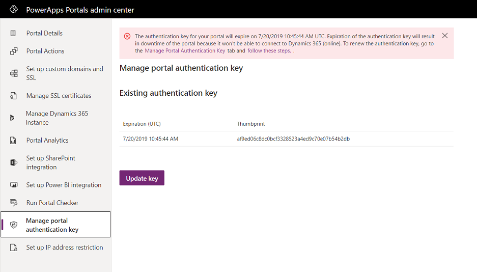
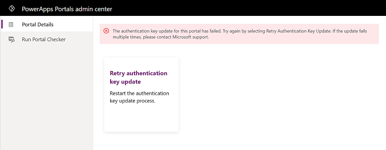

# Renew portal authentication key

Power Apps portals connectivity architecture explained how a portal connects to Microsoft Dataverse environment. When a portal is created, a new authentication key is generated with the public key uploaded to Azure Active Directory application. Portals uses this authentication key to connect to the Dataverse environment. You must renew the key every two years to ensure that your portal can connect to Dataverse environment.

> [!NOTE]
> To renew the key, you must have permissions to manage your portal.

1. Open [Power Apps Portals admin center](admin-overview.md).

2. Select **Manage portal authentication key**. The authentication key is displayed along with its expiration date and thumbprint.

    > [!div class=mx-imgBorder]
    > 

3. Select **Update key**.

4. Select **Update** in the message. The update process starts, and a message is displayed.

> [!NOTE]
> - While this process runs in the background, the portal will restart once.
> - When you update a key, it's valid for next two years.
> - This process will take five to seven minutes.
> - Updating authentication key doesn't change any other portal configuration or the portal state.

### Troubleshooting

If the key update fails, an error message is displayed along with the following action:

- **Retry Authentication Key Update**. This action allows you to restart the portal authentication key update process. If the update fails multiple times, contact Microsoft support.

    > [!div class=mx-imgBorder]
    > 
