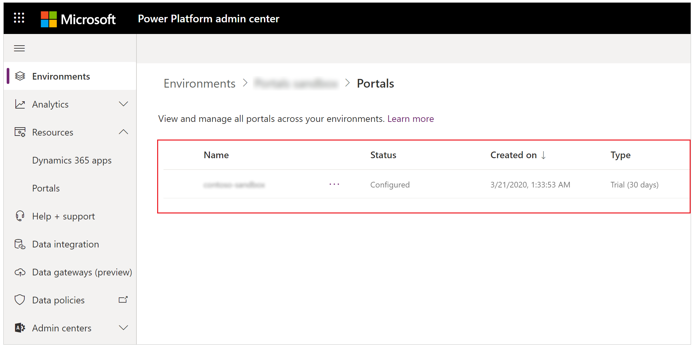
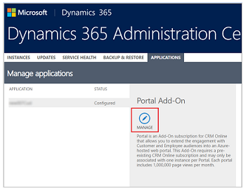
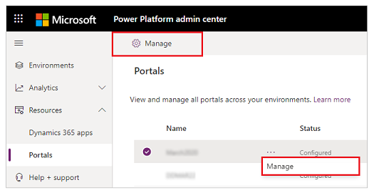
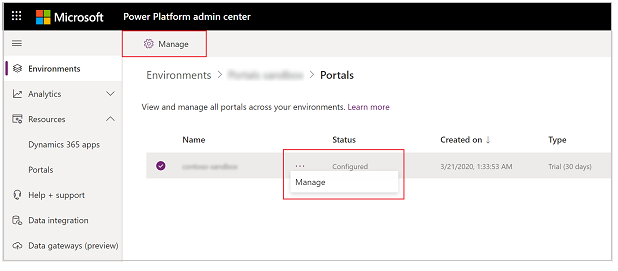
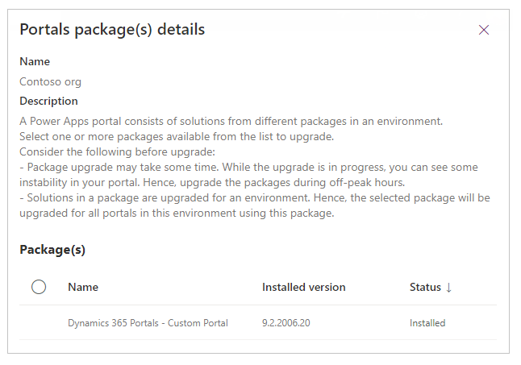
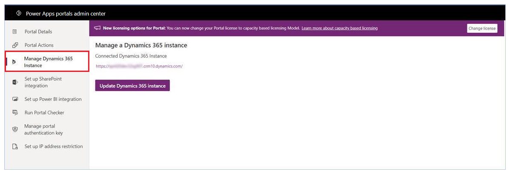
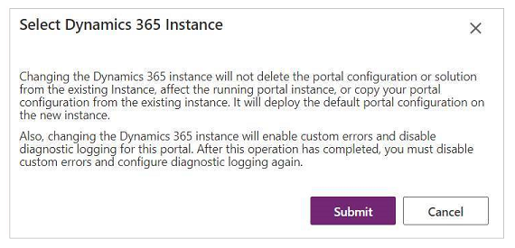

# Manage portals from the Power Platform admin center

You can now manage portals in the Power Platform admin center. The Power Platform admin center helps you manage both capacity-based and add-on portals. You can also see information such as how many days are left before a trial portal expires. For more information about portal licensing, see the [licensing FAQ](/power-platform/admin/powerapps-flow-licensing-faq#portals) and [portal differences](../overview.md#power-apps-portals-dynamics-365-portals-and-add-on-portals). For more information about Power Platform admin center, go to [Administer Power Platform](/power-platform/admin/admin-documentation).

Manage portals in the Power Platform admin center in two ways: Manage all portals for the current tenant from **Resources** > **Portals**. Or, manage portals for a specific environment from **Environments**.

## Manage all portals for a tenant

1. Sign in to the [Power Platform admin center](https://admin.powerplatform.microsoft.com/).

1. In the left pane, select **Resources**, and then select **Portals**.

    

1. Select a portal.

1. To manage the portal, select **More portal actions** (**...**), and then select **Manage**. You can select the portal and then select **Manage** at the top of the page instead.

    

To configure portal details, see [Portal details](portal-details.md).

## Manage all portals for an environment

1. Sign in to the [Power Platform admin center](https://admin.powerplatform.microsoft.com/).

1. In the left pane, select **Environments**.

    

1. Hover over and select the hyperlinked environment name to open the environment details.

    

1. On the right side of the screen, under **Resources**, select **Portals**.

    

   You'll see a list of portals installed in the selected environment.

    

1. To manage a portal, select **More portal actions** (**...**), and then select **Manage**. You can select the portal and then select **Manage** from the top of the page instead.

    

To configure portal details, see [Portal details](portal-details.md).

## Manage the portal add-on

Using the Power Platform admin center to manage portals as described in this article replaces earlier functionality, which is illustrated in the following image.

| Old method to manage an add-on portal | New method to manage an add-on portal for a tenant | New method to manage an add-on portal for an environment |
| - | - | - |
|  |  |  |

### Portal types

The following table describes the different types of portals that are listed in the Power Platform admin center.

| Type                |Description                                                           |
|---------------------|----------------------------------------------------------------------|
| Production          | A production portal based on a capacity-based license.               |
| Trial (*n* days)    | A trial portal based on a capacity-based license, with _n_ days remaining until suspension. |
| Production (add-on) | A production portal based on an add-on license.     |
| Trial (add-on)      | A trial portal based on an add-on license.          |

### Portal status

A portal can have the following status: *Configured*, *Suspended*, or *Not configured*. The following table describes each state.

| Status         |  Description    |
|----------------|-----------------|
| Configured     | This portal has been configured to an environment.     |
| Suspended      | This portal has been suspended because its trial period is over. It will be deleted in seven days, unless it's converted to a production portal. |
| Not configured | This portal is ready to be configured to an environment.   |

> [!NOTE]
> You can [create a new portal](../provision-portal-add-on.md) if the portal add-on status is *Not configured*. The status will change to *Configured* after the portal is provisioned.

## Update the Power Apps portal solution

A Power Apps portal consists of solutions from different packages in an environment.

Use Power Platform admin center to:

- View the details of installed packages (such as the version details).
- If a package with a higher version is available, update them for the selected portal.

> [!IMPORTANT]
> - Package upgrade may take some time. While the upgrade is in progress, you can see some instability in your portal. Hence, upgrade the packages during off-peak hours.
> - Solutions in a package are upgraded for an environment. Hence, the selected package will be upgraded for all portals in this environment using this package.

### Permissions required

You may see the following error message if you don't have the required permissions to view and upgrade portal package:

`You don't have the permissions to access this portal's environment.`

To learn about the permissions required to view and upgrade portal packages, read [Admin roles required for portal administrative tasks](portal-admin-roles.md).

### View portals package details

To view the portals package details:

1. Select the [portal for your environment](#manage-all-portals-for-an-environment).

1. Select **Portal Package(s) details**.

    

1. View the details of the packages for the selected portal.

    

### Update portals package

You can use Power Platform admin center to upgrade portal packages. Choose to upgrade based on selected environment, or from the list of portals for a tenant.

> [!NOTE]
> In addition to the methods listed below, you'll also see a notification when you edit the portal using the portals Studio if an upgrade package is available.

#### Method 1: Update portals packages using the selected environment

1. Select a [portal for your environment](#manage-all-portals-for-an-environment).

1. Select **Upgrade now** from the notification on the top of the page if an update is available. You can also check for the notification from the [package details](#view-portals-package-details) page.

#### Method 2: Update portals packages using the portals list for a tenant

1. Select a portal from the [list of all portals in a tenant](#manage-all-portals-for-a-tenant).

1. Select **Check portal package(s) for upgrade**.

     for upgrade")

1. Update package(s), if available.

### Check package upgrade errors and retry

If the package upgrade fails, you'll see a notification with the problem details.

")

Select **See details** for more information.

 - details")

To retry installing the update, select **Retry upgrade**.

## Update Dynamics 365 Instance for your portal

You can use the Power Platform admin center to update your portal's Dynamics 365 Instance.

> [!IMPORTANT]
> When changing Dynamics 365 Instance for your portal, ensure the new instance is from the same [region](/power-platform/admin/regions-overview) as the current instance. Changing the Dynamics 365 Instance for Power Apps portals across regions isn't supported.

1. Select **Manage** to manage your portal by using one of the methods explained earlier in this article.

1. In the left pane, select **Manage Dynamics 365 Instance**.

1. Select **Update Dynamics 365 Instance**.

    

1. Select your existing instance and portal.

    

1. Select **OK**.

1. Select **Submit** to confirm.

    

    You'll see a confirmation that the update request is in progress.

    

The update may take a while after you select **Submit**. More information: [Upgrade a portal](upgrade-portal.md)

## Next steps

[Configure portal details](portal-details.md)

### See also

- [Administer Power Platform](/power-platform/admin/admin-documentation)
- [Manage Dynamics 365 apps](/power-platform/admin/manage-apps)  
- [Upgrade a portal](upgrade-portal.md)
