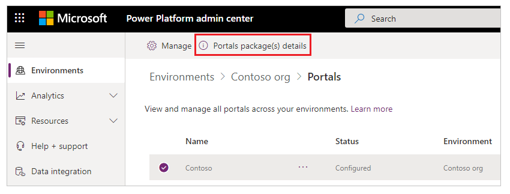

# Update the Power Apps portal solution

A Power Apps portal consists of solutions from different packages in an environment.

Use Power Platform admin center to:

- View the details of installed packages (such as the version details).
- If a package with a higher version is available, update them for the selected portal.

> [!IMPORTANT]
> - Package upgrade may take some time. While the upgrade is in progress, you can see some instability in your portal. Hence, upgrade the packages during off-peak hours.
> - Solutions in a package are upgraded for an environment. Hence, the selected package will be upgraded for all portals in this environment using this package.

## Required permissions

You may see the following error message if you don't have the required permissions to view and upgrade portal package:

`You don't have the permissions to access this portal's environment.`

To learn about the permissions required to view and upgrade portal packages, read [Admin roles required for portal administrative tasks](portal-admin-roles.md).

## View portals package details

To view the portals package details:

1. Select the [portal for your environment](power-platform-admin-center.md#manage-all-portals-for-an-environment).

1. Select **Portal Package(s) details**.

    

1. View the details of the packages for the selected portal.

    

## Update portals package

You can use Power Platform admin center to upgrade portal packages. Choose to upgrade based on selected environment, or from the list of portals for a tenant.

> [!NOTE]
> In addition to the methods listed below, you'll also see a notification when you edit the portal using the portals Studio if an upgrade package is available.

### Method 1: Update portals packages using the selected environment

1. Select a [portal for your environment](power-platform-admin-center.md#manage-all-portals-for-an-environment).

1. Select **Upgrade now** from the notification on the top of the page if an update is available. You can also check for the notification from the [package details](#view-portals-package-details) page.

### Method 2: Update portals packages using the portals list for a tenant

1. Select a portal from the [list of all portals in a tenant](power-platform-admin-center.md#manage-all-portals-for-a-tenant).

1. Select **Check portal package(s) for upgrade**.

     for upgrade")

1. Update package(s), if available.

## Check package upgrade errors and retry

If the package upgrade fails, you'll see a notification with the problem details.

")

Select **See details** for more information.

 - details")

To retry installing the update, select **Retry upgrade**.

### See also

[Upgrade a portal](upgrade-portal.md)  
[Administer Power Platform](/power-platform/admin/admin-documentation)  
[Manage Dynamics 365 apps](/power-platform/admin/manage-apps)
