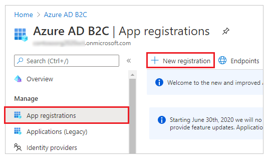
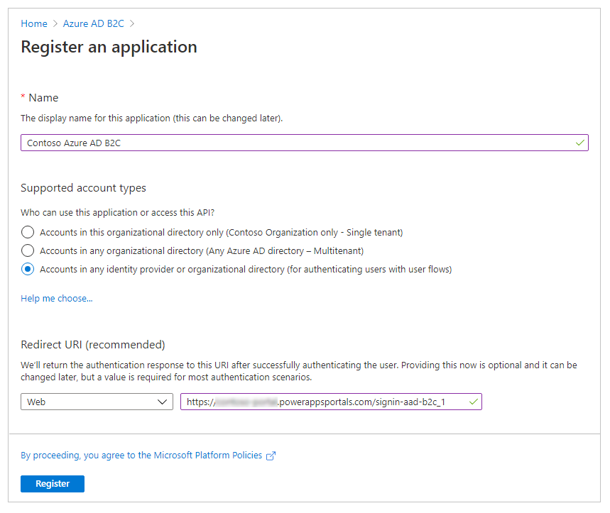
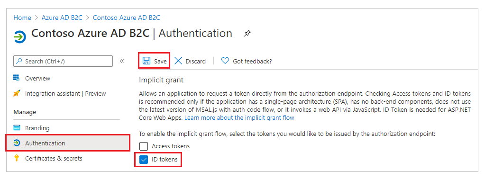
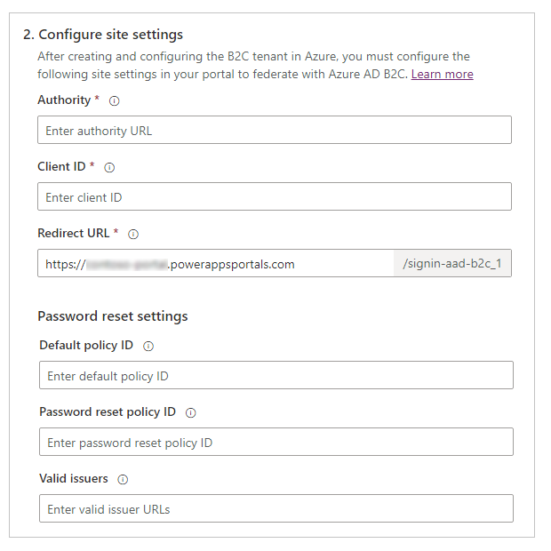
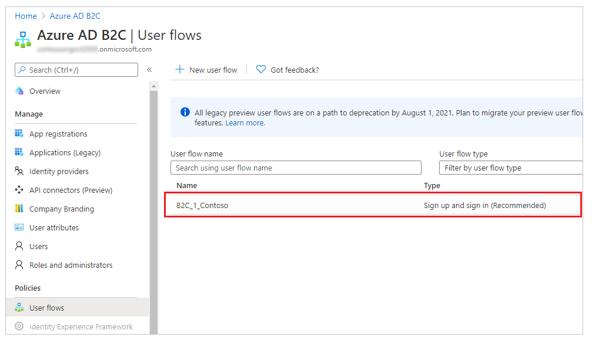
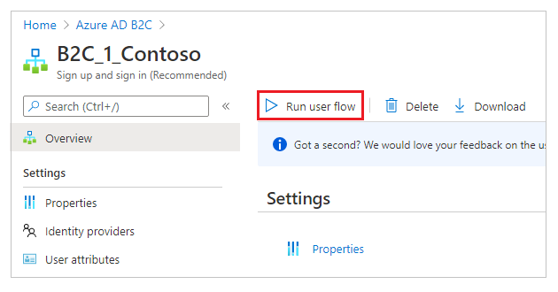
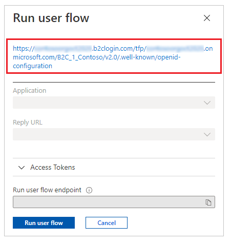
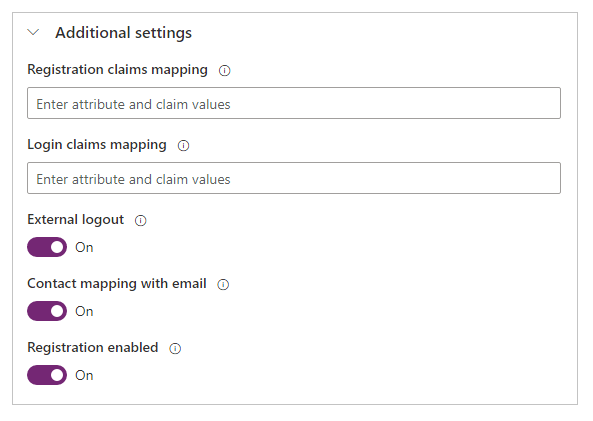

# Configure the Azure Active Directory B2C provider

In this article, learn how to configure Azure Active Directory B2C as the identity provider manually. Use these steps to manually create new Azure AD B2C tenant, register application and configure user flows.

> [!NOTE]
> - If you want to configure the Azure AD B2C provider automatically using Power Apps portals, go to [Configure Azure AD B2C provider](configure-azure-ad-b2c-provider.md).
> - Changes to the authentication settings [may take a few minutes](../admin/clear-server-side-cache.md#caching-changes-for-portals-with-version-926x-or-later) to reflect on the portal. Restart the portal using the [portal actions](../admin/admin-overview.md) if you want to reflect the changes immediately.

To configure Azure AD B2C as the OpenID Connect provider manually:

1. Select **Configure** for **Azure Active Directory B2C**. More information: [Configure a provider](use-simplified-authentication-configuration.md#add-or-configure-a-provider)

    

1. If necessary, update the name.

1. Select **Skip to manual configuration** from the bottom of the screen.

    

1. Select **Next**.

1. In this step, create the application and configure the settings with your identity provider.

    

    1. Sign in to your [Azure portal](https://portal.azure.com/).

    1. [Create an Azure AD B2C tenant](https://docs.microsoft.com/azure/active-directory-b2c/tutorial-create-tenant).

    1. [Register an application](https://docs.microsoft.com/azure/active-directory-b2c/tutorial-register-applications?tabs=applications#register-a-web-application) in your tenant.

        1. Search for and select **Azure AD B2C**.

        1. Under **Manage**, select **App registrations**.

        1. Select **New registration**.

            

        1. Enter a name.

        1. If not selected already, select **Web** for **Redirect URI**.

        1. Enter the **Reply URL** for your portal in the **Redirect URI** text box. <br> Example: `https://contoso-portal.powerappsportals.com/signin-aad-b2c_1`

            > [!NOTE]
            > If you're using the default portal URL, copy and paste the **Reply URL** as shown in **Configure Azure Active Directory B2C application**. If you're using custom domain name for the portal, enter the custom URL. However, ensure you use this value when you configure the **Redirect URL** in your portal settings while configuring Azure AD B2C provider. <br> For example, if you enter the **Reply URL** in Azure portal as `https://contoso-portal.powerappsportals.com/signin-aad-b2c_1`, use it as is for the Azure AD B2C configuration in portals.
    
            
    
        1. Select **Register**.
    
        1. In the left menu, under **Manage**, select **Authentication**.
    
            
    
        1. Under **Implicit grant**, select **ID tokens** check box.
    
        1. Select **Save**.

    1. [Create a sign-up and sign-in user flow](https://docs.microsoft.com/azure/active-directory-b2c/tutorial-create-user-flows#create-a-sign-up-and-sign-in-user-flow). Optionally, [create a password reset user flow](https://docs.microsoft.com/azure/active-directory-b2c/tutorial-create-user-flows#create-a-password-reset-user-flow).

    1. [Configure token compatibility](https://docs.microsoft.com/azure/active-directory-b2c/configure-tokens#configure-token-compatibility) with an **Issuer (iss) claim** URL that includes **tfp**. More information: [Token compatibility](https://docs.microsoft.com/azure/active-directory-b2c/tokens-overview#compatibility)

         

1. In this step, enter the site settings and password reset settings for the portal configuration.

    

    1. **Configure site settings**

        - **Authority** - The issuer URL defined in the metadata of the sign-up and sign-in policy user flow.​
        <br> To get the issuer URL:

           1. Open the sign-up and sign-in user flow you created earlier. For this step, you need to go to the Azure AD B2C tenant on [Azure portal](https://portal.azure.com).

            

           2. Select **Run user flow**.

            

           3. Select the OpenID configuration URL to open in a new browser window or a tab.

                
        
                The URL refers to the *OpenID Connect identity provider configuration document*, also known as the *OpenID well-known configuration endpoint*.

           4. Copy the URL of the **Issuer** from the new browser window or tab.

                

                Ensure you copy only the URL, without the double quotation marks (*""*). <br> For example, `https://contosoorg.b2clogin.com/tfp/799f7b50-f7b9-49ec-ba78-67eb67210998/b2c_1_contoso/v2.0/`

                > [!TIP]
                > Ensure the **Issuer (iss) claim** URL includes **tfp**.

        - **Client ID​** - Enter the **Application ID** of the Azure AD B2C application created earlier.

        - **Redirect URI** - Enter the portal URL. <br> You only need to change the redirect URI if you use a custom domain name.

    2. **Password reset settings**

        - **Default policy ID** - Enter the name of the sign-up and sign-in user flow you created in earlier. The name is prefixed with *B2C_1*.

        - **Password reset policy ID** - Enter the name of the password reset user flow you created earlier. The name is prefixed with *B2C_1*.

        - **Valid issuers** - A comma-delimited list of issuer URLs for the sign-up and sign-in user flow and password reset user flow you created earlier. 
        <br> To get the issuer URLs for the sign-up and sign-in user flow, and password reset user flow, open each flow and then follow the steps under **Authority**, earlier in this section.

1. In this step, you'll configure the additional site settings.

    You have the option of configuring additional setting for the Azure AD B2C identity provider.

    

    1. **Registration claims mapping​** - List of logical name/claim pairs to be used to map claim values returned from Azure AD B2C created during sign up to attributes in the contact record. <br> Format: `field_logical_name=jwt_attribute_name` where `field_logical_name` is the logical name of the field in portals, and `jwt_attribute_name` is the attribute with the value returned from the identity provider. <br> 
     For example, if you've enabled **Job Title (jobTitle)** and **Postal Code (postalCode)** as **User Attributes** in your user flow and you want to update the corresponding Contact entity fields **Job Title (jobtitle)** and **Address 1: ZIP / Postal Code (address1_postalcode)**, enter the claims mapping as: ```jobtitle=jobTitle,address1_postalcode=postalCode```.

    1. **Login claims mapping** - List of logical name/claim pairs to be used to map claim values returned from Azure AD B2C after sign-in to the attributes in the contact record. <br> Format: `field_logical_name=jwt_attribute_name` where `field_logical_name` is the logical name of the field in portals, and `jwt_attribute_name` is the attribute with the value returned from the identity provider. <br> 
     For example, if you've enabled **Job Title (jobTitle)** and **Postal Code (postalCode)** as **Application Claims** in your user flow and you want to update the corresponding Contact entity fields **Job Title (jobtitle)** and **Address 1: ZIP / Postal Code (address1_postalcode)**, enter the claims mapping as: ```jobtitle=jobTitle,address1_postalcode=postalCode```.

    1. **External logout** - Enables or disables federated sign-out. When set to **On**, users are redirected to the federated sign-out user experience when they sign out from the portal. When set to **Off**, users are only signed out from the portal.

    1. **Contact mapping with email** - Specifies whether contacts are mapped to a corresponding email. When set to **On**, this setting associates a unique contact record with a matching email address, and then automatically assigns the external identity provider to the contact after the user successfully signs in.

    1. **Registration Enabled**​ - Turn [open registration](configure-portal-authentication.md#open-registration) for your portal on or off. Setting this toggle to **Off** disables and hides external account registration.

1. Select **Confirm** to view a summary of your configuration and complete the identity configuration.

### See also

[Migrate identity providers to Azure AD B2C](migrate-identity-providers.md)
