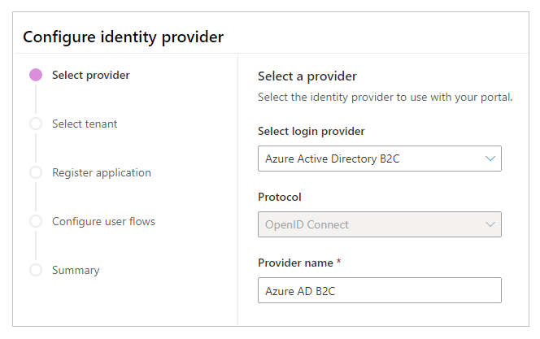
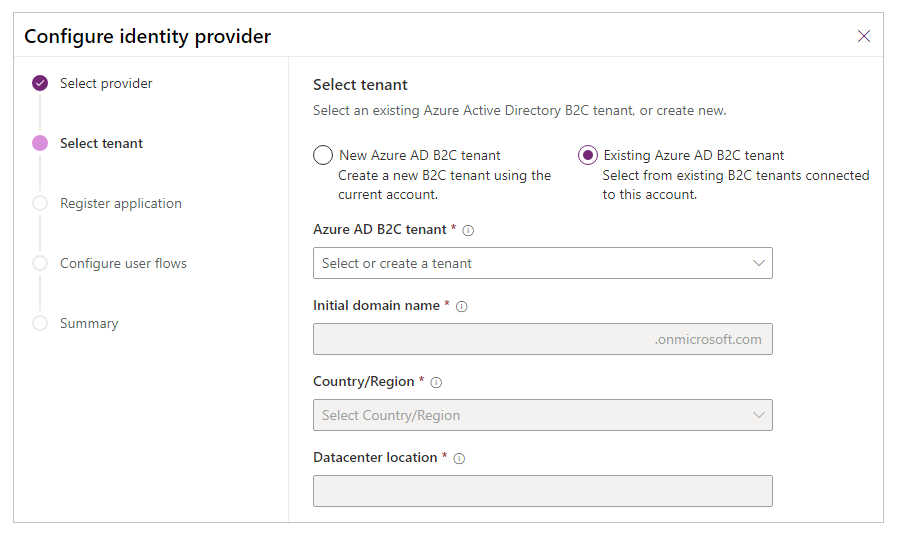
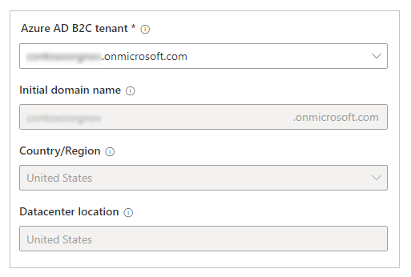
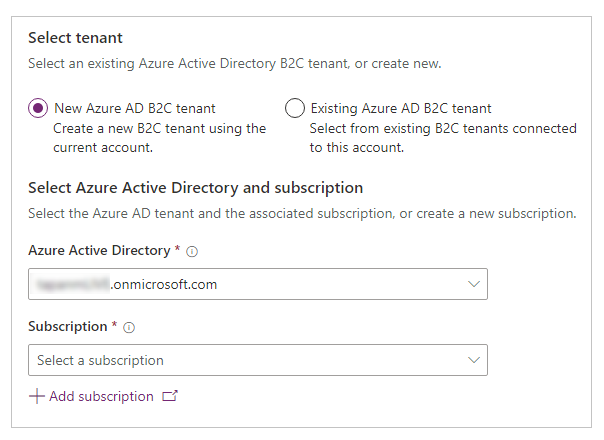
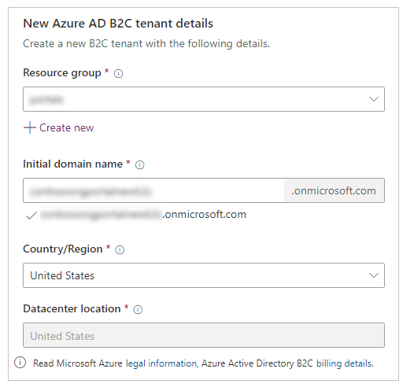
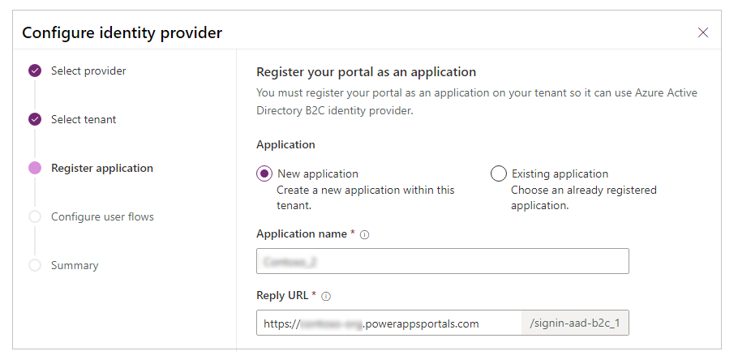
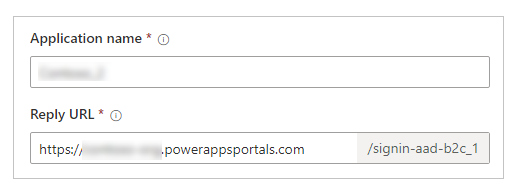
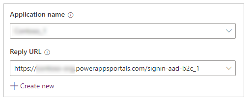
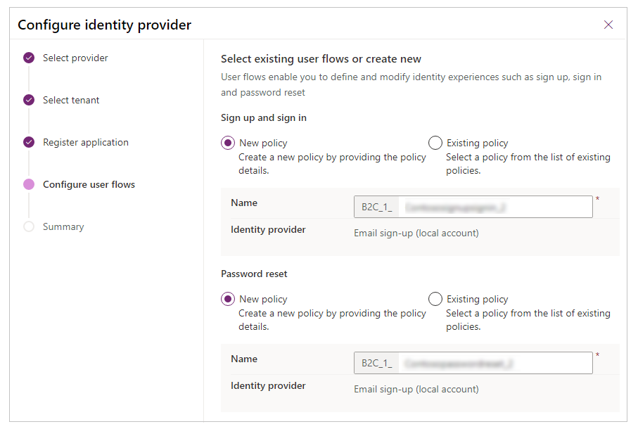
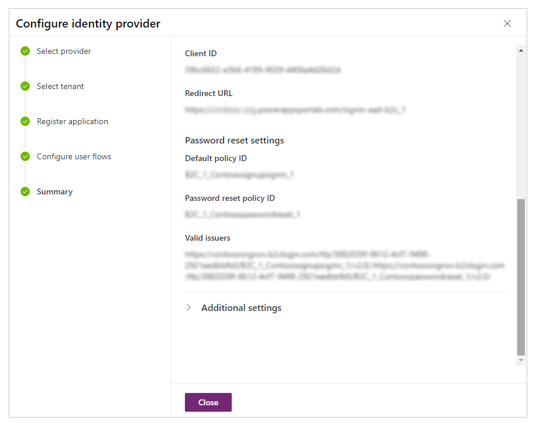

# Configure the Azure Active Directory B2C provider

[!include[Azure](../../../includes/pn-azure-shortest.md)] Active Directory (Azure AD) powers Microsoft 365 and Dynamics 365 services for employee or internal authentication. [!include[Azure](../../../includes/pn-azure-shortest.md)] Active Directory B2C is an extension to that authentication model that enables external customer signs in through local credentials and federation with various common social identity providers.

A portal owner can configure the portal to accept [!include[Azure](../../../includes/pn-azure-shortest.md)] AD B2C as an identity provider. [!include[Azure](../../../includes/pn-azure-shortest.md)] AD B2C supports Open ID Connect for federation.

> [!NOTE]
> - This article explains how to configure Azure Active Directory B2C as the identity provider automatically. Using these steps, you can create new Azure AD B2C tenant, register application and configure user flows from within Power Apps portals. If you want to configure the Azure AD B2C provider manually, go to [Configure Azure AD B2C provider manually](configure-azure-ad-b2c-provider-manual.md).
> - Changes to the authentication settings [may take a few minutes](../admin/clear-server-side-cache.md#caching-changes-for-portals-with-version-926x-or-later) to reflect on the portal. Restart the portal using the [portal actions](../admin/admin-overview.md) if you want to reflect the changes immediately.

Follow these steps to configure Azure AD B2C as the OpenID Connect provider.

## Step 1 - Select provider

1. Select **Configure** for **Azure Active Directory B2C**. More information: [Configure a provider](use-simplified-authentication-configuration.md#add-or-configure-a-provider)

    

1. If necessary, update the name.

1. Select **Next**.

## Step 2 - Select tenant

In this step, select an existing Azure AD B2C tenant, or create a new B2C tenant.

### Option 1: Use existing Azure AD B2C tenant

Select this option if you already have an existing Azure AD B2C tenant. The other details such as the initial domain name, country/region and location are automatically updated.

Select **Next** to continue.

### Option 2: Create a new Azure AD B2C tenant

Select this option to create a new Azure AD B2C tenant for the selected Azure Active Directory.

To create a new Azure AD B2C tenant:

1. Select the Azure Active Directory tenant or directory.

1. Select a subscription for the tenant. If you want, you can also create a new subscription using **Add subscription** from the Azure portal.

1. Select the resource group for the Azure AD B2C tenant.

1. Enter the initial domain name.

1. Select **Country/Region** for the tenant.

1. Select the available **Datacenter location**.

    

1. Select **Next**.

## Step 3 - Register application

In this step, register your portal as an application with the Azure Active Directory. For this step, you can create a new application, or select an already created application from Azure Active Directory.

> [!NOTE]
> If you're using custom domain name for the portal, enter the custom URL as the **Reply URL**.

### Option 1: Create a new application

To create a new application:

1. Enter application name.

1. Enter **Reply URL**.

    

1. Select **Next**.

### Option 2: Select an existing application

To use an existing application:

1. Select an existing application from the list.

1. Select the **Reply URL**. If you want, you can also create a new **Reply URL** using **Create new**.

    

1. Select **Next**.

## Step 4 - Configure user flows

In this step, configure the user flows for sign up, sign in and password reset policy.

Select **New policy** if you want to create a new policy, or **Existing policy** to select an already created policy from the Azure AD B2C tenant.

If you want, you can also change the name of the policy when you select **New policy**.

Select **Create** to create the identity provider configuration.

## Step 5 - Summary

The Azure AD B2C provider configuration is complete. You can view the summary of the configuration, and select **Close** to exit.

### See also

[Migrate identity providers to Azure AD B2C](migrate-identity-providers.md)
