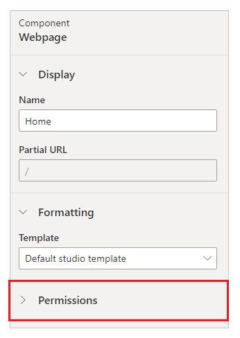
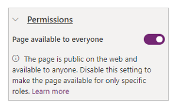
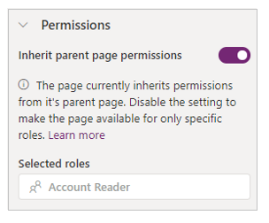
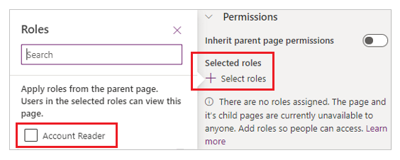
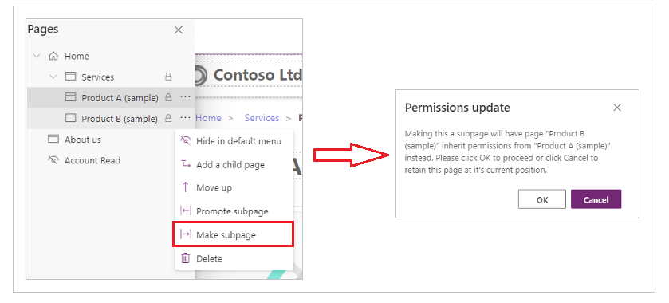
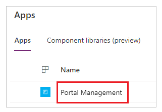
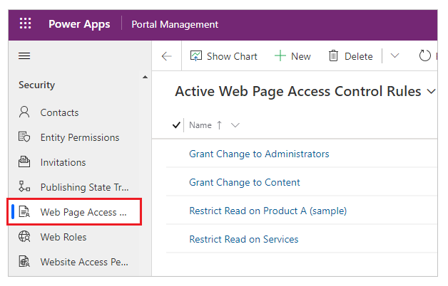
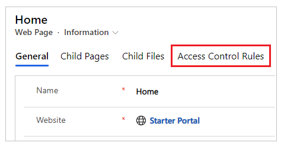

# Manage page permissions

Page permissions control access to the webpages to portal users. For example, you can allow pages to be available anonymously for public access, or restrict access to users from the specific roles. Depending on business requirements, you can manage the inheritance of page permissions from a parent page to a child page. A page can have child [web files](web-files.md), such as downloadable documents or for supporting .css and .js files. You can also manage the inheritance of page permissions from a page to such child web files.

You can manage page permissions in two ways:

- [Portals Studio](#manage-page-permissions-using-portals-studio)
- [Portal Management app](#manage-page-permissions-using-portal-management-app)

Portals Studio simplifies the configuration of webpage access permissions using the Portal Management app. Managing page permissions inside the Portal Management app is referred to as the *web page access control rules*.

## Manage page permissions using portals Studio

Power Apps portals Studio allows you to customize your portal. Page permission management using portals Studio is quicker and more efficient compared to using the Portal Management app. You may still need to use the Portal Management app for managing page permissions of legacy areas.

Managing page permissions using portals Studio still creates the web page access control rules accessible using the Portal Management app. However, using the portals Studio to manage page permissions is recommended.

> [!NOTE]
> Managing page permissions using portals Studio applies to only [Restrict Read](#restrict-read) permissions that control access to pages for the end users. To manage [Grant Change](#grant-change) permissions for managing and publishing content pages using the legacy portal content editor, use the [Portal Management app](#manage-page-permissions-using-portal-management-app).

To get started with managing page permissions using portals Studio:

1. Go to [Power Apps](https://make.powerapps.com).

1. Select **Apps** from the left pane.

    

1. Select your portal.

1. Select **Edit** to open the portal in portals Studio.

    

    More information: [Edit the portal](../manage-existing-portals.md#edit), [Studio anatomy](../portal-designer-anatomy.md)

1. Select a page that you want to manage permissions for.

    

1. Expand **Permissions** on the right side of the screen to manage permissions for the selected page.

    

The options under **Permissions** vary depending on the selected page. For example, the options for a parent page are different from the options for the child page inheriting permissions from the parent page.

Let's take a look at different options to manage permissions for a page.

### Allow anonymous access to a page

A page with **Page available to everyone** set to **On** is available anonymously. This option is available on the root page of a website, or a child page that has the parent page with this option set to **On**.

### Restrict access to a page

When **Page available to everyone** is set to **Off**, the page isn't available everyone by default. You can select specific roles that you want to allow access to this page.

Use **Select roles** to choose the roles allowed to access the page. Only users from the roles selected here will have access to the selected page.

##### Anonymous Users Role

Any role with the [Anonymous Users Role](create-web-roles.md#attributes-and-relationships) value set to **Yes** is excluded from the list of roles that you can select for restricting access to a page.

If Portal Management app is used to configure this role for the selected page, an alert is shown for the applicable role when managing the page permissions.

If this alert shows up, change the permissions as roles with **Anonymous Users Role** set to **Yes** can't be assigned directly to users.

#### Permissions apply to child files

When **Permissions apply to child files** is set to **On**, the child [web files](web-files.md) of that page are only available to the users that can access this web page. When set to **Off**, everyone can access the child web files of the selected page.

> [!CAUTION]
> **Permissions apply to child files** must be set to **Off** for the home page for the portal. Web files such as *bootstrap.min.css*, and *theme.css* used by themes are under the home page. Restricting these files to only authenticated users leads to styles not being applied to any of the pages including sign-in pages available anonymously.

#### Restriction in page hierarchy

When a page is set to **Off** for **Page available to everyone**, a lock icon shows next to the page in the list of pages to signify the page having restrictions.

### Child page permissions

Child page can inherit permissions from the parent page, or can be configured with unique permissions.

#### Inherit permissions from a parent page

**Permissions** section shows **Inherit parent page permissions** when a child page is selected that has the parent page with **Page available to everyone** set to **Off**.

By default, every child page has **Inherit parent page permissions** set to **On**. This setting makes the child page available to all the users that can access its parent page.

#### Configure child page with unique permissions

When a child page has **Inherit parent page permissions** is set to **Off**, the child page and the pages that this child page is a parent of aren't available to the users from the selected roles for the parent page access.

Select specific roles that you want to allow access to this child page and the pages that this child page is a parent of.

#### Child page permissions apply to child files

When **Permissions apply to child files** is set to **On**, the child [web files](web-files.md) of that page are only available to the users that can access this web page. When set to **Off**, everyone can access the child web files of the selected page.

### Effect of permissions on subpage changes

A page can be promoted to a higher level in page hierarchy, or made a subpage to lower level in page hierarchy. 

If a page is made as a subpage, the page inherits permissions from its new parent.

If a page is promoted, the original permissions of the page are retained.

## Manage page permissions using Portal Management app

Using the Portal Management app, you can manage the page permissions through web page access control rules. These rules allow you to control the publishing actions that a web role can do across the pages of your website. Also, it allows you to control which pages are visible by which web roles.

### Web page access control rules

To manage web page access control rules using the Portal Management app:

1. Go to [Power Apps](https://make.powerapps.com).

1. Select **Apps** from the left pane.

    

1. Select **Portal Management** app.

    

1. From the left pane, under **Security**, select **Web Page Access Control Rules**.

    

1. Select a web page access control rule to edit, or select **New** to create a new rule.

    Attributes for the web page access control rule:

    |    Name     |                                                                                                                                                                  Description                                                                                                                                                                   |
    |-------------|------------------------------------------------------------------------------------------------------------------------------------------------------------------------------------------------------------------------------------------------------------------------------------------------------------------------------------------------|
    |    Name     |                                                                                                                                                        A descriptive name for the rule.                                                                                                                                                        |
    |   Website   |                                                                                                           The website that this rule applies to; must match the website of the page to which this rule is applied. Filters Web Page.                                                                                                           |
    |  Web Page   |                            The webpage that this rule applies to. The rule will affect not only the page but all child pages of the page, making this attribute select the branch of the website to which the rule will apply. If a rule is applied to the home page, it will apply to the entire portal.                            |
    |    Right    |                                                                                                                                    [Grant change](#grant-change) or [Restrict read](#restrict-read)                                                                                                                                      |
    |    Scope    | <ul><li><strong>All content</strong>: All descendant content is included in security validation.</li><li><strong>Exclude direct child web files</strong>: All child web files directly related to this webpage are excluded from security validation. This option does not exclude child's descendants.</li></ul>By default, **All content** is selected. |
    | Description |                                                                                                                                                     (Optional) A description of the rule.                                                                                                                                                      |

1. Select **Save & Close** to save your changes.

### View access control rules for a page

After creating a new access control rule, it gets associated with the selected page. This association causes it to affect both the page you assign the rule to and all child pages&mdash;in other words, the entire branch of the website.

To view the associated web page access control rules for a page:

1. In the Portal Management app, from the left pane, under **Content**, select **Web Pages**.

1. Select a webpage that you want to associate the access control rule to.

1. Select **Access Control Rules**.

    

1. View all the webpage access control rules for the page.

    

There are two types of access control rules: Grant Change and Restrict Read.

### Grant Change

Grant Change allows a user in a web role associated with the rule to publish content changes for this page and all child pages of this page. Grant Change takes precedence over restrict read. For example, you might have a news section of the site, which you want to be editable by users in the news editor web role. These users might not have access to the entire site, and certainly can't edit the entire site, but within this branch they have full content publishing authority. You would create a webpage access control rule called grant news publishing to news editors.

Next, you would set the right to grant change and the webpage to the parent page of the entire news branch of your site. You would then assign this web role to any contacts you want to designate as news editors. One user can have many web roles.

A Grant Change rule should always be present in any portal that you wish to enable front-side editing for. This rule will apply to the home page of the site, thus making it the default rule for the entire site. This rule will be associated with a web role that is to represent the administrative role for the site. Users who are to be given front-side content publishing rights will be assigned to this role.

### Restrict Read

The Restrict Read rule is used to limit viewing of a page (and its child pages) and its content to specific users. Whereas grant change is a permissive rule (it grants the ability to do something to its users), restrict read is a restrictive rule in that it restricts an action to a limited set of users. For example, you might have a section of the site meant to be used by employees only. You might restrict read of this branch to only people in the employee web role. You would create a new rule called restrict read to employees only.

You would then set the right to restrict read and the page to the page at the top of the branch that is to be read only by employees. You would then associate this rule with the employee web role and then assign users to this role.

> [!Note]
> If you apply the **Restrict Read** right to the root 'home' page of a website and select **Exclude direct child web files** as the **Scope**, the home page's direct child web files will be accessible to all users.

### See also

[Create web roles for portals](create-web-roles.md)  
[Add record-based security using entity permissions for portals](assign-entity-permissions.md)
