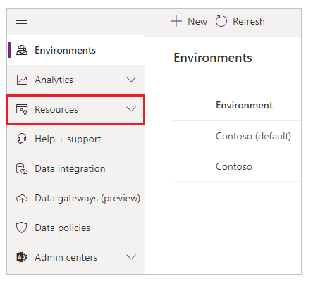
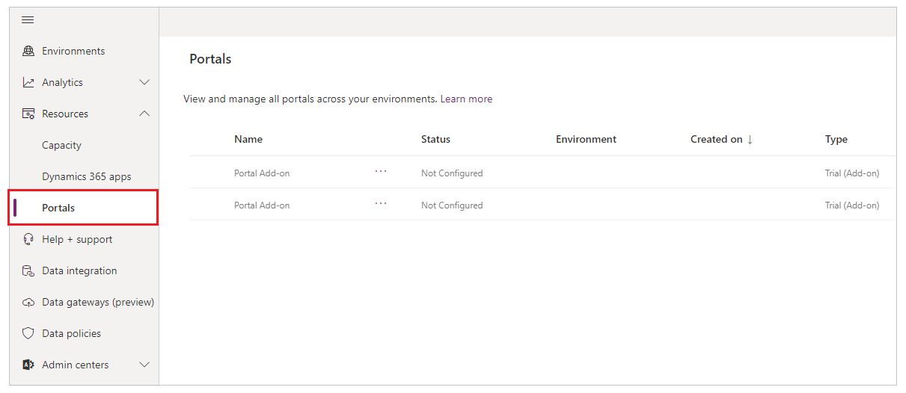
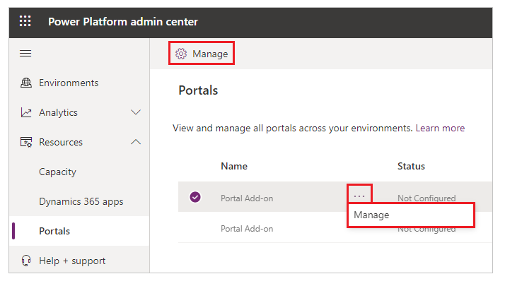
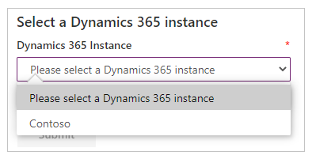
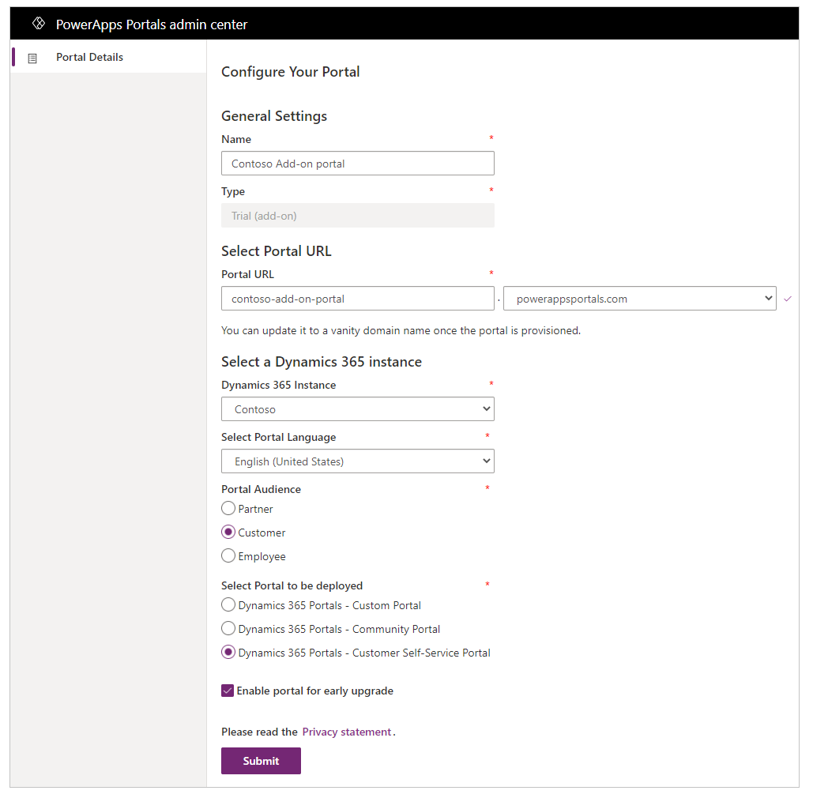
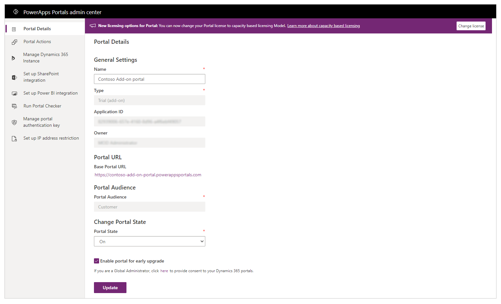
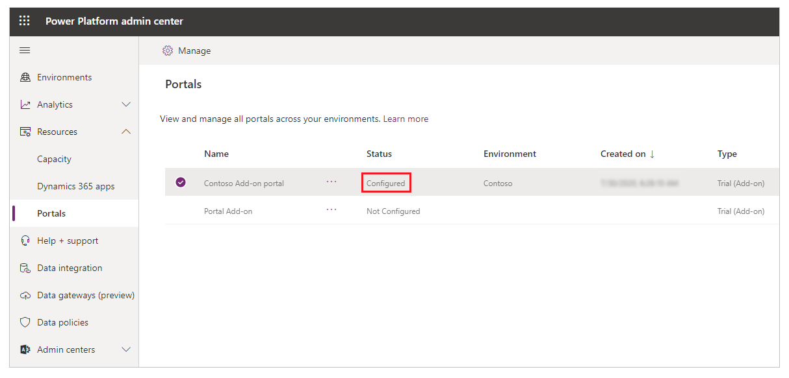

# Provision a portal using the older portal add-on

If you have purchased an older portal add-on, and want to provision a portal using the add-on, you must go to the **Dynamics 365 Administration Center** page and provision the portal.

> [!NOTE]
> - To provision a portal, you must be assigned either System Administrator or System Customizer role of the Common Data Service environment selected for the portal. You must also have the [required permissions](https://docs.microsoft.com/azure/active-directory/develop/howto-create-service-principal-portal#required-permissions) to create and register an application in Azure AD. If you don't have the required permissions, contact the Global Administrator to update your permissions or ask the Global Administrator to provision the portal.
> - There can be only one portal of each type and for a language created in an environment. For more information, go to [creating additional portals](create-portal.md#create-additional-portals-in-an-environment).
> - To learn about the roles required to create add-on portals, read [Admin roles required for portal administrative tasks](portal-admin-roles.md).

## Provision add-on portal

To provision a portal:

1. Sign in to [Power Platform admin center](https://admin.powerplatform.microsoft.com).

     

1. Select and expand **Resources** from the left pane.

     

1. Select **Portals**.

     

1. Select a **Portal Add-on** with the status of *Not configured*.

1. Select **Manage** from the top menu.   You can also select **More portal options** (), and then select **Manage** instead.

    

    A new browser tab opens to fill in the portal details. 

1. In the **General Settings** section, enter a **Name** for your portal. The **Name** will help to identify the portal and can be changed later.

    

1. The **Type** field represents the type of portal subscription (**Trial** or **Production**). This is a system field, and it **can't be changed**.

    > [!IMPORTANT]
    > The value changes based on whether it is trial subscription or paid subscription.

1. Enter portal URL of your choice.

    

    > [!NOTE]
    > - The domain `microsoftcrmportals.com` has been deprecated. Hence, ensure that you select `powerappsportals.com`. For more information, go to [Update Power Apps portals domain](admin/update-portal-domain.md).
    > - To change the URL of a portal after it is provisioned, see [change the base URL of a portal](admin/change-base-url.md).
    > - To link your portal to a custom domain, see [link your portal to a custom domain](admin/add-custom-domain.md).

1. Select the **Dynamics 365 instance** for this portal.

    

    > [!NOTE]
    > You must be a member of the **System Administrator** or **System Customizer** role in the instance to be able to select an instance.

1. Select the portal language. The available languages will depend on the languages that are installed in your instance.
    
    

    > [!NOTE]
    > Sample data is only provided in one language, so choosing a default language will also decide how the sample data is translated. Arabic and Hebrew are not supported and will not appear in the list.

1. Optionally, in the **Portal development status** drop-down list, select one of the following development statuses for your portal:

    - Prototype
    - Development
    - Test
    - UAT
    - Live

    > [!NOTE]
    > - For existing provisioned portals, this drop-down list is available on the **Portal Details** tab and no status is selected by default.
    > - This drop-down list is available only for the portals of type production.
    > - This field is used by Microsoft to understand the usage pattern of this portal and does not affect any functionality. If you use different names for development lifecycle, please select the one which is closer in purpose. This can be changed at a later point of time once portal is provisioned.

1. In the **Portal Audience** section, choose the type of audience who will visit the new portal. This will determine what options of portals you will be given. You can choose:

    -   **Partner**
        - Dynamics 365 Portals - Custom Portal
        - Dynamics 365 Portals - Community Portal
        - Dynamics 365 Portals - Customer Self-Service Portal
        - Dynamics 365 Portals - Partner Portal

    -   **Customer**
        -   Dynamics 365 Portals - Custom Portal
        -   Dynamics 365 Portals - Community Portal
        -   Dynamics 365 Portals - Customer Self-Service Portal

    -   **Employee**
        -   Dynamics 365 Portals - Employee Self-Service Portal

1. Select the checkbox if you want to **enable the portal for early upgrade**.

    

    More information: [Upgrade a portal](admin/upgrade-portal.md).

1. Verify all the information, and then select **Submit**.

    

1. Select **Accept** to accept the *Terms of Service*.

After you accept the Terms of Service, the portal will begin provisioning. Provisioning usually takes 30 minutes but can take a few hours depending on the system load. You can also check the status using the link on the request submission page.

After the portal is provisioned, the **Portal Details** page is displayed with the required details.

 

The Power Platform admin center now shows the portal in **Configured** state.

 

> [!NOTE]
> When a portal user signs in to the portal for the first time by using an Azure AD credential, a consent page is displayed to all users irrespective of the user or portal type.

The table below summarizes the features associated with each portal option:

| Feature                                | Customer Self-Service Portal | Partner Portal | Employee Self-Service Portal | Community Portal | Custom Portal |
|----------------------------------------|------------------------------|----------------|------------------------------|------------------|---------------|
| World Ready                            | *                            | *              | *                            | *                | *             |
| Multi-Language Support                 | *                            | *              | *                            | *                | *             |
| Portal Administration                  | *                            | *              | *                            | *                | *             |
| Customization and Extensibility        | *                            | *              | *                            | *                | *             |
| Theming                                | *                            | *              | *                            | *                | *             |
| Content Management                     | *                            |                | *                            | *                |               |
| Knowledge Management                   | *                            | *              | *                            | *                |               |
| Support/Case Management                | *                            |                | *                            | *                |               |
| Forums                                 | *                            |                | *                            | *                |               |
| Faceted Search                         | *                            |                | *                            |                  |               |
| Profile Management                     | *                            |                | *                            |                  |               |
| Subscribe to Forum Thread              | *                            |                | *                            |                  |               |
| Comments                               | *                            |                | *                            | *                |               |
| [!INCLUDE[pn-azure-shortest](../../includes/pn-azure-shortest.md)] AD Authentication                |                              |                | *                            |                  |               |
| Ideas                                  |                              |                |                              | *                |               |
| Blogs                                  |                              |                |                              | *                |               |
| Project Service Automation Integration |                              | *              |                              |                  |               |
| Field Service Integration              |                              | *              |                              |                  |               |
| Partner Onboarding                     |                              | *              |                              |                  |               |
| Portal Base                            |  *                           | *              |  *                           | *                | *             |
| Portal Workflows                       |  *                           | *              |  *                           | *                | *             |
| Web Notifications                      |  *                           | *              |  *                           | *                | *             |
| [!INCLUDE[cc-microsoft](../../includes/cc-microsoft.md)] Identity                     |     *                         |  *              |     *                         |   *               | *             |
| Identity Workflows                     | *                            |  *             |     *                         |   *               | *             |
| Web Forms                              |  *                            | *               |    *                          | *                 | *             |
| Feedback                               |   *                           |  *              |  *                            | *                 | *             |
||

## Troubleshoot provisioning

Sometimes the package installation process or URL creation process can error out. In these cases, the processes can be restarted.

If *Name*-Configuring changes to *Name*-Provisioning Failed, you need to restart the provisioning process.

1. Go to the **Applications** page, and select the portal.
2. Select the blue pencil button labeled **Manage**.
3. Choose one of the following options:

   - **Restart Provisioning**: Restarts the installation process with the configuration that was previously defined.

   - **Change Values and Restart Provisioning**: Lets you change some of the values before restarting the provisioning process.

If the package installation has failed, the portal administrator page will open without any issues, but navigating to the actual portal URL will show a message Getting set up. To confirm this:

1. Go to the Solution Management page of the **Dynamics 365 Administration Center** page and check that the package status is **Install Failed**. 

2. If the package status is **Install Failed**, try retrying the installation from the solution page. Also, be sure to check that a system administrator is installing the solution with the default language in Common Data Service set to the language the portal should be installed in.

> [!NOTE]
> Some solutions have prerequisites for their installation, so an installation will fail if the prerequisites are not met. For example, to install the Partner Field Service for a partner portal, the Partner Portal and Field Service solutions must have already been installed. If you attempt to install the Partner Field Service first, the installation will fail and give you an error message.

### See also

[Microsoft Learn: Administer Power Apps portals](https://docs.microsoft.com/learn/paths/administer-portals/)
