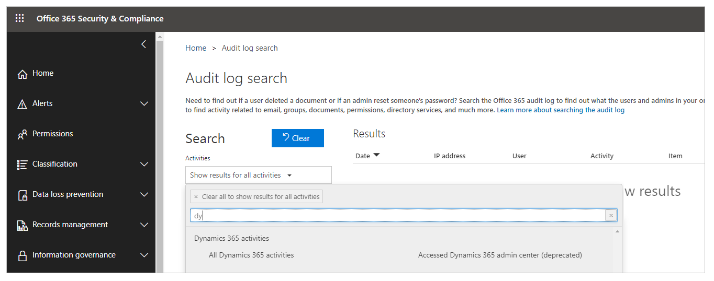

# Portals Web API (Preview)

[This article is pre-release documentation and is subject to change.]

## Overview

The portals Web API enables building a richer user experience inside Power Apps portals pages. You can use the Web API to perform create, update, and delete operations across all Common Data Service entities from your portal pages. For example, you can create a new account, update a contact, or change the [entity permissions](configure/assign-entity-permissions.md) for a product by using the portals Web API instead of the Portal Management app.

> [!IMPORTANT]
> - **Your portal version must be 9.2.6.41 or later for this feature to work**.
> - This feature is in preview. More information: [Understand experimental, preview, and deprecated features in Power Apps](../canvas-apps/working-with-experimental-preview.md)
> - The portals Web API<!--Not sure why this plural suddenly appeared?--> is built for creating a rich user experience inside portal pages. It isn't optimized for third-party services or application integration.
> - Portals Web API operations are limited to entities related to data&mdash;for example, accounts, contacts, or your custom entities. Configuring entity metadata or portal configuration entity data&mdash;for example, configuring portals entities such as adx_contentsnippet, adx_entityform, or adx_entitylist&mdash;isn't supported with the portals Web API. For a complete list, go to [Unsupported configuration entities](#unsupported-configuration-entities), later in this topic.<!--Edit okay? I think this heading should be a bit more descriptive.-->
> - The portals Web API benefits from [server-side caching](admin/clear-server-side-cache.md) and, hence, subsequent calls to the Web API are faster than the initial calls. Note that clearing the portal server-side cache causes temporary performance degradation.

## Web API operations

The portals Web API offers a subset of capabilities for Common Data Service operations that you can do by using the Common Data Service API. We've kept the API format as similar as possible, to reduce the learning curve.

### Web API operations available in portals

- [Create an entity](web-api-perform-operations.md#create-an-entity-record)
- [Update and delete entities](web-api-perform-operations.md#update-and-delete-entities-by-using-the-web-api) 
- [Associate and disassociate entities](web-api-perform-operations.md#associate-and-disassociate-entities-by-using-the-web-api)

## Site settings for the Web API

You must enable the site setting to enable the portals Web API for your portal. Also, you can configure the field-level Web API that determines the entity fields that can or can't be modified with the portals Web API.

| Site setting name | Description|
| - |- |
| *Webapi/\<entity name\>/enabled* | Enables or disables the OData<!--Why is "OData" suddenly used in this section? Should it be "the OData Web API", or simply "Web API" as it is elsewhere?--> API for \<entity name\>.   **Default:** `False`   **Valid values:** `True`, `False` |
| *Webapi/\<entity name\>/fields*  | Defines the comma-separated list of attributes that can be modified with the Web API.    **Possible values:**    - *All attributes:* `*`   - *Specific attributes:* `attr1,attr2,attr3`   **Note**:  The value must be either an asterisk (**\***) or a comma-separated list of field names.   **Important**: This is a mandatory site setting. When this setting is missing, you'll see the error "No fields defined for this entity." |
| *Webapi/error/innererror* | Enables or disables InnerError.<!--note from editor: Not sure whether this is relevant, but please see line 173 of \powerapps-docs-pr\powerapps-docs\developer\common-data-service\webapi\compose-http-requests-handle-errors.md, "We are removing the `innererror` property of the error message. You should remove any code that expects to parse this property."-->   **Default:** `False`   **Valid values:** `True`, `False`

> [!NOTE]
> Site settings must be set to **Active** for changes to take effect.

For example, to expose the OData<!--Or "Web"?--> API for the Case entity where authenticated
users are allowed to perform create, update, and delete operations on this entity, the site settings are shown in the following table.

| Site setting name | Site setting value|
| - |- |
| *Webapi/incident/enabled* | true |
| *Webapi/incident/fields* | attr1,attr2,attr3 |

## Security with the portals Web API

You can configure record-based security to individual records in portals by using [entity permissions](configure/assign-entity-permissions.md). The portals Web API accesses entity records and follows the entity permissions given to users through the associated [web role](configure/create-web-roles.md).<!--note from editor: This diagram needs better alt text. Please describe the boxes and the relationship among them.-->

## Authenticating portals Web API requests

You don't need to include authentication code, because authentication and authorization are managed by the application session. All Web API calls must include a cross-site request forgery (CSRF) token.

## General Data Protection Regulation (GDPR)

All request headers will<!--Edit okay? Please see the style guide entry for "should" at https://styleguides.azurewebsites.net/StyleGuide/Read?id=2700&topicid=35667 --> have a contact ID passed for auditing purpose. For an anonymous user, this will be passed as `null`.

If audit logging is enabled, a user can see all the audit events in the [Office 365 audit log](https://protection.office.com/unifiedauditlog).

More information: [Enable and use Activity Logging](https://docs.microsoft.com/power-platform/admin/enable-use-comprehensive-auditing) [Export, configure, and view audit log records](https://docs.microsoft.com/microsoft-365/compliance/export-view-audit-log-records).

## Unsupported configuration entities

Portals Web API can't be used for the following configuration entities.

| | | |
|-------------------------------------------|---------------------------|--------------------------------------|
| adx_contentaccesslevel                    | adx_redirect              | adx_webpage_tag                      |
| adx_contentsnippet                        | adx_setting               | adx_webpageaccesscontrolrule         |
| adx_entityform                            | adx_shortcut              | adx_webpageaccesscontrolrule_webrole |
| adx_entityformmetadata                    | adx_sitemarker            | adx_webpagehistory                   |
| adx_entitylist                            | adx_sitesetting           | adx_webpagelog                       |
| adx_entitypermission_webrole              | adx_webfile               | adx_webrole_systemuser               |
| adx_externalidentity                      | adx_webfilelog            | adx_website                          |
| adx_pagealert                             | adx_webform               | adx_website_list                     |
| adx_pagenotification                      | adx_webformmetadata       | adx_website_sponsor                  |
| adx_pagetag                               | adx_webformsession        | adx_websiteaccess                    |
| adx_pagetag_webpage                       | adx_webformstep           | adx_websiteaccess_webrole            |
| adx_pagetemplate                          | adx_weblink               | adx_websitebinding                   |
| adx_portallanguage                        | adx_weblinkset            | adx_websitelanguage                  |
| adx_publishingstate                       | adx_webnotificationentity | adx_webtemplate                      |
| adx_publishingstatetransitionrule         | adx_webnotificationurl    | adx_urlhistory                       |
| adx_publishingstatetransitionrule_webrole | adx_webpage               | adx_entitypermission                 |

## Known issues

With the current release, Web API operations aren't blocked on configuration entities. However, this issue will be fixed in upcoming releases.

## Next step

[Perform Web API operations](web-api-perform-operations.md)

### See also

[Compose HTTP requests and handle errors](web-api-http-requests-handle-errors.md)
