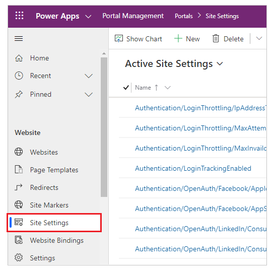
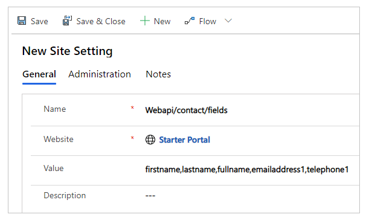
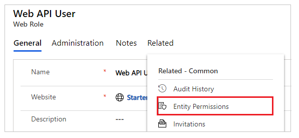
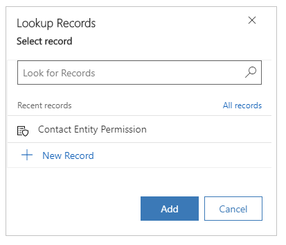
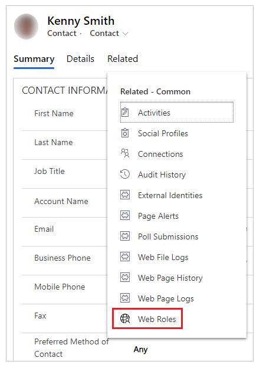
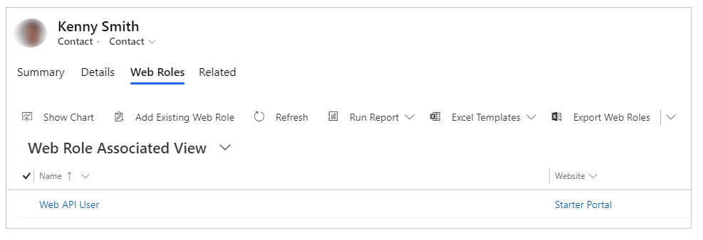
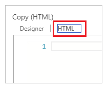
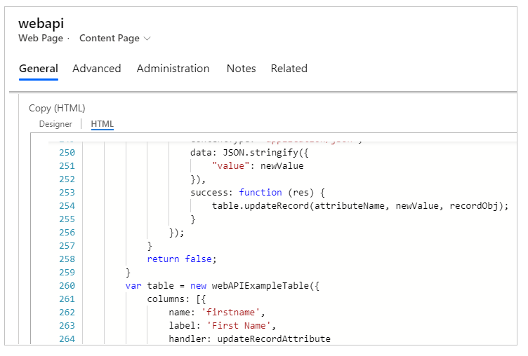
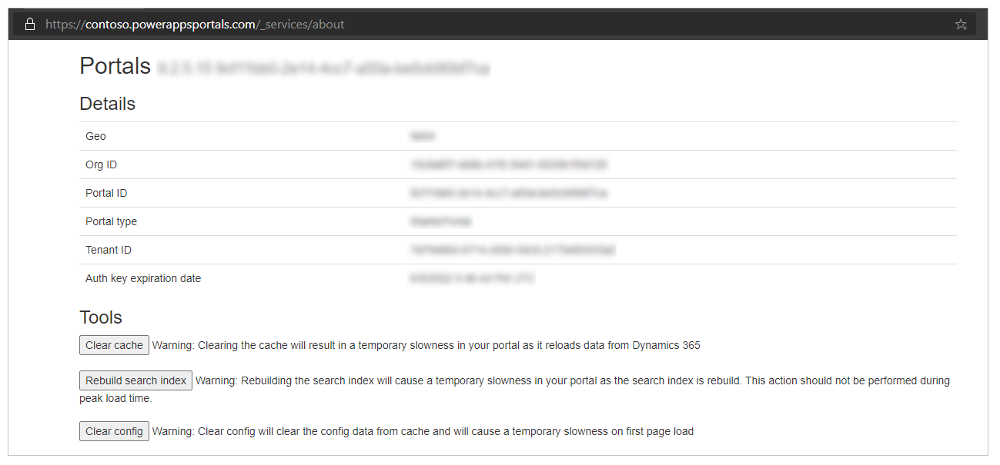
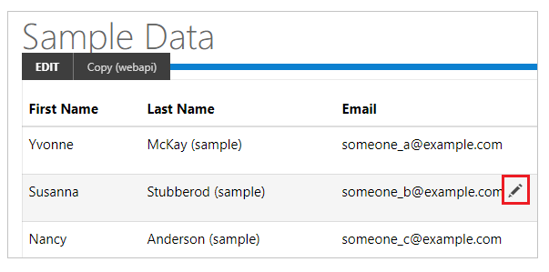

# Portals operations using the Web API (Preview)

[This article is pre-release documentation and is subject to change.]

You can perform [available Web API operations](web-api-overview.md#web-api-operations) in portals. Web API operations consist of HTTP requests and responses. This article shows sample operations, methods, URI, and the sample JSON you can use in the HTTP request.

> [!IMPORTANT]
> - **Your portal version must be 9.2.6.41 or later for this feature to work.**
> - This feature is in preview. More information: [Understand experimental, preview, and deprecated features in Power Apps](../canvas-apps/working-with-experimental-preview.md)

## Create an entity record

### Basic create

<table style="text-align:left">
  <tr>
    <th>Operation</th>
    <th>Method</th>
    <th>URI</th>
    <th>JSON Sample</th>
  </tr>
  <tr>
    <td>Basic create</td>
    <td>POST</td>
    <td><i>[Portal URI]/_api/accounts</i></td>
    <td>{"name":"Sample Account"}</td>
  </tr>
</table>

#### Sample JSON for creating related entity records in one operation

For example, the following request body posted to the Account entity set will create a total of four new entities&mdash;including the account&mdash;in the context of creating the account.<!--note from editor: Edit okay? Only three entities are listed below.-->

- A contact is created because it's defined as an object property of the single-valued navigation property primarycontactid.
- An opportunity is created because it's defined as an object within an array that's set to the value of a collection-valued navigation property opportunity_customer_accounts.
- A task is created because it's defined as an object within an array that's set to the value of a collection-valued navigation property Opportunity_Tasks.

```json
{
 "name": "Sample Account",
 "primarycontactid":
 {
     "firstname": "Alton",
     "lastname": "Stott"
 },
 "opportunity_customer_accounts":
 [
  {
      "name": "Opportunity associated to Sample Account",
      "Opportunity_Tasks":
      [
       { "subject": "Task associated to opportunity" }
      ]
  }
 ]
}
```

### Associate entity records on create

<table style="text-align:left">
  <tr>
    <th>Operation</th>
    <th>Method</th>
    <th>URI</th>
    <th>JSON Sample</th>
  </tr>
  <tr>
    <td>Associate entity records on create</td>
    <td>POST</td>
    <td><i>[Portal URI]/_api/accounts</i></td>
    <td><code>{"name":"Sample Account","primarycontactid@odata.bind":"/contacts(00000000-0000-0000-0000-000000000001)"}</code></td>
  </tr>
</table>

#### Sample JSON for creating an annotation via the Web API

```json
{
    "new_attribute1": "test attribute 1",
    "new_attribute2": "test attribute 2",
    "new_comments": "test comments",
    "new_recordurl": recordURL,
    "new_feedback_Annotations":
        [
            {
                "notetext": "Screenshot attached",
                "subject": "Attachment",
                "filename": file.name,
                "mimetype": file.type,
                "documentbody": base64str,
            }
        ]
    }
```

`documentbody` will contain the attachment<!--note from editor: Not sure why you discuss the attachment here while this section is about creating an annotation.--> as a base64 string.

## Update and delete entities by using the Web API

### Basic update

<table style="text-align:left">
  <tr>
    <th>Operation</th>
    <th>Method</th>
    <th>URI</th>
    <th>JSON Sample</th>
  </tr>
  <tr>
    <td>Basic update</td>
    <td>PATCH</td>
    <td><i>[Portal URI]/_api/accounts(00000000-0000-0000-0000-000000000001)</i></td>
    <td><code>{      "name": "Updated Sample Account ",      "creditonhold": true,      "address1_latitude": 47.639583,      "description": "This is the updated description of the sample account",      "revenue": 6000000,      "accountcategorycode": 2  }</code></td>
  </tr>
</table>

### Update a single property value

<table style="text-align:left">
  <tr>
    <th>Operation</th>
    <th>Method</th>
    <th>URI</th>
    <th>JSON Sample</th>
  </tr>
  <tr>
    <td>Update a single property value</td>
    <td>PUT</td>
    <td><i>[Portal URI]/_api/accounts(00000000-0000-0000-0000-000000000001)/name</i></td>
    <td><code>{"value": "Updated Sample Account Name"}</code></td>
  </tr>
</table>

### Delete a single property value

<table style="text-align:left">
  <tr>
    <th>Operation</th>
    <th>Method</th>
    <th>URI</th>
  </tr>
  <tr>
    <td>Delete a single property value</td>
    <td>DELETE</td>
    <td><i>[Portal URI]/_api/accounts(00000000-0000-0000-0000-000000000001)/description</i></td>
  </tr>
</table>

### Basic delete

<table style="text-align:left">
  <tr>
    <th>Operation</th>
    <th>Method</th>
    <th>URI</th>
  </tr>
  <tr>
    <td>Basic delete</td>
    <td>DELETE</td>
    <td><i>[Portal URI]/_api/accounts(00000000-0000-0000-0000-000000000001)</i></td>    
  </tr>
</table>

## Associate and disassociate entities by using the Web API

### Add a reference to a collection-valued navigation property

<table style="text-align:left">
  <tr>
    <th>Operation</th>
    <th>Method</th>
    <th>URI</th>
    <th>JSON Sample</th>
  </tr>
  <tr>
    <td>Add a reference to a collection-valued navigation property</td>
    <td>POST</td>
    <td><i>[Portal URI]/_api/accounts(00000000-0000-0000-0000-000000000002)/opportunity_customer_accounts/$ref</i></td>
    <td><code>{"@odata.id":"[Portal URI]/_api/opportunities(00000000-0000-0000-0000-000000000001)"}</code></td>
  </tr>
</table>

### Remove a reference to an entity

<table style="text-align:left">
  <tr>
    <th>Operation</th>
    <th>Method</th>
    <th>URI</th>
  </tr>
  <tr>
    <td>Remove a reference to an entity</td>
    <td>DELETE</td>
    <td><i>[Portal URI]/_api/accounts(00000000-0000-0000-0000-000000000002)/opportunity_customer_accounts/$ref?$id=[Portal URI]/_api/opportunities(00000000-0000-0000-0000-000000000001)</i></td>
  </tr>
</table>

### Remove a reference to an entity for a single-valued navigation property
For a single-valued navigation property, remove the $id query string parameter.
<table style="text-align:left">
  <tr>
    <th>Operation</th>
    <th>Method</th>
    <th>URI</th>
  </tr>
  <tr>
    <td>Remove a reference to an entity for a single-valued navigation property</td>
    <td>DELETE</td>
    <td><i>[Portal URI]/_api/opportunities(00000000-0000-0000-0000-000000000001)/customerid_account/$ref</i></td>
  </tr>
</table>

### Change the reference in a single-valued navigation property

<table style="text-align:left">
  <tr>
    <th>Operation</th>
    <th>Method</th>
    <th>URI</th>
    <th>JSON Sample</th>
  </tr>
  <tr>
    <td>Change the reference in a single-valued navigation property</td>
    <td>PUT</td>
    <td><i>[Portal URI]/_api/opportunities(00000000-0000-0000-0000-000000000001)/customerid_account/$ref</i></td>
    <td><code>{"@odata.id":"[Portal URI]/_api/accounts(00000000-0000-0000-0000-000000000002)"}</code></td>
  </tr>
</table>

### Associate entities on create

New entities can be created with relationships by using *deep* insert.

### Associate entities on update by using a single-valued navigation property

You can associate entities on update by using the same message described in [Basic update](#basic-update), earlier in this topic, but you must use the `@odata.bind` annotation to set the value of a single-valued navigation property. The following example changes the account associated to an opportunity by using the customerid_account single-valued navigation property.

### Associate entities on update by using a single-valued navigation property

<table style="text-align:left">
  <tr>
    <th>Operation</th>
    <th>Method</th>
    <th>URI</th>
    <th>JSON Sample</th>
  </tr>
  <tr>
    <td>Associate entities on update by using a single-valued navigation property</td>
    <td>PATCH</td>
    <td><i>[Portal URI]/_api/opportunities(00000000-0000-0000-0000-000000000001)</i></td>
    <td><code>{"customerid_account@odata.bind":"[Portal URI]/_api/accounts(00000000-0000-0000-0000-000000000002)"}</code></td>
  </tr>
</table>

## Web API AJAX samples

This sample demonstrates how to create, update, and delete entity records by using Asynchronous JavaScript and XML (AJAX).

### Wrapper AJAX function

```javascript
	(function(webapi, $){
		function safeAjax(ajaxOptions) {
			var deferredAjax = $.Deferred();
	
			shell.getTokenDeferred().done(function (token) {
				// add headers for AJAX
				if (!ajaxOptions.headers) {
					$.extend(ajaxOptions, {
						headers: {
							"__RequestVerificationToken": token
						}
					}); 
				} else {
					ajaxOptions.headers["__RequestVerificationToken"] = token;
				}
				$.ajax(ajaxOptions)
					.done(function(data, textStatus, jqXHR) {
						validateLoginSession(data, textStatus, jqXHR, deferredAjax.resolve);
					}).fail(deferredAjax.reject); //AJAX
			}).fail(function () {
				deferredAjax.rejectWith(this, arguments); // on token failure pass the token AJAX and args
			});
	
			return deferredAjax.promise();	
		}
		webapi.safeAjax = safeAjax;
	})(window.webapi = window.webapi || {}, jQuery)
```

### Create

```javascript
	webapi.safeAjax({
		type: "POST",
		url: "/_api/accounts",
		contentType: "application/json",
		data: JSON.stringify({
			"name": "Sample Account"
		}),
		success: function (res, status, xhr) {
      //print id of newly created entity record
			console.log("entityID: "+ xhr.getResponseHeader("entityid"))
		}
	});

```

### Update

```javascript
  webapi.safeAjax({
    type: "PATCH",
    url: "/_api/accounts(00000000-0000-0000-0000-000000000001)",
    contentType: "application/json",
    data: JSON.stringify({
      "name": "Sample Account - Updated"
    }),
    success: function (res) {
      console.log(res);
    }
  });
```

### Delete

```javascript
	webapi.safeAjax({
		type: "DELETE",
		url: "/_api/accounts(00000000-0000-0000-0000-000000000001)",
		contentType: "application/json",
		success: function (res) {
			console.log(res);
		}
  });
```

## Example

In this example, you'll use a sample script to view, edit, create, and delete contacts by using the fields *firstname*,*lastname*, *fullname*, *emailaddress1*, and *telephone1*.

You can change the field names, or use a different entity, while following the steps in this example.

### Step 1 - Create site settings

Before you can use the portals Web API, you have to enable the required site settings with the Portal Management app. The site settings depend on the entity that you want to use when interacting with the Web API.

1. Go to [Power Apps](https://make.powerapps.com).

1. On the left pane, select **Apps**.

1. Select the **Portal Management** app.

    

1. In the **Portal Management** app on the left pane, select **Site Settings**.

    

1. Select **New**.

1. In the **Name** box, enter **Webapi/contact/enabled**.

1. In the **Website** list, select your website record.

1. In the **Value** box, enter **true**.

    

1. Select **Save & Close**.

1. Select **New**.

1. In the **Name** box, enter **Webapi/contact/fields**.

1. In the **Website** list, select your website record.

1. In the **Value** box, enter<br>**firstname,lastname,fullname,emailaddress1,telephone1**

   

1. Select **Save & Close**.

1. Select **New**.

1. In the **Name** box, enter **Webapi/error/innererror**.

1. In the **Website** list, select your website record.

1. In the **Value** box, enter **true**.

    

1. Select **Save & Close**.

1. Verify the site settings for **Web API**.

     

### Step 2 - Configure permissions

You'll have to configure permissions so that users are able to use the Web API feature. In this example, you'll enable the Contact entity for entity permissions, create a web role for using the Web API, add the entity permissions for the Contact entity to this web role, and then add the web role to users to allow them to use the Web API.

1. In the **Portal Management** app on the left pane, select **Entity Permissions**.

1. Select **New**.

1. In the **Name** box, enter **Contact Entity Permission**.

1. In the **Entity Name** list, select **Contact (contact)**.

1. In the **Website** list, select your website record.

1. In the **Scope** list, select **Global**.

1. Select **Read**, **Write**, **Create**, and **Delete** privileges.

1. Select **Save & Close**.

    

1. On the left pane, select **Web Roles** .

1. Select **New**.

1. In the **Name** box, enter **Web API User**.

1. In the **Website** list, select your website record.

1. For **Authenticated Users Role**, select **Yes**.

    

1. Select **Save**.

1. Select **Related** > **Entity Permissions**.

    

1. Select **Add Existing Entity Permission**.

1. Select **Contact Entity Permission**, created earlier.

1. Select **Add**.

    

1. Select **Save & Close**.

    

1. On the left pane, select **Contacts**.

1. Select a contact that you want to use in this example for the Web API.

    > [!NOTE]
    > This contact is the user account used in this example for testing the Web API. Be sure to select the correct contact in your portal.

1. Select **Related** > **Web Roles**.

    

1. Select **Add Existing Web Role**.

1. Select the **Web API User** role, created earlier.

1. Select **Add**.

    

1. Select **Save & Close**.

### Step 3 - Create a webpage

Now that you've enabled the Web API and configured user permissions, create a webpage with sample code to view, edit, create, and delete records.

1. In the **Portal Management** app on the left pane, select **Web Pages**.

1. Select **New**.

1. In the **Name** box, enter **webapi**.

1. In the **Website** list, select your website record.

1. For **Parent Page**, select **Home**.

1. For **Partial URL**, enter **webapi**.

1. For **Page Template**, select **Home**.

1. For **Publishing State**, select **Published**.

1. Select **Save**.

    

1. Select **Related** > **Web Pages**.

    

1. From **Web Page Associated View**, select **webapi**.

    

1. Scroll down to the **Content** section, and then go to **Copy (HTML)** (HTML designer).

    

1. Select the **HTML** tab.

    

1. Copy the following sample code snippet and paste it in the HTML designer.

    ```html
        <!-- Sample code for Web API demonstration -->
    <style>
        #processingMsg {
            width: 150px;
            text-align: center;
            padding: 6px 10px;
            z-index: 9999;
            top: 0;
            left: 40%;
            position: fixed;
            -webkit-border-radius: 0 0 2px 2px;
            border-radius: 0 0 2px 2px;
            -webkit-box-shadow: 0 2px 4px rgba(0, 0, 0, 0.2);
            box-shadow: 0 2px 4px rgba(0, 0, 0, 0.2);
            display: none;
        }
    
        table td[data-attribute] .glyphicon-pencil {
            margin-left: 5px;
            opacity: 0;
        }
    
        table td[data-attribute]:hover .glyphicon-pencil {
            opacity: 0.7;
        }
    </style>
    
    <fetch version="1.0" mapping="logical">
        <entity name="contact">
            <attribute name="fullname"></attribute>
            <attribute name="firstname"></attribute>
            <attribute name="lastname"></attribute>
            <attribute name="contactid"></attribute>
            <attribute name="emailaddress1"></attribute>
            <attribute name="telephone1"></attribute>
            <order attribute="contactid" descending="false"></order>
        </entity>
    </fetch>
    
    <script>
        //Add the contact data in json object
        var contactList = [
            
        {
            id: "{{entity.contactid}}",
                fullname: "{{entity.fullname}}",
                    firstname: "{{ entity.firstname }}",
                        lastname: "{{ entity.lastname }}",
                            emailaddress1: "{{ entity.emailaddress1 }}",
                                telephone1: "{{ entity.telephone1 }}"
        } , 
          
    ];
        $(function () {
            //Web API ajax wrapper
            (function (webapi, $) {
                function safeAjax(ajaxOptions) {
                    var deferredAjax = $.Deferred();
                    shell.getTokenDeferred().done(function (token) {
                        // Add headers for ajax
                        if (!ajaxOptions.headers) {
                            $.extend(ajaxOptions, {
                                headers: {
                                    "__RequestVerificationToken": token
                                }
                            });
                        } else {
                            ajaxOptions.headers["__RequestVerificationToken"] = token;
                        }
                        $.ajax(ajaxOptions)
                            .done(function (data, textStatus, jqXHR) {
                                validateLoginSession(data, textStatus, jqXHR, deferredAjax.resolve);
                            }).fail(deferredAjax.reject); //ajax
                    }).fail(function () {
                        deferredAjax.rejectWith(this, arguments); // On token failure pass the token ajax and args
                    });
                    return deferredAjax.promise();
                }
                webapi.safeAjax = safeAjax;
            })(window.webapi = window.webapi || {}, jQuery)
            // Notification component
            var notificationMsg = (function () {
                var $processingMsgEl = $('#processingMsg'),
                    _msg = 'Processing...',
                    _stack = 0,
                    _endTimeout;
                return {
                    show: function (msg) {
                        $processingMsgEl.text(msg || _msg);
                        if (_stack === 0) {
                            clearTimeout(_endTimeout);
                            $processingMsgEl.show();
                        }
                        _stack++;
                    },
                    hide: function () {
                        _stack--;
                        if (_stack <= 0) {
                            _stack = 0;
                            clearTimeout(_endTimeout);
                            _endTimeout = setTimeout(function () {
                                $processingMsgEl.hide();
                            }, 500);
                        }
                    }
                }
            })();
            // Inline editable table component
            var webAPIExampleTable = (function () {
                var trTpl = '<% _.forEach(data, function(data){ %>' +
                    '<tr data-id="<%=data.id%>" data-name="<%=data.fullname%>">' +
                    '<% _.forEach(columns, function(col){ %>' +
                    '<td data-attribute="<%=col.name%>" data-label="<%=col.label%>" data-value="<%=data[col.name]%>">' +
                    '<%-data[col.name]%><i class="glyphicon glyphicon-pencil"></i>' +
                    '</td>' +
                    '<% }) %>' +
                    '<td>' +
                    '<button class="btn btn-default delete" type="submit"><i class="glyphicon glyphicon-trash" aria-hidden="true"></i></button>' +
                    '</td>' +
                    '</tr>' +
                    '<% }) %>';
                var tableTpl = '<table class="table table-hover">' +
                    '<thead>' +
                    '<tr>' +
                    '<% _.forEach(columns, function(col){ %>' +
                    '<th><%=col.label%></th>' +
                    '<% }) %>' +
                    '<th>' +
                    '<button class="btn btn-default add" type="submit">' +
                    '<i class="glyphicon glyphicon-plus" aria-hidden="true"></i> Add Sample Record' +
                    '</button>' +
                    '</th>' +
                    '</tr>' +
                    '</thead>' +
                    '<tbody>' + trTpl + '</tbody>' +
                    '</table>';
                function getDataObject(rowEl) {
                    var $rowEl = $(rowEl),
                        attrObj = {
                            id: $rowEl.attr('data-id'),
                            name: $rowEl.attr('data-name')
                        };
                    $rowEl.find('td').each(function (i, el) {
                        var $el = $(el),
                            key = $el.attr('data-attribute');
                        if (key) {
                            attrObj[key] = $el.attr('data-value');
                        }
                    })
                    return attrObj;
                }
                function bindRowEvents(tr, config) {
                    var $row = $(tr),
                        $deleteButton = $row.find('button.delete'),
                        dataObj = getDataObject($row);
                    $.each(config.columns, function (i, col) {
                        var $el = $row.find('td[data-attribute="' + col.name + '"]');
                        $el.on('click', $.proxy(col.handler, $el, col, dataObj));
                    });
                    //User can delete record using this button
                    $deleteButton.on('click', $.proxy(config.deleteHandler, $row, dataObj));
                }
                function bindTableEvents($table, config) {
                    $table.find('tbody tr').each(function (i, tr) {
                        bindRowEvents(tr, config);
                    });
                    $table.find('thead button.add').on('click', $.proxy(config.addHandler, $table));
                }
                return function (config) {
                    var me = this,
                        columns = config.columns,
                        data = config.data,
                        addHandler = config.addHandler,
                        deleteHandler = config.deleteHandler,
                        $table;
                    me.render = function (el) {
                        $table = $(el).html(_.template(tableTpl)({ columns: columns, data: data })).find('table');
                        bindTableEvents($table, { columns: columns, addHandler: addHandler, deleteHandler: deleteHandler });
                    }
                    me.addRecord = function (record) {
                        $table.find('tbody tr:first').before(_.template(trTpl)({ columns: columns, data: [record] }));
                        bindRowEvents($table.find('tbody tr:first'), config);
                    }
                    me.updateRecord = function (attributeName, newValue, record) {
                        $table.find('tr[data-id="' + record.id + '"] td[data-attribute="' + attributeName + '"]').text(newValue);
                    }
                    me.removeRecord = function (record) {
                        $table.find('tr[data-id="' + record.id + '"]').fadeTo("slow", 0.7, function () {
                            $(this).remove();
                        });
                    }
                };
            })();
            //Applicaton ajax wrapper 
            function appAjax(processingMsg, ajaxOptions) {
                notificationMsg.show(processingMsg);
                return webapi.safeAjax(ajaxOptions)
                    .fail(function (response) {
                        if (response.responseJSON) {
                            alert("Error: " + response.responseJSON.error.message)
                        } else {
                            alert("Error: Web API is not available... ")
                        }
                    }).always(notificationMsg.hide);
            }
            function addSampleRecord() {
                //Sample data to create a record - change as appropriate
                var recordObj = {
                    firstname: "Willie",
                    lastname: "Huff" + _.random(100, 999),
                    emailaddress1: "Willie.Huff@contoso.com",
                    telephone1: "555-123-4567"
                };
                appAjax('Adding...', {
                    type: "POST",
                    url: "/_api/contacts",
                    contentType: "application/json",
                    data: JSON.stringify(recordObj),
                    success: function (res, status, xhr) {
                        recordObj.id = xhr.getResponseHeader("entityid");
                        recordObj.fullname = recordObj.firstname + " " + recordObj.lastname;
                        table.addRecord(recordObj);
                    }
                });
                return false;
            }
            function deleteRecord(recordObj) {
                var response = confirm("Are you sure, you want to delete \"" + recordObj.name + "\" ?");
                if (response == true) {
                    appAjax('Deleting...', {
                        type: "DELETE",
                        url: "/_api/contacts(" + recordObj.id + ")",
                        contentType: "application/json",
                        success: function (res) {
                            table.removeRecord(recordObj);
                        }
                    });
                }
                return false;
            }
            function updateRecordAttribute(col, recordObj) {
                var attributeName = col.name,
                    value = recordObj[attributeName],
                    newValue = prompt("Please enter \"" + col.label + "\"", value);
                if (newValue != null && newValue !== value) {
                    appAjax('Updating...', {
                        type: "PUT",
                        url: "/_api/contacts(" + recordObj.id + ")/" + attributeName,
                        contentType: "application/json",
                        data: JSON.stringify({
                            "value": newValue
                        }),
                        success: function (res) {
                            table.updateRecord(attributeName, newValue, recordObj);
                        }
                    });
                }
                return false;
            }
            var table = new webAPIExampleTable({
                columns: [{
                    name: 'firstname',
                    label: 'First Name',
                    handler: updateRecordAttribute
                }, {
                    name: 'lastname',
                    label: 'Last Name',
                    handler: updateRecordAttribute
                }, {
                    name: 'emailaddress1',
                    label: 'Email',
                    handler: updateRecordAttribute
                }, {
                    name: 'telephone1',
                    label: 'Telephone',
                    handler: updateRecordAttribute
                }],
                data: contactList,
                addHandler: addSampleRecord,
                deleteHandler: deleteRecord
            });
            table.render($('#dataTable'));
        });
    </script>
    <div id="processingMsg" class="alert alert-warning" role="alert"></div>
    <div id="dataTable"></div>
    ```

    

1. Select **Save & Close**.

### Step 4 - Clear the portals cache

You've created a **webapi** sample page to test the Web API functionality. Before you get started, ensure that the Power Apps portals cache has been cleared so that the changes from the Portal Management app are reflected on your portal.

> [!IMPORTANT]
> Clearing the portal server-side cache causes temporary performance degradation of the portal while data gets reloaded from Common Data Service.

To clear the cache:

1. Sign in to your portal as a member of the Administrators web role.

1. Change the URL by appending **/_services/about** at the end. For example, if the portal URL is https://contoso.powerappsportals.com, change it to https://contoso.powerappsportals.com/_services/about.

    

    > [!NOTE]
    > You must be a member of the **Administrators** web role to clear the cache. If you see a blank screen, check the web role assignments.

1. Select **Clear cache**.

More information: [Clear the server-side cache for a portal](admin/clear-server-side-cache.md)

### Step 5 - Use the Web API to view, edit, create, and delete

The sample webpage with the URL **webapi** created earlier in this example is now ready for testing.

To test the Web API functionality:

1. Sign in to your portal with the user account that has been assigned the **Web API User** role you created earlier.

1. Go to the **webapi** webpage created earlier. For example, *https://contoso.powerappsportals.com/webapi*.

    

1. Select **Add Sample Record** to add the sample record from the script.

1. Select a field. In this example, we've selected **Email** to change the email address of a contact.<!--note from editor: Edit okay? I assume changing the email address isn't actually the point of this procedure.-->

    

1. Select  to delete a record.

Now that you've created a webpage with a sample in this example to view, edit, create and delete records, you can customize the forms and layout.

## Next step

[Compose HTTP requests and handle errors](web-api-http-requests-handle-errors.md)

### See also

[Web API overview](web-api-overview.md)
