# Create your first app in Microsoft Teams

You can create, edit, and delete [canvas apps](/powerapps/maker/canvas-apps/getting-started) in Teams.

If you're creating an app by using Power Apps in a Teams team for the first time, a new Project Oakdale environment will be created for you. More information: [About the Project Oakdale environment](/power-platform/admin/about-teams-environment)

## Get started with creating your first app

After installing the Power Apps app from the Teams store:

1. Start Teams, and sign in.

1. In the left pane, select **Power Apps**, and then select **Create an app**.

    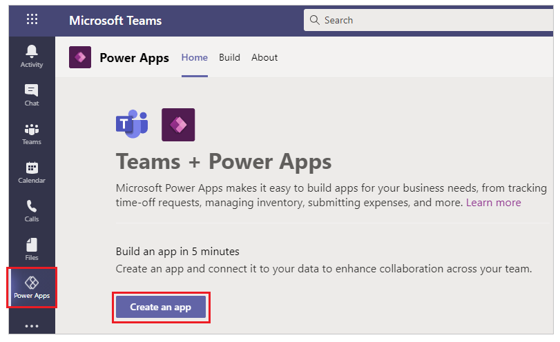

    > [!TIP]
    > If you don't see the **Power Apps** app in the left pane, select  (*More added apps*), and then select **Power Apps**.
    
    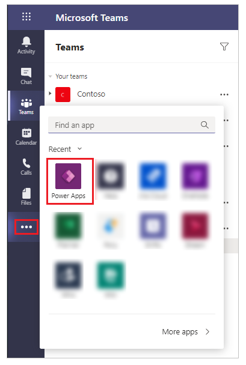

1. You'll be prompted to select a team where you want to create the app. Select the team that will be responsible for customizing and maintaining the app. You will have an opportunity to share the app to other teams once you’re done building the app.

    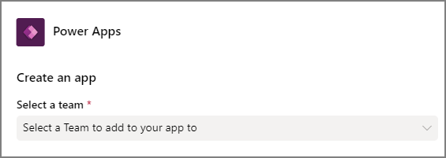

    If this is the first app being created in the selected team, a new Project Oakdale environment will be created for the selected team. You'll see a message about this when you select the team. More information: [About the Project Oakdale environment](/power-platform/admin/about-teams-environment)

    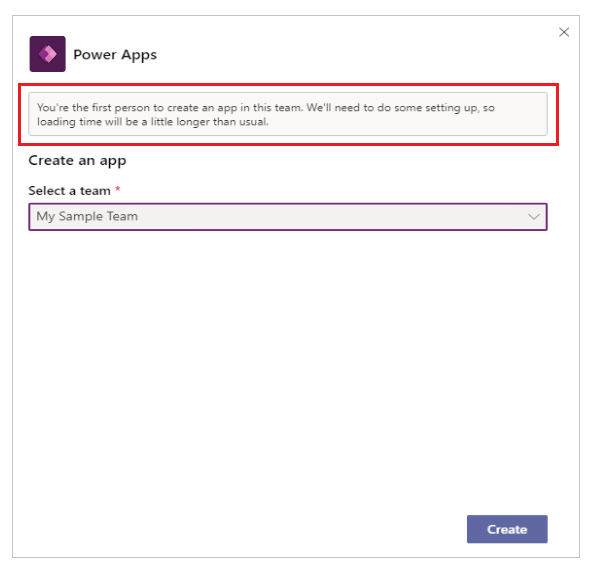

1. Select **Create**. You'll see a confirmation about the Project Oakdale environment being created, which might take some time. You'll be notified when the environment is available for you to create your first app.

    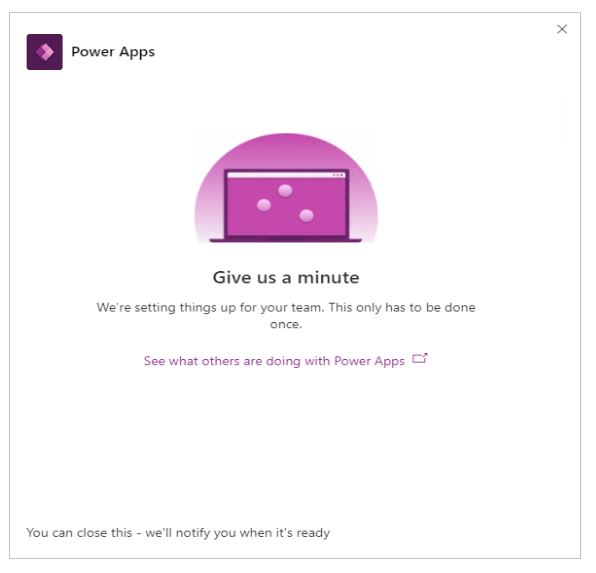

> [!NOTE]
> Environment creation will fail if the Teams team that you selected has *Hiddenmembership* enabled. If this happens, try creating the app in a different team. More information: [Hidden membership groups](known-issues-limitations.md#hidden-membership-groups)

## Creating an app in a team with a Microsoft 365 Group

When you select **Create** to create an app in the selected team, Power Apps automatically enables the selected team's Microsoft 365 Group for security. However, if the group can't be enabled for security, you'll see the following error: 

`The request failed with error: 'Insufficient privileges to complete the operation.' The tracking Id is '[xxxxxxx-xxxx-xxxx-xxxx-xxxxxxxxxxxx]'`.

To fix this issue, manually update the Microsoft 365 Group setting *SecurityEnabled* from
*False* to *True* by using PowerShell. For detailed steps, see [Share an app with Microsoft 365 Groups](../maker/canvas-apps/share-app.md#share-an-app-with-office-365-groups). More information: [Microsoft 365 Groups and Microsoft Teams](https://docs.microsoft.com/microsoftteams/office-365-groups)

### Enabling security for teams with same names

Team names aren't always unique. It's possible for more than one
team in Teams to share the same display name. For example, there might be
more than one team with the name "Inspection" in a tenant. However, the
Microsoft 365 Group associated with each team has a different *ObjectId* in
Azure Active Directory (Azure AD), even when the team names are the same. The *ObjectId* in
Azure AD for a Microsoft 365 Group is the same as the *GroupId* in
Teams for the associated team.

To find the **GroupId** (ObjectID in Azure AD) of a team:

1. Go to the team in Teams.

1. Select any channel in the team.

1. Select **More options** (...) from the upper-right corner, and then select **Get link to channel**.

    

1. Copy the *GroupID* from the link.

    

    You can also copy the channel link by selecting **Copy**, and then pasting it into a text editor
to get the *GroupID* value.

    `https://teams.microsoft.com/l/channel/19%3a06f038959c9f4387a35f5d776484cff2%40thread.tacv2/General?groupId=40b7e373-a788-4e29-a590-5a86db7550e3&tenantId=00000000-0000-0000-0000-0000000000000000`

1. Now that you have the correct team's **GroupID** (ObjectID in Azure AD), use the instructions in
[Share an app with Microsoft 365 Groups](/powerapps/maker/canvas-apps/share-app#share-an-app-with-office-365-groups)
to enable security for the team's Microsoft 365 Group.

## Continue creating your first app

After your Project Oakdale environment has been created, you can go to the build hub and continue creating your first app.

> [!NOTE]
> If you wait in Teams for the environment to be created, you're automatically taken to the Power Apps Studio and a new app. In this situation, skip this step and go to [create your first table](#create-your-first-table).

1. Select the **Build** tab to view the environment created for your team.

    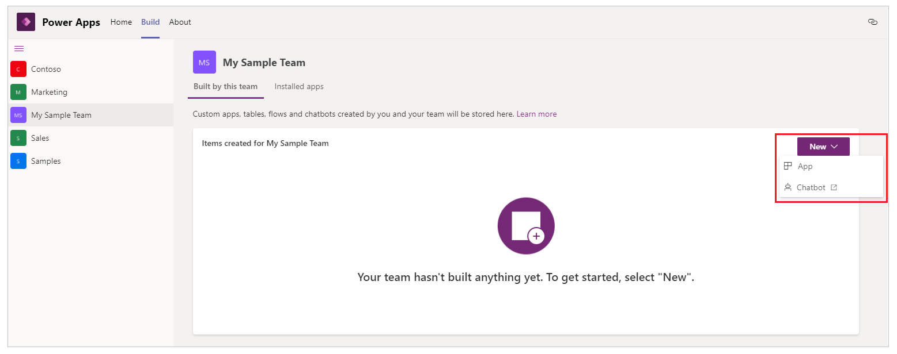

1. Select **Create** to get started building your first app. This action opens
Power Apps Studio, where you're prompted to name your app. 

1. Enter an app name, and then select **Save**.

    

    > [!TIP]
    > An app template is included with the app by default, so that you can get started with creating your table and using the app. More information: [Understand Power Apps Studio](understand-power-apps-studio.md)

### Create your first table

Data for apps built in Teams lives in Project Oakdale environments as tables. Like other data experiences, you can add additional columns to track different attributes of each record before filling up the table with multiple rows of data.

> [!TIP]
> To learn about Project Oakdale tables in detail, go to [Overview of Project Oakdale](overview-data-platform.md).

To get started creating your first table:

1. Select **Create new table**.

    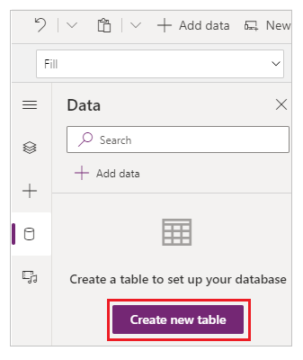

1. In the **Create a table** dialog box, type a meaningful name for your
new table that describes this dataset, and then select
**Create**.

1. After the table is created, you can add columns of different types, add rows, and
work with data in the visual editor.

   

### Add columns to the table

To add a new column to track new data:

1. Select **Add column.**  

1. Enter a name that best describes your new column.

1. Select the type for your column.

    > [!TIP]
    > For more information about column types supported by the table
    designer, go to [Supported column types](understand-power-apps-studio.md#supported-column-types). To add columns that aren't supported by
    the visual editor, create a table by using the **Build** tab. More information: [Create tables](create-table.md)

1. If required, change **Advanced options** for the selected column type.

1. Select **Create**.

1. Repeat the previous steps to add the rest of the data columns.

### Add rows to the table

To add rows, select the empty row and start typing additional data, or
select **Add row**.


### Update the app template

After you close the table, the app template that was added to the app screen by default is automatically refreshed to use the new table.

> [!NOTE]
> If you add additional data sources, such as a new table, or if you reopened the app, refer to [Manually connect data to the app](#manually-connect-data-to-the-app) to manually refresh the app with the new data.

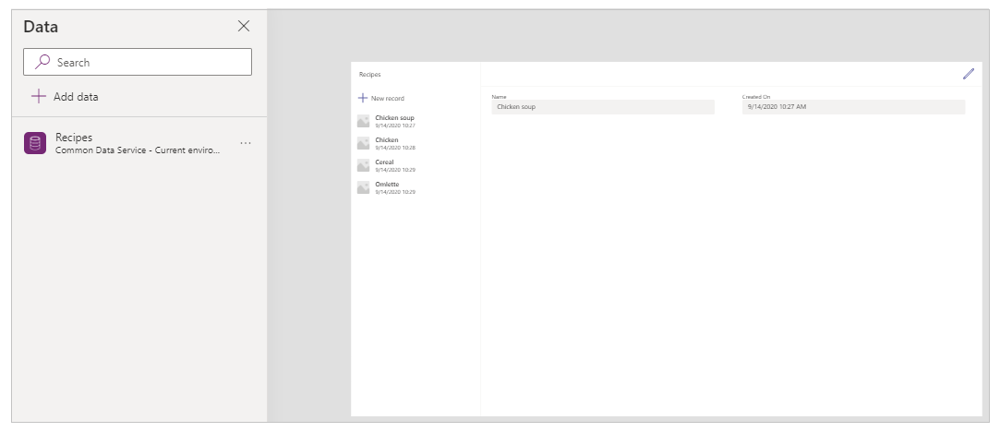

Depending on the number of fields you added to your table, the app template might need updates to the form and the gallery.

#### Manually connect data to the app

The gallery and the edit form components on the screen automatically refresh with the data only for the first data source. If you add additional data sources, such as a new table, or if you reopened the app, you'll have to manually connect the data to the template gallery and form.

> [!TIP]
> Skip these steps if the app screen is already connected to the table that you created.

To manually connect to the new data:

1. Select the gallery, and then select the correct data source.

    

1. Select the form, and then select the correct data source.

    

1. If you see any formula error, select **Edit in the formula bar**, and update the formula with the data source name.

    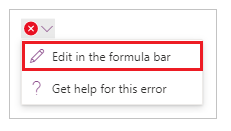

    For example, to change from using *MyRecipes* as the data source name for the edit form to *Recipes*, replace the name of the data source.

    Change from:

    ```powerapps-dot
    Remove(NewRecipes, selectedRecord); If(IsEmpty(Errors(NewRecipes, selectedRecord)),UpdateContext( {itemSelected:false, editMode:false, newMode:false, deleteMode:false}); Set(CurrentItem,First(NewRecipes)););
    ```
    Change to:

    ```powerapps-dot
    Remove(Recipes, selectedRecord); If(IsEmpty(Errors(Recipes, selectedRecord)),UpdateContext( {itemSelected:false, editMode:false, newMode:false, deleteMode:false}); Set(CurrentItem,First(Recipes)););
    ```

1. Repeat the earlier step to fix any additional formula errors.

#### Update background color for the selected gallery record

The gallery shows records created earlier. However, the background color needs to change for a record when selected from the gallery to show the selection.

To update the selected item background color:

1. Select the gallery.

    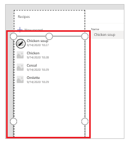

2. Select *TemplateFill* property from the property drop-down on the top-left.

    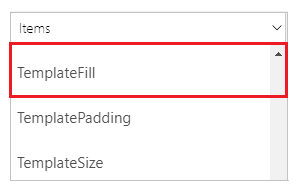

3. Update the *TemplateFill* property value in the formula bar to the following formula:

    ```powerapps-dot
    If(ThisItem.IsSelected, RGBA(0,0,0,.05), RGBA(0,0,0,0))
    ```

    

#### Update fields on the form

The template shows two fields inside the form by default. To add more fields to the form:

1. Select the form.

    

1. Select **Edit fields** from the property pane on the right.

    

1. Select **Add fields**.

    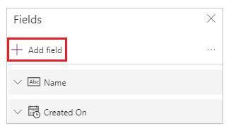

1. Select the fields that you want to add on the form.

    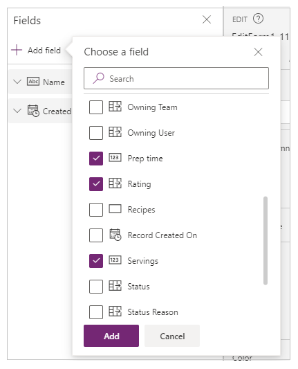

1. Select **Add**.

1. (Optional) Select fields to move up or down, or remove unwanted fields by selecting **Remove**.

    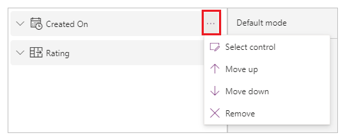

1. Close the fields pane.

Adding, removing, and reordering fields automatically updates the form.

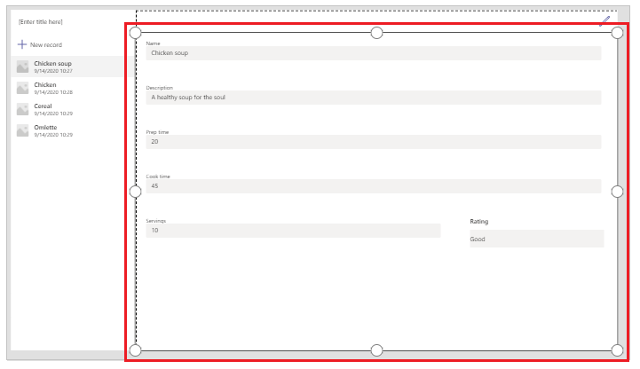

#### Update fields in the gallery

The gallery on the default app template might need updates to reflect the fields from the table you created.

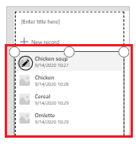

To update the fields in the gallery:

1. Select **Edit fields** from the property pane on the right.

    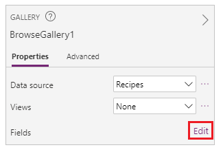

1. Select the drop-down menu for a gallery component (such as image, title, or subtitle) and change the selection to the field you want.

    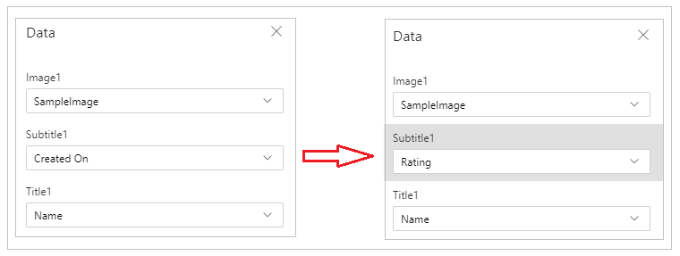

1. Close the data pane.

The gallery is updated with the selected changes.


#### Update the app title

To update the app title:

1. Select the label from the upper-left corner of the screen.

    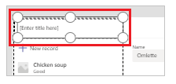

1. Change the *Text* property value from the properties pane on the right.

    

Verify all the changes you made to the app.


> [!TIP]
> For better responsiveness, the [data cards](../maker/canvas-apps/working-with-cards.md) by default have [**Width fit**](../maker/canvas-apps/controls/properties-size-location.md#size) property set to *On*. If you want to resize the data cards manually, select the data cards and then set the **Width fit** property to *Off* first.

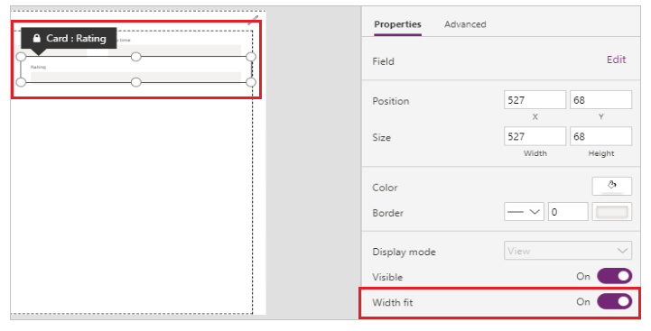

### Save and preview the app

Now that you've created your first app with data, you can save your changes and preview the app.


1. Select **Save**.

1. Select **Preview**.

    - To add a new record, select **New record** and fill in the form.
    - To edit a record, select the record from the left pane, and edit the values.
    - To close the preview, select **Close** or the **Esc** key.

## Add your app to a Teams channel as a tab

To use the app as a tab in your Teams channel, you'll need to save the app,
publish it, and then add it to your team's channel.

1. Go to your team in Teams.

1. Select the channel that you want to pin the app to, and then select +.

    

1. Select **Power Apps**.

    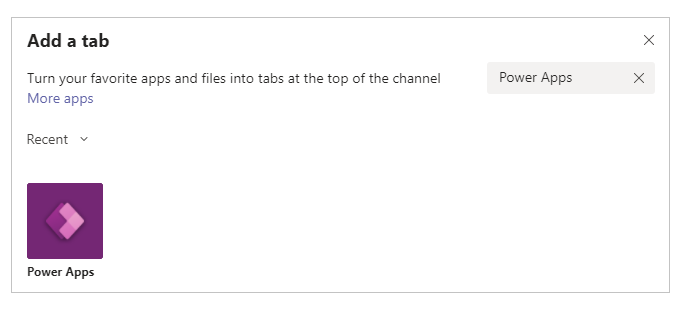

1. Select **Add**.

1. Select your app from the list (in this example, **Sample app**), and then select **Save** to add the app as a tab.

Now that you've created your first app from a blank table, let's go through the
Power Apps interface, Studio, controls and how to create additional apps in
detail.

## Next steps

[Overview of the Power Apps app](overview-of-the-power-apps-app.md)<br/>
[Understand Power Apps Studio](understand-power-apps-studio.md)<br/>
[Use the Fluent UI controls](use-the-fluent-ui-controls.md)<br/>
[Create additional apps](create-additional-apps.md)
