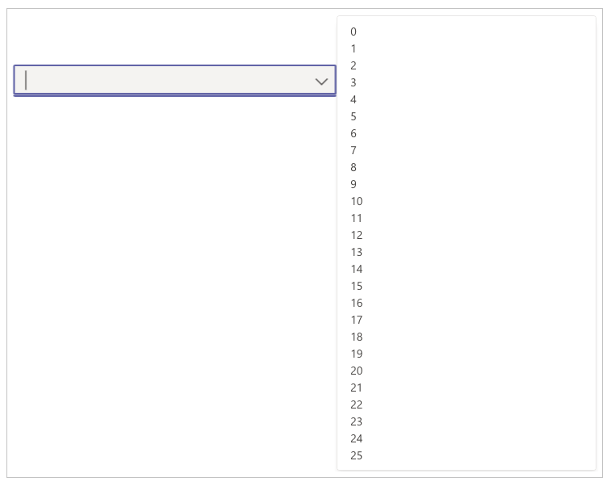

# Known issues and limitations

This article provides details about the known issues and limitations when using [**Project Oakdale environments**](/power-platform/admin/about-teams-environment) during the preview release.

## Additional components

The following components aren't supported:

- Model-driven apps
- AI Builder
- Custom connectors

## Build hub

Selecting **Play** for apps in build hub launches the application in an external browser window, and may not work.

Use one of the following options to play an app:

- Edit the app and play using the Studio.
- Publish the app in Teams and play from the pinned tab.

## Component library

[Component library](../maker/canvas-apps/component-library.md) isn't supported.

## Government Community Cloud (GCC)

Project Oakdale currently isn't available in [Power Apps Government Community Cloud (GCC)](/power-platform/admin/powerapps-us-government).

## Hidden membership groups

Project Oakdale doesn't support [hidden membership groups](https://docs.microsoft.com/graph/api/resources/group?view=graph-rest-1.0&preserve-view=true#group-visibility-options). You'll receive the following error when you try to create an app in a team that has the group visibility set to *Hiddenmembership*.

`Existing limits on this team`  
`You're unable to continue due to an administrative setting on this team. You can try again with another team.`

The group may have hidden membership enabled by your administrator. Try using Project Oakdale on a new Teams team, an existing team that does not have hidden membership enabled, or contact your administrator.

## Localization

Localization of [Power Apps Studio](understand-power-apps-studio.md) isn't supported.

## Required fields

There is no enforcement of user-created required table fields. Rows that have empty values in those fields can be saved successfully. System required fields are enforced and cannot be saved without a value.

## Studio

### Classic controls

Enabling classic controls requires a refresh of Power Apps Studio.  

### Combo box

The combo box control currently only supports up to 25 items in the dropdown.

### Canvas components

You may see red errors while using the modern controls in canvas components. These errors won't functionally impact your app, and you can ignore them.

### Controls

The following controls aren't supported:

- [Forms Pro survey (preview)](/forms-pro/embed-survey-powerapps)
- [Mixed reality](../maker/canvas-apps/mixed-reality-overview.md)
- [Video control](../maker/canvas-apps/controls/control-audio-video.md)

### New connections

Connections in the Power Apps Studio that require an authentication dialog fails in the [Teams desktop client](https://docs.microsoft.com/microsoftteams/get-clients#desktop-client). Open the Studio in the [Teams web client](https://docs.microsoft.com/microsoftteams/get-clients#web-client) to add these connectors.

### Studio and visual editor synchronization

Power Apps Studio doesn't reflect the changes to tables after:

1. Renaming tables.
1. Adding relationships within the inline [visual editor](understand-power-apps-studio.md#visual-editor).

To see the new changes, refresh Power Apps Studio.

### Studio version

It's currently not possible to change your Studio version.

### Visual editor

Currency, Duration, Language, Ticker, and Timezone fields can't be added using visual editor. To create these fields, use the experience to work with tables as available using [build hub](create-table.md).

## Theme

Power Apps Studio and apps currently don't support **Dark theme**.

## Others

-	If a user is an owner of the Azure Active Directory (Azure AD) group associated with a team but is not also a member of that group, they may not be able to see that team in the Power Apps and Power Virtual Agents apps.

-	It may take up to 2 hours for deleting, renaming, or restoring a team to reflect correctly within the Power Apps and Power Virtual Agents apps.

-	It may take up to 15 minutes for new team users to be able to see the team within the Power Apps and Power Virtual Agents apps.
