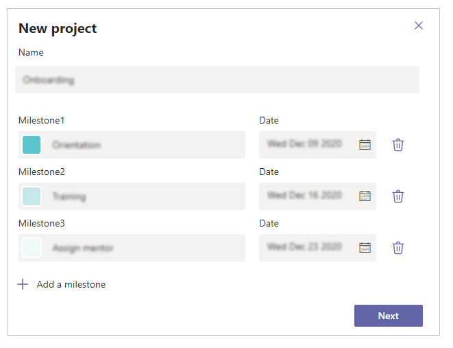
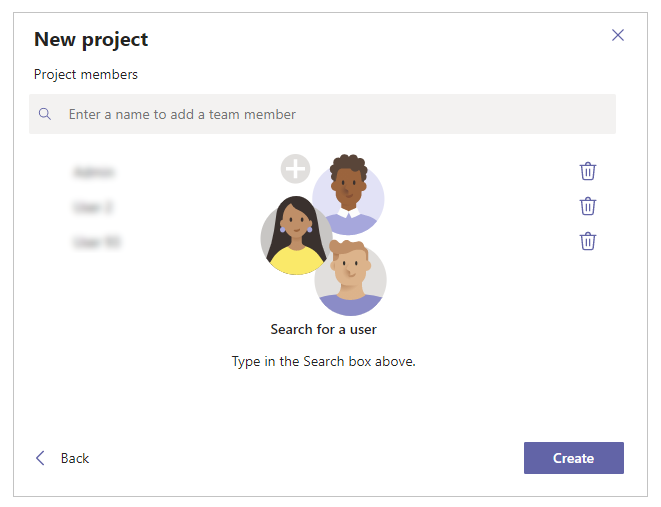
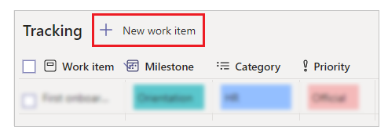
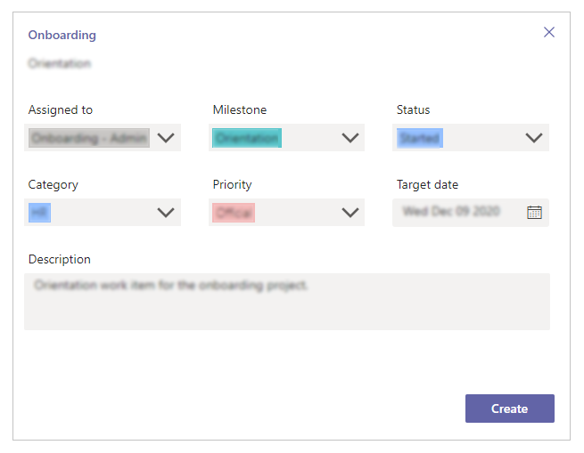
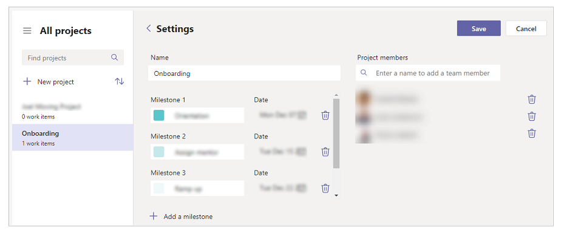
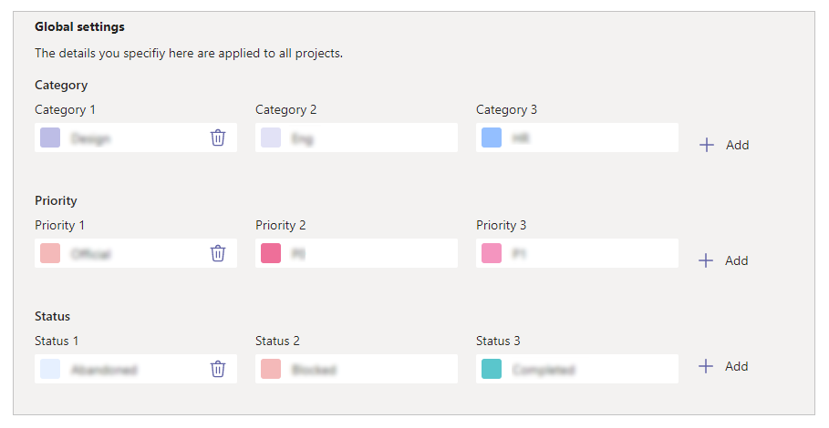

# Milestones sample app (Preview)

[This article is pre-release documentation and is subject to change.]

In this tutorial, you'll learn about configuring, and using the **Milestones** sample app.

## Overview

The Milestones sample app for Microsoft Teams provides a simple way to keep track of your projects and initiatives.

Benefits of using the Milestones app:

- Managers can easily set up projects, and work items.
- Assign work items to employees.
- Classify work items by milestones.
- Configure work item categories, priorities, and status options.

> [!IMPORTANT]
> - This is a preview feature.
> - [!INCLUDE[cc_preview_features_definition](../includes/cc-preview-features-definition.md)]

## Prerequisites

Before using this app:

1. Find the app in Teams store.
2. Install the app.
3. Set up the app for the first use.

For details about the above steps, go to [Use sample apps from the Teams store](use-sample-apps-from-teams-store.md).

## Open the Milestones app

To open the Milestones app:

1. Sign in to Teams.

1. Select the Team.

1. Select the channel where you installed the **Milestones** app.

1. Select the **Milestones** tab.

1. Select **Allow** if the app asks for your permissions to use the connectors.

1. You can learn more about extending this app's capabilities on the splash screen. Select **Got it** to close the screen, and go to the app. To hide this message while opening this app again, select **Don't show this again** before you select **Got it**.

    

## Understand the Milestones interface

The Milestones app gives you easy access to your projects, work items,
activities, and project milestones

1. **Search for projects** - search for projects to display in the list on the left pane inside the app.

1. **Select theme** - allows managers to select a theme, or add a custom header image/color.

1. **App information** - shows additional information about the app.

1. **App settings** - provides access for managers to change app settings, such as rename projects, or update project category, priority, and status.

1. **New project** - create a new project.

1. **Sort projects** - sorts the list of projects in ascending, or descending order based on project start date.

1. **View team status of work items by owner** - color coded counts display the number of work items by team member.

1. **Team/Milestone toggle** - toggle between user summary view, and milestone status view.

1. **New activity** - add an update to the activity log.

1. **Expand/collapse the activity log** - expands, or collapses the activity log section.

1. **Projects list** - shows all projects, or the results of the search term entered in the find projects search box. Overdue work item count is displayed if the project has any overdue work items.

1. **Customize** - open the app inside Power Apps Studio for customization.

1. **Project work items** - create, read, update, and delete work items associated with the project.

1. **Activity log** - view activity log, including manually added items, and system-generated notifications.

## Create a new project

To create a new project:

1. Open the **Milestones** app.

1. Select **New Project** from the left pane.

    

1. Enter **Name**.

1. Enter milestones as required.
      To add additional milestones, select **Add a milestone**.

    

1. Select **Next**.

1. Add team members to the project.

1. Select **Create** to create the project

    

## Add theme to project

Once your project is created, select the image button to select an existing image, choose a color, or upload a custom image as the project theme.

## Add work items to a project

To add work items to a project:

1. Open the **Milestones** app.

1. Select a project from the left pane.

1. Select **New work item**.

    

1. Add the work item details: *Name*, *Description*, values for *Assigned to*, *Milestone*, *Status*, *Category*, *Priority*, and *Target date*.

1. Select **Create**.

    

## Edit a project

To edit project details:

1. Open **Milestones** app.

1. Select a project from the left pane.

1. Select **Settings** ().

1. Update project details.

1. Select **Save**.

    

## Create category, priority, and status

You can change the options and color coding for options used for priority,
status, and category.

1. Open **Milestones** app.

1. Select **Settings** ().

1. In the **Global settings** area, select the color for the option you want to change to select a new color

    

1. To rename a category, select the name of the category that you wish to change, and enter a new name.

1. To add an additional option, select **Add**. And then, select the color, and enter the name.

1. To delete an option, select the field, then select the **Delete**.

1. When finished, select **Save** to save your changes.

### See also

- [Customize sample apps](customize-sample-apps.md)
- [Sample apps FAQs](sample-apps-faqs.md)
- [Bulletins sample apps](bulletins.md)
- [Employee ideas sample app](employee-ideas.md)  
- [Inspection sample apps](inspection.md)  
- [Issue reporting sample apps](issue-reporting.md)
- [Use sample apps from the Microsoft Teams store](use-sample-apps-from-teams-store.md)
