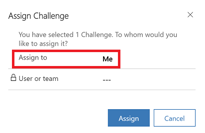
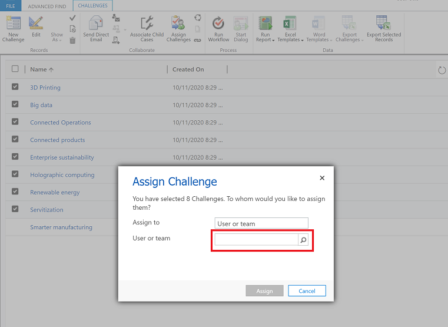
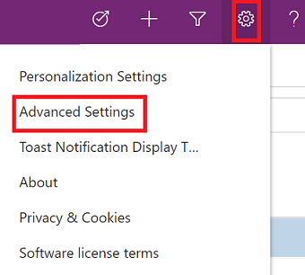
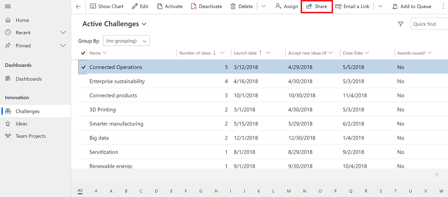
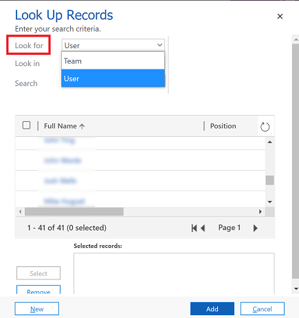

# Assign or share records

When you create a record, you are the owner of the record. If you would like another person in your organization to take ownership of the record, then you can assign the record to that person. You can assign a record to a user or team. You can also assign a record to yourself that that another user owns but you need to have system administrator privilege to do this.

If you want to keep ownership of the record but let someone else work on it with you, then use the **Share** option to share the record. 

For more information on how privileges and access works, see [How access to a record is determined](https://docs.microsoft.com/power-platform/admin/how-record-access-determined).

## Assign a record to a user or team

1. From a list of records, select the record that you want to assign to someone else. You can select multiple records.

   > [!div class="mx-imgBorder"]
   > 

2. On the command bar, select **Assign**. 

   > [!div class="mx-imgBorder"]
   > 

  
3. In the assign dialog box, select the **Assign to** field and choose one of the following options:
    - Select **Me** to assign the record to yourself and them select **Assign**. Remember only a system administrator can assign a record that belongs to someone else to themself.
    
      > [!div class="mx-imgBorder"]
      > 
    
    - Select **User or Team** and then enter the name of the user or team or use the lookup to find them. Or, select **New Record** to create a new user or team record. When you're done select **Assign**.

      > [!div class="mx-imgBorder"]
      > 

## Use advanced find to reassign records

Use advanced find to search for records and then reassign them to someone else. For more information on advanced find, see [Create, edit, or save an Advanced Find search](advanced-find.md).

1. On the command bar, select **Advanced Find**.

   > [!div class="mx-imgBorder"]
   > 
   
2. Use the [advanced find search](advanced-find.md) to find records that you want to assign to someone else. For example, to look for active record types that are **Challenges**, in **Look for:** enter **Challenges** and status equals **Active**. Then select **Results** to run the query.

    > [!div class="mx-imgBorder"]
    > 

3. Select the records that you want to assign and then select **Assign (page name)**

   > [!div class="mx-imgBorder"]
   > 
   
 4. In the assign dialog box, select the **Assign to** field and choose one of the following options:
 
    - Select **Me** to assign the record to yourself and them select **Assign**. Remember only a system administrator can assign a record that belongs to someone else to themself.
    
    - Select **User or Team** and then enter the name of the user or team or use the lookup to find them. Or, select **New Record** to create a new user or team record. When you're done select **Assign**.
    
      > [!div class="mx-imgBorder"]
      > 
   
 
 ## Reassign all records (for admins)
 
 When you have a user that leaves your organization or ownership needs to change from one user to another the records can be reassigned by an administrator.
 
 1. Go to **Settings** > **Advanced Settings**.
 
    > [!div class="mx-imgBorder"]
    > 
 
 2. From the top menu navigate from **Settings** > **Security**.
     > [!div class="mx-imgBorder"]
     > 
 
 3. Under **Security** select **Users**.
 
 4. From the list of users, select a user name to open the user's profile.

 5. On the command bar, select **REASSIGN RECORDS**.
 
    > [!div class="mx-imgBorder"]
    > 
   
 4. On the **Reassign Records** dialog box choose how to want to reassign all the records and then select **OK**.
 
    > [!div class="mx-imgBorder"]
    > 
 
   > [!NOTE]
   > - The **Reassign Records** option will reassign all records regardless of their status. Inactive and active records will be reassigned to the other user or team. This will also deactivate all activated processes including business rules and workflows when the record is reassigned to another user or team. The new owner must activate the processes that was deactivated when the record is reassigned.  
   > - When there is a large amount records to reassign, the system may take a while to process. 
   > - If there is an issue during the reassignment process such as the user that the records are being reassigned to doesn't have the required privileges then the **Reassign Records** process will stop. The records that are processed before the issue will be updated and saved. For the records that were not saved, you will need reassign the records again using the **Reassign Records** option.
   
 
 ## Share a record with someone else
 
 If you want to keep ownership of a record but let someone else work on the record with you then use the share option.
 
 
1. From a list of records, select the record that you want to assign to someone else. You can select multiple records.

   > [!div class="mx-imgBorder"]
   > 

2. On the command bar, select **Share**. 

   > [!div class="mx-imgBorder"]
   > 
   
 3. On the share dialog box, select **Add User/Team**.  

    > [!div class="mx-imgBorder"]
    > 
   
 4. On the **Look up Records** dialog box, select the **Look for** menu and choose **User** or **Team**.
 
    > [!div class="mx-imgBorder"]
    > 
    
 5. Use the lookup to find the user or team and select the name and then choose **Select**.
 
     > [!div class="mx-imgBorder"]
     > 
     
 6. Select **Add**. 
 
     > [!div class="mx-imgBorder"].
     > 
     
 7. On the share dialog box, select the type of permissions the user or team has for the record. When you're done, select **Share**   
 
     > [!div class="mx-imgBorder"].
     > 
 
