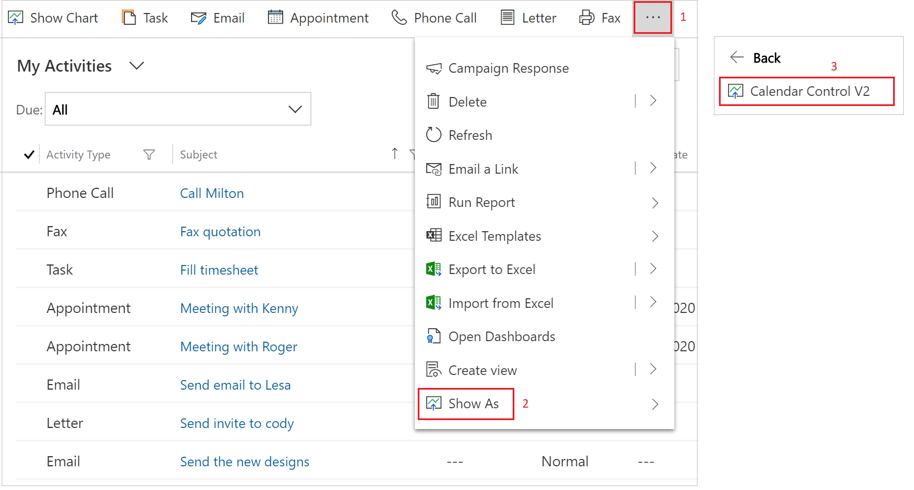
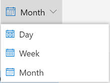
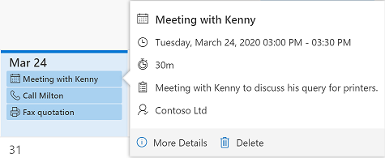
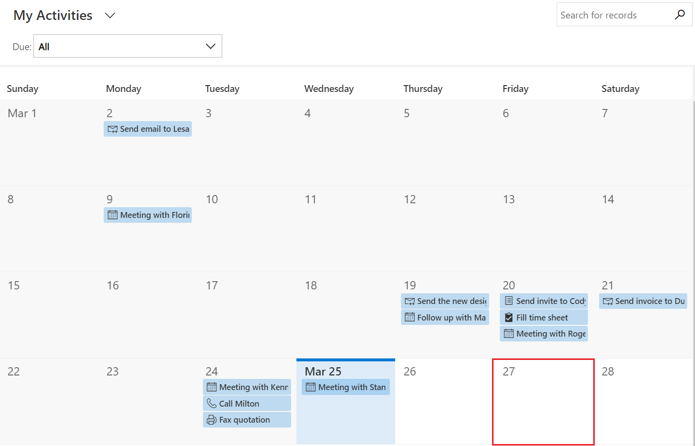
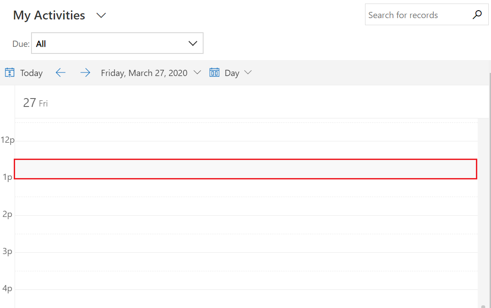

# Work with rows in the new calendar view

The new calendar view displays scheduled activities and their associated details. You can view, create, and delete your activities in a day, week, or month view. For the new calendar view to be visible, the **Calendar Control V2** control must be added to a table view by a system customizer or a system administrator. The **Calendar Control V2** control can be added to any table.

By default, rows are displayed in a read-only grid. When the **Calendar Control V2** control is added to a table and the view is changed to the calendar view, rows associated with the table will be displayed in an interactive calendar.

## Switch to the new calendar view

The calendar view is made available when the calendar control is added to a table view. If the calendar view isn't visible, contact your system customizer or a system administrator.

**To switch to the new calendar view**

1.  In the site map, select an item. For example, **Activities**.

2.  On the command bar, select the **More commands** icon, and then select **Show As** > **Calendar Control V2**.

    > [!div class="mx-imgBorder"]
    >  

    The activities are displayed in the new calendar view.

    > [!div class="mx-imgBorder"]
    >  

## Work with the new calendar view

Using the new calendar view, you can:

- [Change the calendar view](#change-the-calendar-view).
- [View details of a calendar item](#view-details-of-a-calendar-item).
- [Create and delete rows from the calendar](#create-and-delete-rows-from-the-calendar).
- [Search through rows](#search-through-rows).

### Change the calendar view

You can choose from these calendar views:

- **Month**: View the entire month.
- **Week**: View the week from Sunday through Saturday, by default. You can change the first day of the week in system settings.
- **Day**: View the current day.

**To change the view**

1.  On the navigation bar of the calendar, select the view you're currently in: **Month**, **Day**, or **Week**.

    > [!div class="mx-imgBorder"]
    >  

2.  Select the view you want to change to.

    > [!div class="mx-imgBorder"]
    >  

If you want to set a calendar view as the default view, you do that through personalization settings.

### View details of a calendar item

You can view a summary of a row by selecting it in the calendar. A pop-up window opens and displays the summary information.

**Row details for an activity**

> [!div class="mx-imgBorder"]
>  

**Row details for an opportunity**

> [!div class="mx-imgBorder"]
>  

If you want to view complete details about the row, select **More Details** in the pop-up window.

> [!NOTE]
> This view is not customizable. If you would like to customize this view, add your suggestion [here](https://ideas.powerapps.com).

### Create and delete rows from the calendar

The new calendar view allows you to create and delete rows from the calendar.

**To create a row**

1.  In the calendar, double-click a date tile (in **Month** view) or select a time slot (in **Day** or **Week** view) in which you want to create a row.

    > [!div class="mx-imgBorder"]
    > 

    > [!div class="mx-imgBorder"]
    >  

    Depending on the table on which the calendar control was added, an appropriate **New** form is opened. For example, if you're viewing leads, a form to create a new lead is opened. If you're viewing opportunities, a form to create a new opportunity is opened.

    > [!NOTE]
    > - When you add the new calendar control on the Activity table, an appointment is created when you create a row from the calendar. The start and end times are filled-in automatically as per the selected date tile or time slots. By default, the duration is set to 30 minutes.
    > - When you add the new calendar control on a table other than Activity, the corresponding table row is created when you create a row from the calendar.
    > - You can also create a new row by selecting and dragging across time slots in **Day** or **Week** view.

2.  Enter the detail, and then save the row. 

**To delete a row**

1.  On the calendar, select the row you want to delete.

2.  Select **Delete** in the pop-up window.

    > [!div class="mx-imgBorder"]
    > 

### Search through rows

You can use the Search box to filter the rows in the calendar based on a search term. For example, when you enter the keyword **Meeting**, it refreshes the calendar view to show only the rows where the title begins with **Meeting**.

> [!div class="mx-imgBorder"]
> 

### See also

[Add the calendar control to tables](../maker/model-driven-apps/add-calendar-control.md)
