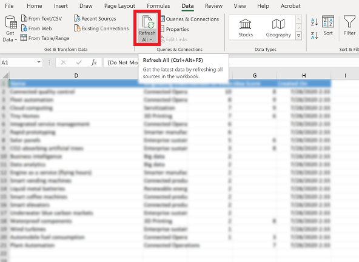

# Export to an Excel dynamic worksheet

Export your app data to an Office Excel worksheet so users can have the latest information. Imagine the CEO of your company getting the critical information they need without having to navigate in an app, but instead merely opening the Excel link on their desktop. You can export up to 100,000 rows at a time.    
  
## Export data to an Excel dynamic worksheet  

You can’t export data to a dynamic worksheet in Excel for all row types. If you don’t see the option, it’s not available for that row.  
  
1. Open a list of rows in the app and select the arrow to the right of **Export to Excel**. 

   > [!div class="mx-imgBorder"] 
   > 
  
2. Select **Dynamic Worksheet**.  
  
3. In the **Select Columns for Dynamic Excel** dialog box, select the column settings and then select **Export**.  
  
4. Select **Save** and then save the .xlsx file. Make note of the location where you saved the file.  
  
   > [!NOTE]
   > If you’re going to edit the data file later, it’s recommended that you save the file before you open it. Otherwise, you might get this error message: **Excel cannot open or save any more documents because there is not enough available memory or disk space.**  
   > 
   > To fix the issue:  
   > 
   >    1. Open Excel and go to **File** > **Options** > **Trust Center** **Settings Center Settings** > **Protected View**.  
   >    2. In **Protected View**, clear all three items.  
   >    3. Select **OK** > **OK**.  
   >     
   >    We still strongly recommend that you save and then open the data file rather than disabling protected view, which might put your computer at risk.  
  
5. Open Excel and then open the .xlsx file you saved in the previous step.  
  
6. If you see the security warning **External Data Connections have been disabled**, select **Enable Content**.  
  
7. To refresh data in the file, on the **Data** tab, select **Refresh All**.  

   > [!div class="mx-imgBorder"] 
   > 
  
   > [!NOTE]
   > - If you have a phone number that starts with **+** or **–** (for example +1-123-456-7890), when you refresh the dynamic worksheet, the phone number column will not display the number correctly.   
   > To avoid the issue, use a space or parentheses **()**, like this: +1 123-456-7890 or +1 (123)-456-7890.  
   >- If you have any issues with dynamic worksheet, see [Troubleshoot export to Excel](ts-export-to-excel.md).  
  
## Tips  
  
- You can email a dynamic Excel file or store it as a shared file if the recipients are in the same domain as you. When recipients open the dynamic file, they’ll see data they have permission to view in the app, so the data they see may be different from what you see.  
  
- Some system views, such as Accounts: No Campaign Activities in Last 3 Months, can be exported only to a static Excel worksheet.  
  
- In Power Apps, currency values are exported to Excel as numbers. To format the data as currency after you have completed the export, see the Excel Help topic titled “Display numbers as currency."

- The date and time values that you see in the app show up only as Date when you export the file to Excel, but the cell actually shows both the date and time.  
  
- If you’re going to make changes and import the data file back into the app, remember that secured, calculated, and composite columns (such as Full Name) are read-only and can’t be imported into the app. You’ll be able to edit these columns in Excel, but when you import the data back into the app, these columns will not be updated. If you want to update these columns, such as a contact’s name, then it’s recommended that you use that view to export your data, update it in Excel, and import it back to the app for changes.  
 

