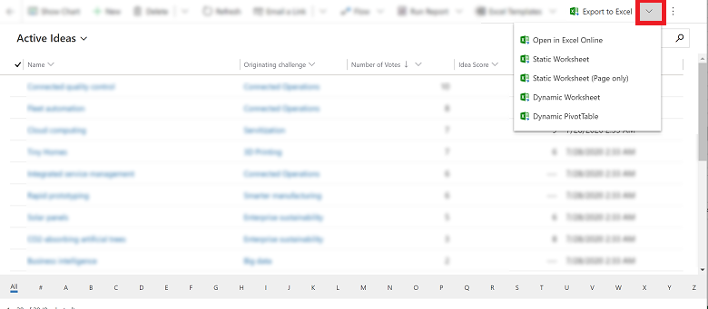

# Export to an Excel static worksheet

When you want to present information about the data in your app to an individual who doesn’t have access to the app, or you have data that doesn’t change often, consider exporting the app data to an Office Excel static worksheet.

You can export up to 100,000 records at a time. By default, a model-driven app lists up to 50 records per page. Choose the **Page** arrows at the bottom of the list to view any additional pages.  
  
## Export data to an Excel static worksheet  
You may have the option to export data to an Excel static worksheet in all record types. However, in some cases the format might be legacy, or the data might not be filtered by what you see in the app.  
  
1. Open a list of records in the app, select the arrow to the right of **Export to Excel**, and then choose **Static worksheet (Page only)**.  

   > [!div class="mx-imgBorder"] 
   > 
  
2. By default, an exported worksheet includes the fields that are displayed in the list, using the same field order, sorting, and field widths. To make changes to the columns in an Advanced Find View, choose **Edit Columns**. 
  
3. Choose **Save** and then save the .xlsx file. Make note of the location where you saved the file.  
  
   > [!NOTE]
   > If you’re going to edit the data file later, it’s recommended that you save the file before you open it. Otherwise, you might get this error message: **Excel cannot open or save any more documents because there is not enough available memory or disk space.**  
   > 
   > To fix the issue do this:  
   > 
   > 1. Open Excel and go to **File** > **Options** > **Trust Center** > **Settings Center Settings** > **Protected View**.  
   > 2.  In **Protected View**, clear all three items.  
   > 3.  Select **OK** > **OK**.  
   > 
   > We still strongly recommend that you save and then open the data file rather than disabling protected view, which might put your computer at risk.  

4. Open Excel and then open the .xlsx file you saved in the previous step.  
  
   By default, an exported worksheet includes the fields that are displayed in the list, using the same field order, sorting, and field widths.  
  
## Tips  
  
- You can email a static exported worksheet to anyone or store it in a shared file. Anyone who opens the file will see all the data in the file.
  
- You can’t change the columns for a system view, such as **All Active Accounts**. You must either customize the view, which requires the System Administrator or System Customizer security role, or use Advanced Find to create your own view based on the current view.  
    
- In model-driven apps, currency values are exported to Excel as numbers. After you have completed the export, see [Format numbers as currency](https://support.microsoft.com/office/format-numbers-as-currency-0a03bb38-1a07-458d-9e30-2b54366bc7a4?ui=en-US&rs=en-US&ad=US).
  
- The date and time values that you see in the app show up only as Date when you export the file to Excel, but the cell actually shows both the date and time.  
  
- If you’re going to make changes and import the data file back into the app, remember that secured, calculated, and composite fields (such as Full Name) are read-only and can’t be imported into the app. You’ll be able to edit these fields in Excel but when you import the data back into the app, these fields will not be updated. If you want to update these fields, such as a contact’s name, then it’s recommended that you use that view to export your data, update it in Excel, and import it back to the app for changes.  
  

