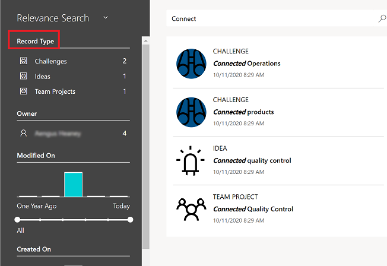
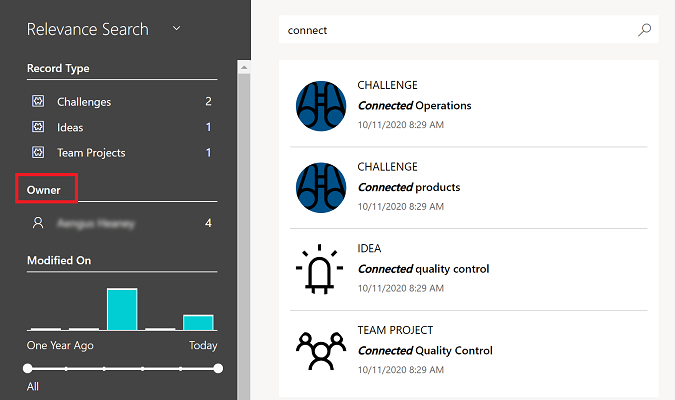

# Filter rows with facets

With Dataverse, you can refine your search results by using facets and filters. Facets and filters let you drill into and explore the results of your current search without having to repeatedly refine your search terms.

Facets are available in the leftmost pane. Immediately after you perform a search, the following global facets are available for four common columns:  
  
-   Row Type  
  
-   Owner  
  
-   Created On  
  
-   Modified On  
  
### Row Type facets

To narrow your search results to a specific table, select the table under the **Row Type** section.  
 
  > [!div class="mx-imgBorder"]
  >   
  
When you filter on a specific row type, you can include activities and notes that are related to the selected row in your search results. To do that, select the **Related Notes & Activities** check box. The activities and notes will appear in top-level results.
 
  > [!div class="mx-imgBorder"]
  >   
  
Search results that are found in email attachments or appointment tables are shown in the search results under their parent row, either Email or Appointment.  
  
When you refine by row type, the facet scope switches to the selected table, and up to four facets that are specific to the table are shown. For example, if you select the Account table, you'll see the **Primary Contact** facet in addition to the global facets.  
  
In the **Set Personal Options** dialog box, you can also choose other facets from the ones that your system administrator has made available to you. The user setting overrides the default setting. [!INCLUDE[proc_more_information](../includes/proc-more-information.md)] [Configure facets and filters for the search](#BKMK_ConfigureFacets)  
  
#### Text-based facets

All lookups, choices, and row types are text-based facets. For example, the text-based facet Owner consists of a list of column values and their corresponding counts.  
 
  > [!div class="mx-imgBorder"]
  >   
  
Filters in these facets are sorted in descending order by count. The top four facet values are displayed by default. When there are more than four facet values, you'll see a **SHOW MORE** link that you can select to expand the list and see up to fifteen top facet values. Select each value to filter the search results to show only rows where the column has the value you've selected. For example, if you select **Jim Glynn**, the search results will show all rows where the owner is Jim Glynn. When you select a lookup or option set facet value, search results are filtered to only include rows with the value that you specified.  
  
#### Date and Time facets

Like other facets, you can use date and time facets to filter and see search results for a specific time. To select a range of values, drag the slider or select one of the vertical columns.  
 
  > [!div class="mx-imgBorder"]
  >   

## Configure facets and filters
  
Configure your own facets and filters.  

> [!NOTE]
> Your admin can use the Quick Find view to define which fields appear as default facets when you use Relevance Search. The first four view columns with data types other than single line of text and multiple lines of text are displayed as default facets in the result. You can override this setting in your [Personalization Settings](https://docs.microsoft.com/powerapps/user/set-personal-options#to-set-personal-options). At any time up to four fields can be selected as facets.
  
1. In the upper-right corner, select **Settings**, and then select **Personalization Settings**.  
  
   > [!div class="mx-imgBorder"]
   > 
  
2. On the **General** tab, in the **Select the default search experience** section, for the **Facets and Filters** column, select **Configure**.  

   > [!div class="mx-imgBorder"]
   >   
  
3. In the **Configure Facets and Filters** dialog box, specify the facets you'd like to see for a table. 
  
   - In the **Select Table** drop-down list, select a table you want to configure facets for. This drop-down list contains only the tables that are enabled for relevance search.  
  
   - For the selected table, select up to four facet columns. By default, the first four "facet-able" columns in the **Quick Find** view for the selected table are selected in the list. At any time, you can only have four columns selected as facets.  
  
   You can update multiple tables at one time. When you select **OK**, the changes for all tables that you've configured are saved. To revert to the default behavior for a table that you previously configured, select **Default**.  
  
   > [!NOTE]
   > - If a system customizer deletes a column or makes it no longer searchable, and you've saved a facet for that column, it will no longer show up as a facet.  
   >   -   You'll only see the columns that exist in the default solution and that are configured as searchable by your system customizer.  
