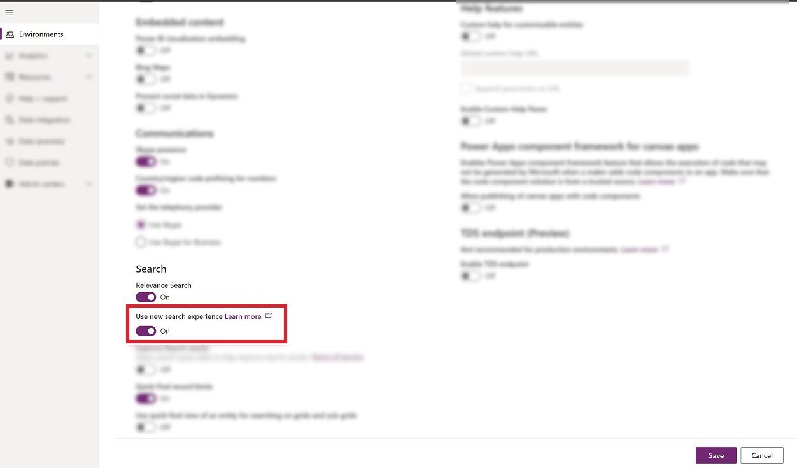
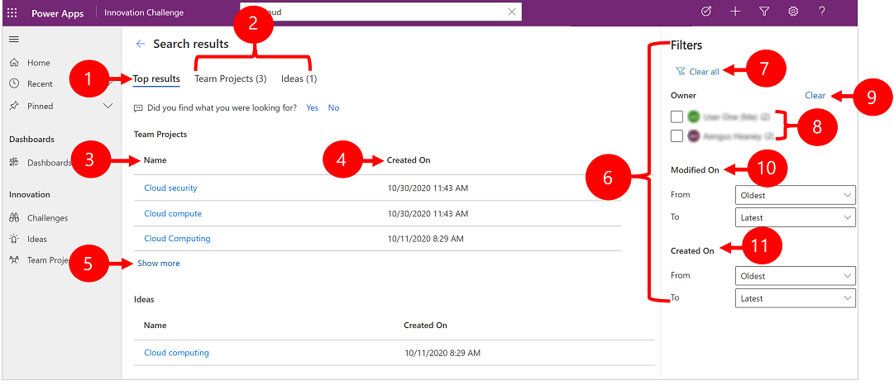
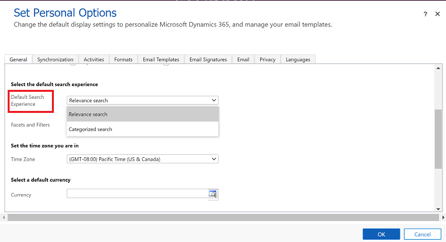
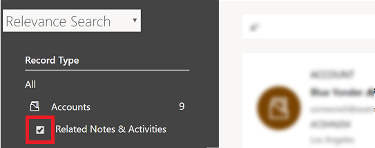
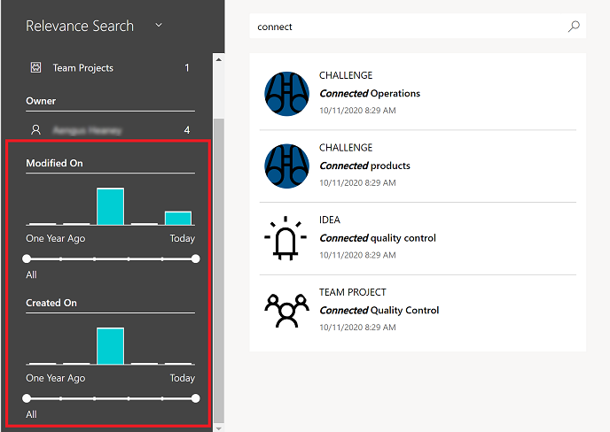
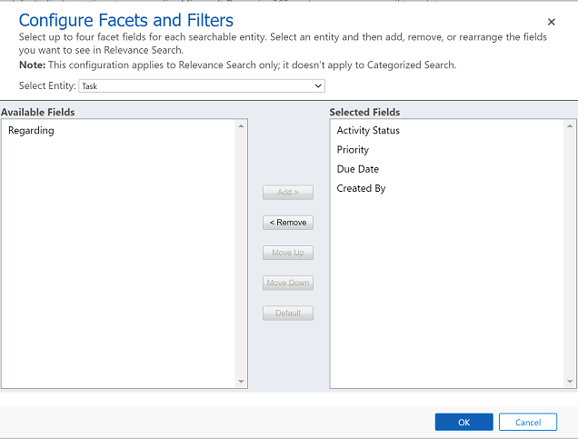

# Search for records using Relevance Search 

Relevance Search delivers fast and comprehensive results across multiple entities, in a single list, sorted by relevance. It is the best search experience to find and act on your data in Common Data Service. 

- Relevance Search is faster than Categorized search. 
- Relevance Search finds matches across fields to find the most relevant results. Relevance Search is smarter, in the following ways: 

  - It finds matches for inflectional words like **stream**, **streaming**, or **streamed**. A relevance ranking system that factors in information like how close or spread out the search terms are in a field 
  - Search results with matched text is highlighted, so you can easily see and understand the results. 
  - Finds matches to any word in the search term in any field in the entity, compared to quick find where all words from the search term must be found in one field. 
  
    > [!NOTE]
    > - Highlighted results are shown in context of the sentence that it is a part of. This may result in unexpected behavior, when a field has a period (.) because the period is considered as the end of sentence. Due this behavior, you may get results were part of the matched field is truncated.
    > - Certain words that are very commonly used in a language (like the or a) are ignored during search, because they don't help uniquely identify records. Because they're ignored during search, these words are also not highlighted in results

- Relevance Search can comb through the text in a document that's stored in Common Data Service, including text in notes, email attachments, or appointments. The following file formats are supported for search: PDF, Microsoft Office documents, HTML, XML, ZIP, EML, plain text, and JSON.
- Relevance Search enables you to search for records that are shared with you and records that you own.
    > [!NOTE]
    >  Hierarchical security models aren't supported. Even if you see a row in Common Data Service because you have access to it through hierarchical security, you won't see the result in Relevance Search.
    
- Relevance Search lets you search for option sets and lookups. For example, if you want to find a retail store account that has **Pharmaceuticals** in the name. When you search for **Pharmaceutical Retail**, you'll find the result because there's a match to the Industry field, which is a searchable option set.
    > [!NOTE]
    > Relevance Search is text-based and can search only on fields of type Single Line of Text, Multiple Lines of Text, Option Sets, or Lookups. It doesn't support searching in fields of Numeric or Date data type.

-  Relevance Search allows you to use syntax in your search term to get the results you want. For example, type **car silver 2-door** to include matches for any word in the search term in the search results. Type **car+silver+2-door** to find only matches that include all three words. Type **car&#124;silver&#124;2-door** to  get results that contain **car** or **silver** or **2-door**, or all three words. For more information about syntax you can use in your search queries, see [Search across entity data using relevance search](https://docs.microsoft.com/powerapps/developer/common-data-service/webapi/relevance-search). 

## Turn on Relevance Search

Relevance Search needs to be enabled on by the administrator for your organization, thus allowing all users in the organization to use it. After Relevance Search is enabled, you might have to wait up to an hour or more, depending on the size of your organization before it is available in your apps. Smaller changes in indexed data can take up to 15 minutes to show up in your system. For more information, see [Configure Relevance Search to improve search results and performance](https://docs.microsoft.com/power-platform/admin/configure-relevance-search-organization).

### Turn on the new Relevance Search experience 

The new search experience is available as a feature setting in the Power Platform admin Center. It combines the strength of Relevance Search as a service, with a user interface that is intuitive, familiar, and easy to use. When the **Use new search experience** setting is turned on, it will enable the new experience to all the apps in the environment.

 > [!div class="mx-imgBorder"]
 >  

> [!NOTE]
> The **Use new search experience** feature setting is only available for environments where Relevance Search is already turned on. For environments where Relevance Search has never been not turned on, the setting **Use new search experience** will not be shown and the new experience is turned on by default.

## Use the new Relevance Search experience 

The new search experience compliments the performance and intelligence of Relevance Search service and is intuitive and easy to use. 

### Prominent search bar

The search bar in the top is easy to find from any page in your app. It is always available to start a new search and quickly find the information that you're looking for.

> [!div class="mx-imgBorder"]
> 

### No search required to see recent records

Immediately see the records that you accessed recently when you click inside the search box.

 

### See recent records and searches

Before you even start typing in the search box, you will see any recent searches and recently accessed records in combined view to help with your search. Recently accessed records are also grouped by entity type, allowing you to quickly scan and understand the list of results.

> [!div class="mx-imgBorder"]
>  

Legend

1. **Recent searches**: Shows your recent searches.
2. **Recently accessed records**:  Shows recently accessed records that are grouped by entity type.

### View results quickly

Fast and powerful search with suggested results. View search results inline as you type, minimizing keystrokes and simplifying page navigation.

 

### Search results page

Search results are ranked and grouped by entity, with more fields that are displayed to help distinguish records and filter to take further action.

The **Top results** tab displays the top 20 results for the search term, with records grouped by entity type.

The full result set is grouped by entity, with the entity type displayed as a horizontal list of tabs along the top of the screen.

Each of the tabs lets you drill into a specific entity type, with the filter panel updating to show the set of facets and filters configured for that entity.

   > [!div class="mx-imgBorder"]
   >  

Legend

1. **Top results**: Show records that best matches the search query.
2. **Record type**: To narrow your search results to a specific page (entity), select the page (entity) tab.
3. **Name**: Shows the name of the record.
4. **Created on**: Shows when the record was created.
5. **Show more**: Select to show more results.
6. **Filters**: Refine the search results by using filters. Filters let you drill into and explore the results of your current search without having to repeatedly refine your search terms. Immediately after you perform a search you can filter by record type, owner, created on, and modified on.
7. **Clear all**: Select to clear all the filters. 
8. **Owner**: Select your user name to find records that you are the owner of.
9. **Clear**: Only clears the **Owner** filter. Note, you only see this filter when the **Owner** filter is selected.
10. **Modified on**: Filter the search results by when the record was last modified.
11. **Created on**: Select a time range to find records created in the selected time range.

## Set default search experience

If your organization has turned on both Relevance Search and categorized search, you can select a default search experience in your personal settings.

1. In the upper-right corner of the page, select **Settings**, and then select **Personalization Settings**.  
  
   > [!div class="mx-imgBorder"]
   >   

2. On the **General** tab, in the **Select the default search experience** section, for the **Default Search Experience**, select your default experience. 

   > [!div class="mx-imgBorder"]
   >   

> [!IMPORTANT]
> If you have the new Relevance Search experience available but you set your default search experience to Categorized Search, then the old Relevance Searchh experience and categorized is available. To use the new Relevance Search experience, you must set your default search experience to, Relevance Search. 

## Use the old Relevance Search experience 

If you're organization has Relevance Search enabled but your administrator has not turned on the [new relevance search experience](relevance-search.md#new-relevance-search-experience) then you will see the old search experience.

### Switch between the old Relevance Search experience and Categorized Search

If your organization has turned on both search options (relevance search and categorized search), you can switch between the two.

1. To switch between search types, on the navigation bar, select **Search**.

   > [!div class="mx-imgBorder"]
   >  

2. On the left, select the drop-down menu to switch between **Relevance Search** or **Categorized Search**.

   > [!div class="mx-imgBorder"]
   >  
   
### Start a search using the old Relevance Search experience
 
1.  From the top nav bar, select **Search**.  

    > [!div class="mx-imgBorder"]
    >  
  
2.  Enter your search words in the search box, and then select **Search**.

    > [!div class="mx-imgBorder"]
    >    

### Filter records with facets

With Common Data Service, you can now refine your search results by using facets and filters. Facets and filters let you drill into and explore the results of your current search without having to repeatedly refine your search terms.

Facets are available in the leftmost pane. Immediately after you perform a search, the following global facets are available for four common fields:  
  
-   Record Type  
  
-   Owner  
  
-   Created On  
  
-   Modified On  
  
#### Record Type facets

To narrow your search results to a specific entity, select the entity under the **Record Type** section.  
 
  > [!div class="mx-imgBorder"]
  >   
  
When you filter on a specific record type, you can include activities and notes that are related to the selected record in your search results. To do that, select the **Related Notes & Activities** check box. The activities and notes will appear in top-level results.
 
  > [!div class="mx-imgBorder"]
  >   
  
Search results that are found in email attachments or appointment entities are shown in the search results under their parent record, either Email or Appointment.  
  
When you refine by record type, the facet scope switches to the selected entity, and up to four facets that are specific to the entity are shown. For example, if you select the Account entity, you'll see the **Primary Contact** facet in addition to the global facets.  
  
In the **Set Personal Options** dialog box, you can also choose other facets from the ones that your system administrator has made available to you. The user setting overrides the default setting. [!INCLUDE[proc_more_information](../includes/proc-more-information.md)] [Configure facets and filters for the search](#BKMK_ConfigureFacets)  
  
#### Text-based facets

All lookups, option sets, and record types are text-based facets. For example, the text-based facet Owner consists of a list of field values and their corresponding counts.  
 
  > [!div class="mx-imgBorder"]
  >   
  
Filters in these facets are sorted in descending order by count. The top four facet values are displayed by default. When there are more than four facet values, you'll see a **SHOW MORE** link that you can select to expand the list and see up to fifteen top facet values. Select each value to filter the search results to show only records where the field has the value you've selected. For example, if you select **Jim Glynn**, the search results will show all records where the owner is Jim Glynn. When you select a lookup or option to set the facet value, search results are filtered to only include records with the value that you specified.  
  
#### Date and Time facets

Like other facets, you can use date and time facets to filter and see search results for a specific time. To select a range of values, drag the slider or select one of the vertical columns.  
 
  > [!div class="mx-imgBorder"]
  >   

## Configure facets and filters
  
> [!NOTE]
>  A system customizer can set the default experience for all entities, but you can configure your own facets and filters.  
  
1. In the upper-right corner, select **Settings**, and then select **Personalization Settings**.  
  
   > [!div class="mx-imgBorder"]
   > 
  
2. On the **General** tab, in the **Select the default search experience** section, for the **Facets and Filters** field, select **Configure**.  

   > [!div class="mx-imgBorder"]
   >   
  
3. In the **Configure Facets and Filters** dialog box, specify the facets you'd like to see for an entity. Your system administrator or customizer can set a default experience for all entities, but you can set your own here.  

   > [!div class="mx-imgBorder"]
   >   
  
 
   - In the **Select Entity** drop-down list, select an entity you want to configure facets for. This drop-down list contains only the entities that are enabled for Relevance Search.  
  
   - For the selected entity, select up to four facet fields. By default, the first four "facet-able" fields in the **Quick Find** view for the selected entity are selected in the list. At any time, you can only have four fields selected as facets.  
  
   You can update multiple entities at one time. When you select **OK**, the changes for all entities that you've configured are saved. To revert to the default behavior for an entity that you previously configured, select **Default**.  
  
   > [!NOTE]
   > - If a system customizer deletes a field or makes it no longer searchable, and you've saved a facet for that field, it will no longer show up as a facet.  
   >   -   You'll only see the fields that exist in the default solution and that are configured as searchable by your system customizer.  
   
