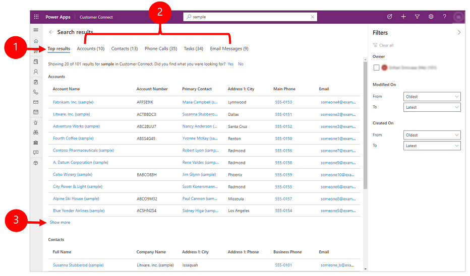
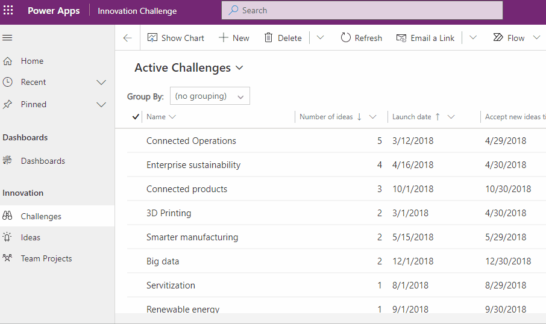
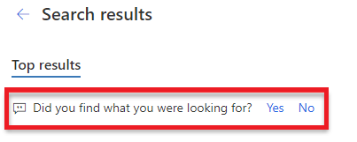

# Using relevance search to search for rows

[!INCLUDE[cc-data-platform-banner](../includes/cc-data-platform-banner.md)]

Relevance search is easy to use, fast, and more accurate in helping you find information that you're looking for. The search bar in the top is easy to find from any page in your app. It is always available to start a new search and quickly find the information that you're looking for.

> [!div class="mx-imgBorder"]
> 

  
## Turn on Relevance Search

The new experience needs to be enabled by the administrator for your organization. When relevance search is enabled for your environment, you see the search bar in the header. Search can be accessed in a familiar and recognizable way in all model-driven Power Apps in that environment. For more information, see [Enable the new Relevance Search experience](https://docs.microsoft.com/power-platform/admin/configure-relevance-search-organization#enable-the-new-relevance-search-experience).

## See recent rows and searches

See your recent searches and recently accessed rows when you select the search box. Before you even start typing in the search box, you will see information to help you complete the search quickly. 

Up to three recent search terms appear at the top, based on the three most recent search queries that you accessed and viewed the results. The recent search terms are personalized for you, based on your device and browser.

The next information in the flyout is recently accessed rows. You can see up to seven recently accessed rows. If you frequently access a small set of rows, you can quickly get to it from here. Recently accessed rows are independent of tables that are indexed for Relevance Search, because there is no search performed at this point. The rows are also grouped by table type, allowing you to quickly scan the list.

> [!div class="mx-imgBorder"]
>  

Legend

1. **Recent searches**: Shows your recent searches.
2. **Recently accessed rows**:  Shows recently accessed rows that are grouped by table type.

## Inline suggestions

As you start typing, you will see suggested results which minimize keystrokes and simplify page navigation. Suggested results are quick results based on a search performed on the primary column of a table that is both enabled for Relevance Search and included in the model-driven app.

Suggestions are shown when three or more characters are entered in the search box, and it based on two types of matching.

-	**Word completion**: Rows where the primary field contains a word that begins with the search term. For example, entering **work** will show the Account Adventure **Work**s, contact John **Work**er, among other results.

- **Fuzzy search**: Suggestions incorporate fuzzy search where terms that are misspelled by one character are matched. For example, entering **winry** will show the Account Coho **Winery**, among other suggestions. 

With suggestions you can access your information quickly with minimal keystrokes even when the search term is misspelled by up to one character. Text that's highlighted in bold in the suggestions shows the term that is matched.

## Search results page

You can view the full results for a search by pressing Enter or select **Show results for (search term)** at the bottom of the suggested results flyout.

Search results are ranked based on relevance and grouped by tables. The list of tables with rows matching the search term are displayed as a horizontal list of tabs along the top of the screen.

### Top results tab

The **Top results** tab displays the top 20 results for the search term, with rows grouped by table type. Each group has results for that table in a grid with up to six columns. These columns are the first six columns of the table’s quick find view's **View Columns set**.

> [!NOTE]
> - The primary column of a table is always used as the first column for a table in the **Top results** tab.
> - For notes and attachment tables, you can see two additional columns to indicate information on the related row for that note or attachment row.
> - Party list columns on activity tables like To, CC, attendees cannot be searched on or shown and will be blank

Legend:

 1. **Top results**:  Shows the top 20 results for the search term.
 2. **Rows grouped by table type**: To narrow your search results to a specific table, select the table tab.
 3. **Show more**: When you select **Show more** at the bottom of a group switches to the table tab.

### Table specific tab

Specific table tabs are displayed as a horizontal list of tabs along the top of the screen. The exact order of the list of tables from left to right in an LTR environment is based on the relevance of the results. You can collapse the filter panel or hover over the list of tabs to scroll horizontally.

The tables of the rows in the top 20 results are shown in the first few tabs from left to right, based on relevance. The tables corresponding to result rows outside of the top 20 are displayed in descending order of matched rows.

.
 2. This is the 3 tables that are part of the top results set that are ordered by relevance.
 3. Thi is the rest of the matched table types that are ordered by number of records that matches the search.

 

Each of the tabs lets you drill into a specific table and view more information on rows in the results. At the top of the page, you can view the number of results that are shown and the list of columns that was searched on within the table.

<Picture from Slide 3>

Each table tab displays more information than Top results tab along two different dimensions:

- If the quick find view for the table has more than 6 **View Columns**, then all columns are displayed in the table tab, compared to up to 6 columns shown in **Top results** tab.
- All matching rows for the table are accessiable in the table specific tab as an infinitely scrollable list.

### No search required to see recent rows

Immediately see the rows that you accessed recently when you click inside the search box.

 

### See recent rows and searches

Before you even start typing in the search box, you will see any recent searches and recently accessed rows in combined view to help with your search. Recently accessed rows are also grouped by table type, allowing you to quickly scan and understand the list of results.

> [!div class="mx-imgBorder"]
>  

Legend

1. **Recent searches**: Shows your recent searches.
2. **Recently accessed rows**:  Shows recently accessed rows that are grouped by table type.

### View quick suggestions

View suggested search results inline as you type, minimizing keystrokes and simplifying page navigation. The suggested results are based on the primary column of an table row, and support misspellings off by one character. For more information, see [Search across entity data using relevance search](https://docs.microsoft.com/powerapps/developer/data-platform/webapi/relevance-search#suggestions).

 

### Search results page

Search results are ranked and grouped by table, with more columns that are displayed to help distinguish rows and filter to take further action.

The full result set is grouped by table, with the table type displayed as a horizontal list of tabs along the top of the screen.

The **Top results** tab displays the top 20 results for the search term, with rows grouped by table type. Tables that contain the top 20 results are shown on the first few tabs from left to right based on relevance. The next few tabs have the matched table types in descending ordered by number of matched rows.

Each of the tabs lets you drill into a specific table type, with the filter panel updating to show the set of facets and filters configured for that table.

   > [!div class="mx-imgBorder"]
   >  

Legend

1. **Top results**: Show rows that best matches the search query.
2. **Row type**: To narrow your search results to a specific table, select the table tab.
3. **Name**: Shows the name of the row.
4. **Created on**: Shows when the row was created.
5. **Show more**: Select to show more results.
6. **Filters**: Refine the search results by using filters. Filters let you drill into and explore the results of your current search without having to repeatedly refine your search terms. Immediately after you perform a search you can filter by row type, owner, created on, and modified on.
7. **Clear all**: Select to clear all the filters. 
8. **Owner**: Select your user name to find rows that you are the owner of.
9. **Clear**: Only clears the **Owner** filter. Note, you only see this filter when the **Owner** filter is selected.
10. **Modified on**: Filter the search results by when the row was last modified.
11. **Created on**: Select a time range to find rows created in the selected time range.

### Feedback link

On the search results page, the **Did you find what you were looking for? Yes No** feedback is collected in our product telemetry. Search parameters like the query text that user enters into the search box is not collected irrespective of the response to the question. We only **Yes** or **No** response statistics to help us understand the usefulness of the new search experience. Currently there isn't an option to disable the feedback question prompt.

   > [!div class="mx-imgBorder"]
   >   

## Set default search experience

If your organization has turned on both Relevance Search and categorized search, you can select a default search experience in your personal settings.

1. In the upper-right corner of the page, select **Settings**, and then select **Personalization Settings**.  
  
   > [!div class="mx-imgBorder"]
   >   

2. On the **General** tab, in the **Select the default search experience** section, for the **Default Search Experience**, select your default experience. 

   > [!div class="mx-imgBorder"]
   >   

> [!IMPORTANT]
> If you have the new Relevance Search experience available but you set your default search experience to Categorized Search, then the old Relevance Searchh experience and categorized is available. To use the new Relevance Search experience, you must set your default search experience to, Relevance Search. 

## Use the old Relevance Search experience 

If you're organization has Relevance Search enabled but your administrator has not turned on the [new relevance search experience](https://docs.microsoft.com/powerapps/user/relevance-search#use-the-new-relevance-search-experience) then you will see the old search experience.

### Switch between the old Relevance Search experience and Categorized Search

If your organization has turned on both search options (relevance search and categorized search), you can switch between the two.

1. To switch between search types, on the navigation bar, select **Search**.

   > [!div class="mx-imgBorder"]
   >  

2. On the left, select the drop-down menu to switch between **Relevance Search** or **Categorized Search**.

   > [!div class="mx-imgBorder"]
   >  
   
### Start a search using the old Relevance Search experience
 
1.  From the top nav bar, select **Search**.  

    > [!div class="mx-imgBorder"]
    >  
  
2.  Enter your search words in the search box, and then select **Search**.

    > [!div class="mx-imgBorder"]
    >    

## Filter rows with facets

With Dataverse, you can now refine your search results by using facets and filters. Facets and filters let you drill into and explore the results of your current search without having to repeatedly refine your search terms.

Facets are available in the leftmost pane. Immediately after you perform a search, the following global facets are available for four common columns:  
  
-   Row Type  
  
-   Owner  
  
-   Created On  
  
-   Modified On  
  
### Row Type facets

To narrow your search results to a specific table, select the table under the **Row Type** section.  
 
  > [!div class="mx-imgBorder"]
  >   
  
When you filter on a specific row type, you can include activities and notes that are related to the selected row in your search results. To do that, select the **Related Notes & Activities** check box. The activities and notes will appear in top-level results.
 
  > [!div class="mx-imgBorder"]
  >   
  
Search results that are found in email attachments or appointment tables are shown in the search results under their parent row, either Email or Appointment.  
  
When you refine by row type, the facet scope switches to the selected table, and up to four facets that are specific to the table are shown. For example, if you select the Account table, you'll see the **Primary Contact** facet in addition to the global facets.  
  
In the **Set Personal Options** dialog box, you can also choose other facets from the ones that your system administrator has made available to you. The user setting overrides the default setting. [!INCLUDE[proc_more_information](../includes/proc-more-information.md)] [Configure facets and filters for the search](#BKMK_ConfigureFacets)  
  
#### Text-based facets

All lookups, choices, and row types are text-based facets. For example, the text-based facet Owner consists of a list of column values and their corresponding counts.  
 
  > [!div class="mx-imgBorder"]
  >   
  
Filters in these facets are sorted in descending order by count. The top four facet values are displayed by default. When there are more than four facet values, you'll see a **SHOW MORE** link that you can select to expand the list and see up to fifteen top facet values. Select each value to filter the search results to show only rows where the column has the value you've selected. For example, if you select **Jim Glynn**, the search results will show all rows where the owner is Jim Glynn. When you select a lookup or option set facet value, search results are filtered to only include rows with the value that you specified.  
  
#### Date and Time facets

Like other facets, you can use date and time facets to filter and see search results for a specific time. To select a range of values, drag the slider or select one of the vertical columns.  
 
  > [!div class="mx-imgBorder"]
  >   

## Configure facets and filters
  
Configure your own facets and filters.  

> [!NOTE]
> Your admin can use the Quick Find view to define which fields appear as default facets when you use Relevance Search. The first four view columns with data types other than single line of text and multiple lines of text are displayed as default facets in the result. You can override this setting in your [Personalization Settings](https://docs.microsoft.com/powerapps/user/set-personal-options#to-set-personal-options). At any time up to four fields can be selected as facets.
  
1. In the upper-right corner, select **Settings**, and then select **Personalization Settings**.  
  
   > [!div class="mx-imgBorder"]
   > 
  
2. On the **General** tab, in the **Select the default search experience** section, for the **Facets and Filters** column, select **Configure**.  

   > [!div class="mx-imgBorder"]
   >   
  
3. In the **Configure Facets and Filters** dialog box, specify the facets you'd like to see for a table. 
  
   - In the **Select Table** drop-down list, select a table you want to configure facets for. This drop-down list contains only the tables that are enabled for relevance search.  
  
   - For the selected table, select up to four facet columns. By default, the first four "facet-able" columns in the **Quick Find** view for the selected table are selected in the list. At any time, you can only have four columns selected as facets.  
  
   You can update multiple tables at one time. When you select **OK**, the changes for all tables that you've configured are saved. To revert to the default behavior for a table that you previously configured, select **Default**.  
  
   > [!NOTE]
   > - If a system customizer deletes a column or makes it no longer searchable, and you've saved a facet for that column, it will no longer show up as a facet.  
   >   -   You'll only see the columns that exist in the default solution and that are configured as searchable by your system customizer.  

