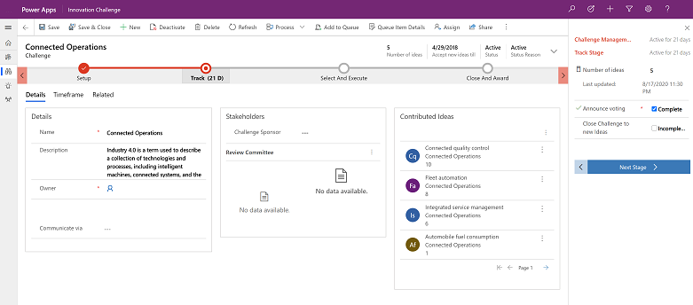
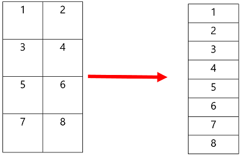
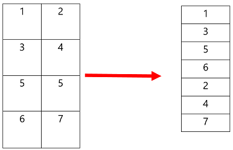
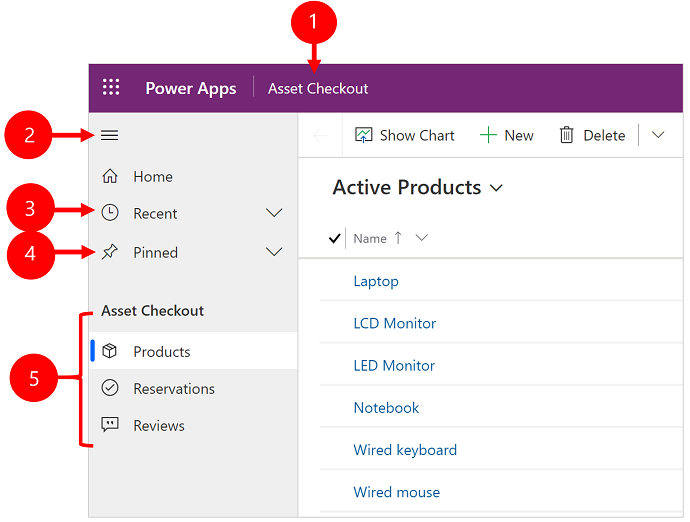
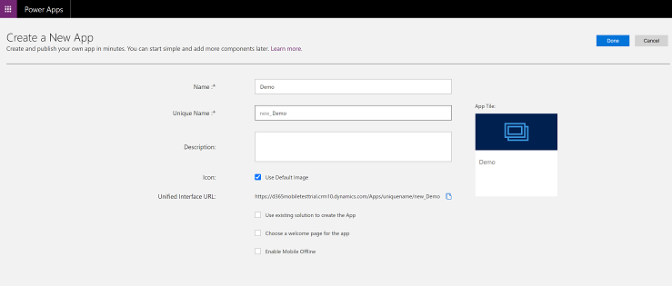

# Enhanced user experience with the Unified Interface for model-driven apps 

The Unified Interface for model-driven apps provides a consistent and accessible user experience across devices—whether on a desktop, laptop, tablet, or phone. The apps scale by reflowing the components on the screen. The responsive design adapts to your environment based on screen size, so the more available space that you have, the more information can be displayed.

> 

For an overview of Unified Interface in model-driven apps, watch this video: [Introduction to Unified Interface](https://www.youtube.com/watch?v=_VPOi_Iq6ko)

> [!NOTE]
> The legacy web client will be deprecated and customers must transition to Unified Interface before December 1, 2020. To learn more on how to transition, see [Quick start for transitioning](/powerapps/maker/model-driven-apps/transition-web-app) and [FAQs: Transition to Unified Interface](/powerapps/maker/model-driven-apps/faqs-transition-unified-interface).

## Reflow 

The Unified Interface is designed for a modern reflow experience. 

For forms, there are pixel breakpoints that cause information on a form to move on the screen based on the space available for the form to display in. This happens when the display space available to the form decreases. For example, if you resize the window that your app is in and decrease the width of the window it will decrease the space available for the form to display in. When the width decreases past certain breakpoints, information that would be hidden will move below where it used to be so that it is either visible or you can vertically scroll down to see it.

When columns in a form section reflows from multiple columns to one column, it reflows from left to right (in left-to-right languages). When a control spans at least two columns in a section, then it reflows from top to bottom. The difference in behavior is so that tab navigation order is kept after reflow.

In example below, each number corresponds to a control.

|Reflow experience from left to right: When multiple columns reflow to one column   |Reflow experience from top to bottom: When a control spans at least two columns in a section (notice control #5 spans across) |
|---------|---------|
|      |        |

## Navigation

The menu options let you swiftly navigate the different apps in the system. They provide quick access to recently viewed records and pinned favorites.

  

Legend
  
1. **Click to change app**: Select the current app name to change a differ app. 
2. **Collapse/expand button**: Select this to collapse the navigator to allow more room for the main part of the page. If the navigator is already collapsed, select this button to expand it again. 
3. **Recent records**: Expand this entry to view a list of records you were recently using. Select a record here to open it. Select the push-pin icon next to a record listed here to add it to your favorites (pinned records).
4. **Favorite records**: Expand this entry to view and open your favorite (pinned) records. Use the **Recent records** list to add records here. Select the remove-pin icon next to a record listed here to remove it from this list.
5.  **Page navigation**: This area lists each entity and dashboard page available for the current work area. Select any entry here to open the named dashboard or list view for that entity.

For more information, see [Basic navigation in a model-driven app](navigation.md).

## Dashboards and charts
You can access all the system and user dashboards from within your Unified Interface apps. The interactive dashboards are now available for all record types with richer interactive dashboard capabilities. For more information, see [Track your progress with dashboards and charts](track-your-progress-with-dashboard-and-charts.md).

## Timeline control 
The timeline view helps you collaborate with your team by tracking customer communication in a record on a single page in an easy-to-read view. You can see everything from posts and voice attachments, to emails and notes. It provides a quick way to see the entire communication thread. For more information, see [Add an appointment, email, phone call, notes or task activity to the timeline](add-activities.md).

## Business process 
The business process flow has been improved by the docking mechanism. You can dock the business process stage on your screen to help you stay focused on the task at hand in your business process flow. This is especially useful when the stage of the process has complex steps to complete. For more information, see [Work with business processes](work-with-business-processes.md).

## Accessibility
The improved accessibility experience lets you use screen readers to translate on-screen information into audible sound and print to a Braille reader so that more people can use the app. For more information, see [Use a screen reader](screen-reader.md).

## Create a Unified Interface app
If you have requirements to create your own experience on Unified Interface, you can create a model-driven app using the app designer. See [Overview of building model-driven apps](https://docs.microsoft.com/powerapps/maker/model-driven-apps/model-driven-app-overview).

## Unified Interface Community

Go to the [Unified Interface Community site](https://community.dynamics.com/365/unified-interface/) to get help with planning and executing a smooth transition to the Unified Interface and engage with experts and peers on blogs, webinars, videos, events, and more.
